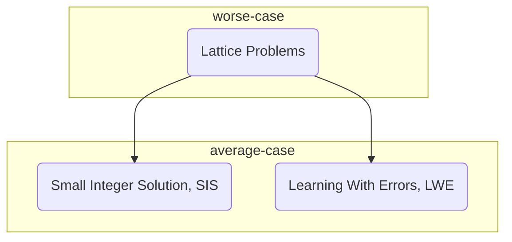

Worse-Case to Average-Case Reduction for SIS

If one wants to build the cryptography based on *worst-case lattice problems*, one just bases it on one of the these two problems:

- Small Integer Solution (**SIS**) Problem
- Learning With Erroes (**LWE**) Problem

*PostScript: Minicrypt &rarr; one of the 5 worlds of impagliazzo*

**Representing Lattices**:

- $$L(B) = \{z: z = Bx\ for\ x\ in\ Z^n\}$$

- $$L^{\perp}(A) = \{z\ in\ Z^m:Az = 0 \mod q\}$$

 