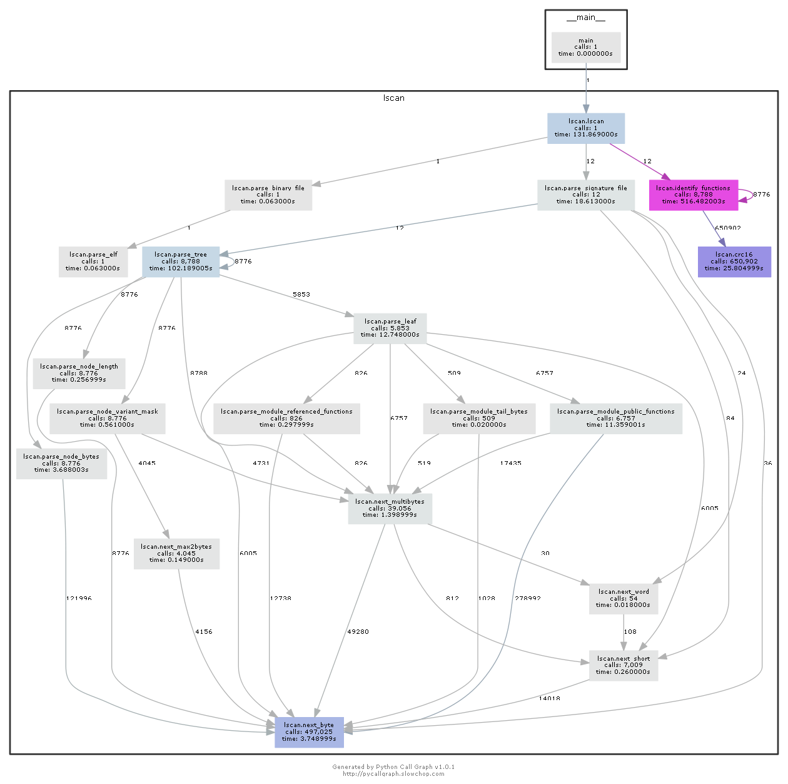

# 4.3x17

> 参考资料：
>
> * [https://github.com/maroueneboubakri/lscan/wiki/Reverse-Engineer-a-stripped-binary-with-lscan-and-IDApro](https://github.com/maroueneboubakri/lscan/wiki/Reverse-Engineer-a-stripped-binary-with-lscan-and-IDApro)
> * [https://www.jianshu.com/p/7a1441e4f355](https://www.jianshu.com/p/7a1441e4f355)

## 3x17

### 保护等级

首先检查程序的保护等级：

```bash
$ checksec 3x17 
[*] '/media/data/program/ctf/pwnable/3x17/3x17'
    Arch:     amd64-64-little
    RELRO:    Partial RELRO
    Stack:    No canary found
    NX:       NX enabled
    PIE:      No PIE (0x400000)
```

首先我们发现这是一个 64 位的程序，另外程序没有开启栈溢出的 `canary` 保护，但是堆栈不可执行。

我们再看程序的链接方式：

```bash
$ objdump -R 3x17 

3x17：     文件格式 elf64-x86-64

objdump: 3x17：不是动态对象
objdump: 3x17: invalid operation
```

是一个静态链接的文件。看各个段的权限：

```bash
gdb-peda$ vmmap 
Start              End                Perm    Name
0x00401000         0x0048e335         rx-p    /root/ctf/pwnable/3x17/3x17
0x00400200         0x004b2a31         r--p    /root/ctf/pwnable/3x17/3x17
0x004b40c0         0x004baa20         rw-p    /root/ctf/pwnable/3x17/3x17
```

### 加载 `sig` 函数签名

#### `lscan.py`

在 `gdb` 中我们并没有发现任何函数名与变量名的信息。于是我们可以尝试为文件添加一些标识，否则分析起来就太困难了。

我在网上找了一圈，发现大家都用一个 `lscan.py` 的项目，这是一个启发式的检测项目，这个项目通过识别文件的签名，为静态链接的文件查找最可能用于链接的签名文件：

```bash
$ mkvirtualenv -p python2.7 Reverse2.7

$ pip install pyelftools pefile

$ git clone https://github.com/maroueneboubakri/lscan.git && cd lscan

$ python lscan.py -f D:/program/ctf/pwnable/3x17/3x17 -S ./amd64/sig
D:\program\git\lscan\amd64\sig\libc-2.13.sig 12266/3369 (364.08%)
D:\program\git\lscan\amd64\sig\libc-2.22.sig 12870/2859 (450.16%)
D:\program\git\lscan\amd64\sig\libc-2.23.sig 13163/2869 (458.80%)
D:\program\git\lscan\amd64\sig\libcrypto-1.0.2h.sig 36850/5057 (728.69%)
D:\program\git\lscan\amd64\sig\libm-2.13.sig 11125/445 (2500.00%)
D:\program\git\lscan\amd64\sig\libm-2.22.sig 11121/582 (1910.82%)
D:\program\git\lscan\amd64\sig\libm-2.23.sig 11124/600 (1854.00%)
D:\program\git\lscan\amd64\sig\libpcre-8.38.sig 18/150 (12.00%)
D:\program\git\lscan\amd64\sig\libpthread-2.13.sig 11379/319 (3567.08%)
D:\program\git\lscan\amd64\sig\libpthread-2.22.sig 11159/262 (4259.16%)
D:\program\git\lscan\amd64\sig\libpthread-2.23.sig 11160/258 (4325.58%)
D:\program\git\lscan\amd64\sig\libssl-1.0.2h.sig 0/665 (0.00%)
```

我们发现它们的识别率都超过的 `100%`，而项目官网上提供的 demo 中是很正确的，那一定是哪里出了问题，于是我开始阅读这个工具的源码以修正这一 `bug`。

#### 项目修复

我们首先使用 `pycallgraph` 这个工具得到了一个函数的调用图：



可见 `lscan` 的大致流程大概分为三步：解析 `elf` 可执行文件、解析 `sig` 签名文件、匹配 `sig` 与 `elf`。根据上面出现的问题，应该是第三步解析错误。

_EDIT_：修了一半，bug 实在太多了！！！放弃这个工具。我要取消 `github` 上的赞。

#### IDA 插件

在 Google 上找了很久想要可以满足这个需求的插件：

* `github` 上有一个各种插件的列表：[https://github.com/onethawt/idaplugins-list](https://github.com/onethawt/idaplugins-list)。但是这里面似乎没有。

### 程序流程

#### `start`

在程序入口函数 `start` 调用的几个函数中，可以根据参数判断看到 `main` 函数。

#### `main`

`main` 函数中，由 `Ida Pro` 的到的 c 代码对某些函数的参数处理似乎有一些问题：

```
// local variable allocation has failed, the output may be wrong!
int __cdecl main(int argc, const char **argv, const char **envp)
{
  int result; // eax
  int v4; // eax
  char *v5; // ST08_8
  __int64 v6; // rcx
  unsigned __int64 v7; // rt1
  char buf[24]; // [rsp+10h] [rbp-20h]
  unsigned __int64 v9; // [rsp+28h] [rbp-8h]

  v9 = __readfsqword(0x28u);
  result = (unsigned __int8)++ITER;
  if ( ITER == 1 )
  {
    write(1u, "addr:", 5uLL);
    read(0, buf, 0x18uLL);
    strcpy((__int64)buf);
    v5 = (char *)v4;
    write(1u, "data:", 5uLL);
    argv = (const char **)v5;
    *(_QWORD *)&argc = 0LL;
    read(0, v5, 0x18uLL);
    result = 0;
  }
  v7 = __readfsqword(0x28u);
  v6 = v7 ^ v9;
  if ( v7 != v9 )
    sub_44A3E0(*(_QWORD *)&argc, argv, envp, v6);
  return result;
}
```

`main` 函数的逻辑大致是：

1. 先检测全局变量中 `ITER` 的值，如果通过检测，则执行下面的两步：
   1. 读取 `0x18` 个字节 `addr` 到缓冲区内，然后进行一次字符串复制（`strcpy` 函数是猜的）；
   2. 再读取 `0x18` 个字节 `data` 到缓冲区内，然后再进行一次字符串赋值；
2. 检测栈溢出，如果栈溢出发生则调用 `sub_44A3E0` 函数。

我再仔细看看条件分支内的汇编代码（然后我们重新自己命名了函数）：

```
; 15:     write(1u, "addr:", 5uLL);
mov     [rbp+var_28], 0
mov     edx, 5          ; count
lea     rsi, buf        ; "addr:"
mov     edi, 1          ; fd
mov     eax, 0
call    write
; 16:     read(0, buf, 0x18uLL);
lea     rax, [rbp+buf]
mov     edx, 18h        ; count
mov     rsi, rax        ; buf
mov     edi, 0          ; fd
mov     eax, 0
call    read
; 17:     addr = atoi((__int64)buf);
lea     rax, [rbp+buf]
mov     rdi, rax
mov     eax, 0
call    atoi
cdqe
mov     [rbp+addr], rax
; 18:     write(1u, "data:", 5uLL);
mov     edx, 5          ; count
lea     rsi, aData      ; "data:"
mov     edi, 1          ; fd
mov     eax, 0
call    write
; 19:     read(0, addr & 0xffffffff, 0x18);
mov     rax, [rbp+addr]
mov     edx, 18h        ; count
mov     rsi, rax        ; buf
mov     edi, 0          ; fd
mov     eax, 0
call    read
mov     eax, 0
jmp     short loc_401C37
```

也就是说，高级语言代码应该是这样的：

```c
int __cdecl main(int argc, const char **argv, const char **envp)
{
  int result; // eax
  int addr; // ST08_8
  __int64 v6; // rcx
  unsigned __int64 v7; // rt1
  char buf[24]; // [rsp+10h] [rbp-20h]
  unsigned __int64 v9; // [rsp+28h] [rbp-8h]

  v9 = __readfsqword(0x28u);
  result = (unsigned __int8)++ITER;
  if ( ITER == 1 )
  {
    write(1u, "addr:", 5uLL);
    read(0, buf, 0x18uLL);
    addr = atoi((__int64)buf);
    write(1u, "data:", 5uLL);
    read(0, addr & 0xffffffff, 0x18);
    result = 0;
  }
  if ( v9 != __readfsqword(0x28u))
    __stack_chk_fail(*(_QWORD *)&argc, argv, envp);
  return result;
}
```

可见它主要提供了一个任意地址写的功能，但是由于我们只能控制低 32 位，因此不能往栈上写入内容。查看之前的权限查看，在程序段中 `0x004b40c0 - 0x004baa20` 这段地址是可写的。

### 漏洞发现与利用

漏洞非常明显，不需要发现，直接进行利用。

#### 构造循环
