> 复习地址:
>
> - https://github.com/huihut/interview

# C++ 知识结构系统梳理

## 关键字

## 零碎知识

## 面向对象

## 智能指针

智能指针定义在头文件 `memory` 中。

## 强制类型转换

## STL

`Deque` 的全称是 double ended queue，两端结束队列；

它是 `stack` 与 `queque` 的底层存储结构，它的实现基于 `vector` 的实现，它结构大致如下：

可以看到这样存储的优点是：

1. 仍然可以通过接近与 O(1) 常数级别的时间复杂度进行访问；
2. 在两端的插入删除复杂度仍然为 O(1)；

对于 `stack` 与 `queue` 这样的仅仅在双端有插入删除访问操作的数据结构，是一个合适的基类；

