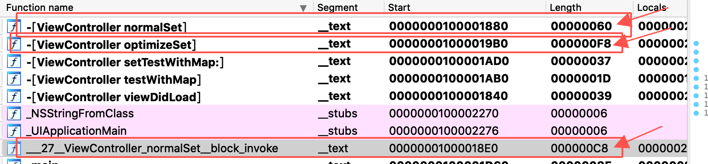
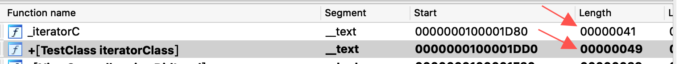
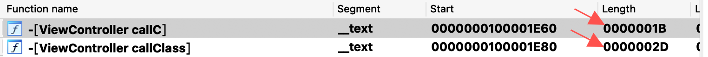

# 静态分析

iOS 的静态分析工具主要有 Hopper/IDA Pro。

## Hopper

## IDA Pro

下面是一些 IDA Pro 的常用功能与快捷键：

1. 字符串搜索：Alt+T (Windows)；Option+T (Mac OS)；
2. 跳转地址：在 IDA 中按 "G"，输入指定的跳转地址即可跳转；
3. 编写注释：
   1. 可重复注释：按 ";" 分号，可以添加可重复注释，这种注释会同时出现在其交叉引用的地方；
   2. 非重复注释：按 ":" 冒号，可添加重复注释，优先级大于前者，不过不会出现在交叉引用的位置；
   3. 伪代码注释：直接按 "/" 分号，可以为伪代码添加注释；
4. 变量重命名：单击目标变量，按 "N" 进行重命名；
5. 查看交叉引用：选中函数/变量，按 "X" 可以查看当前位置被哪些地方引用了；
6. 进制转换：伪代码展示的数字默认进制是十进制，可以按 "H" 进行进制转换；
7. 类型声明：变量类型/方法参数签名等，如果 IDA 默认识别有问题，可以按 "Y" 进行重声明；
8. 格式转化：
   1. 在被解析为数据的位置按 "C" 可以解析为代码，反之按 "D"；
   2. 对于一连串的 ASCII 字符，按 "A" 可以将一连串地址的字符转化为字符串；
   3. 按 "U" 可以取消对数据段的解析；

## 静态分析实践

### 产物分析

我们使用 XCode 默认建立的工程，在 viewDidLoad 里面编写了一段代码，看看这写代码是如何实现的：

```objective-c
#define SCREEN_WIDTH [UIScreen mainScreen].bounds.size.width
#define SCREEN_HEIGHT [UIScreen mainScreen].bounds.size.height
#define TEXT_WIDTH 100
#define TEXT_HEIGHT 100

@implementation ViewController

- (void)viewDidLoad
{
    CGPoint origin = CGPointMake((SCREEN_WIDTH - TEXT_WIDTH) / 2, (SCREEN_HEIGHT - TEXT_HEIGHT) / 2);
    UITextView *customTextView = [[UITextView alloc] initWithFrame:CGRectMake(origin.x,
                                                                        origin.y,
                                                                        TEXT_WIDTH,
                                                                        TEXT_HEIGHT)];
    customTextView.text = @"Westworld.";
    customTextView.scrollEnabled = YES;
    customTextView.editable = NO;
    [self.view addSubview:customTextView];
}

@end
```

在 Product 文件夹中，找到 `.app` 后缀的产物文件夹，放入 IDA。在左侧窗口注意到这个方法：`- [ViewController viewDidLoad]`：

```c
void __cdecl -[ViewController viewDidLoad](ViewController *self, SEL a2)
{
  void *v2; // rax
  void *v3; // r15
  void *v4; // rax
  void *v5; // rbx

  v2 = (void *)objc_alloc((__int64)&OBJC_CLASS___UITextView, (__int64)a2);
  v3 = objc_msgSend(v2, "initWithFrame:", xmmword_100002460, xmmword_100002470);
  objc_msgSend(v3, "setText:", CFSTR("Westworld."), xmmword_100002460, xmmword_100002470);
  v4 = objc_msgSend(self, "view");
  v5 = (void *)objc_retainAutoreleasedReturnValue((__int64)v4);
  objc_msgSend(v5, "addSubview:", v3);
  objc_release(v5);
  objc_release(v3);
}
```

上面的伪代码结果可以让我们对 OC 的局部变量的工作机制有一定的了解，有关 `objc_alloc` / `objc_msgSend` 等函数的实现，我们使用现在的 `.app` 产物文件包，暂时是看不到的。

### 包大小优化案例 -- Block 优化

一个经典的包大小优化方式是 Block 优化，为什么对 Block 的优化可以优化包大小呢？

我编写了下面一个测试程序：

```objective-c
- (void)normalSet
{
    [self.testWithMap setMapMsgWithBlock:^(NSMutableDictionary * _Nonnull map) {
        map[@"hello1"] = @"hello1";
        map[@"hello2"] = @"hello2";
        map[@"hello3"] = @"hello3";
        map[@"hello4"] = @"hello4";
    }];
}

- (void)optimizeSet
{
    NSMutableDictionary *map = self.testWithMap.testMap;
    map[@"hello1"] = @"hello1";
    map[@"hello2"] = @"hello2";
    map[@"hello3"] = @"hello3";
    map[@"hello4"] = @"hello4";
}
```

在 IDA Pro 中分析后可以得到使用两种方法对内存的增量改变：



除此之外，前者还在数据端保存了一份 block 的结构体：

```c
struct __block_impl {
  void *isa; 
  int Flags; 
  int Reserved; 
  void *FuncPtr;
};
```


用更直观的图表示：



这也就是说：

- `normalSet` 方法占用字节大小：`0x60 + 0xC8 + 0x18 = 0x140`
- `optimizeSet` 方法占用的字节大小：`0xF8`
- 二者占用内存的差值是：`0x140 - 0xF8 = 0x48`

### 包大小优化案例 -- 类方法转 C 方法

同样的，我们也来研究一下，为什么类方法转 C 方法会可以对内存进行优化。

测试程序：

```objective-c
void iteratorC(void)
{
    for (int i = 0; i < 100; i++) {
        NSLog(@"%d\n", i);
    }
}

@implementation TestClass

+ (void)iteratorClass
{
    for (int i = 0; i < 100; i++) {
        NSLog(@"%d\n", i);
    }
}

@end
```

在 IDA Pro 中，可以分析这两者之间的函数二进制主体的大小：



可以看出它们的函数主体大约有 0x8 个字节的差异，这并不是很大的差异，我们看看他们的汇编代码可以看出这个差异在哪里：

```assembly
mov     [rbp+var_8], rdi
mov     [rbp+var_10], rsi
```

这是后者相对于前者多出的两行汇编代码，恰好 8 个字节：

- 后者是 OC 的方法，默认带有 `TestClass_meta *self, SEL a2` 两个参数；
- 上面的两行汇编代码是把这两个参数复制寄存器中的代码；
- 这两行代码在函数主体中没有使用到，是没有意义的编译器产生的冗余代码，很有可能在开启了编译选项后被优化；

那么是否有更有意义的优化呢？我们再编写一段调用方的代码：

```objective-c
- (void)callC
{
    iteratorC();
}

- (void)callClass
{
    [TestClass iteratorClass];
}
```

在 IDA Pro 中，分析这二者的二进制函数主体大小：



它们的函数主体大约有 0x12 个字节的差异，同样的我们可以在汇编中看出这一差异来自于：

```assembly
# callClass 传递参数的代码贡献了 0x11 个字节的代码增量。
mov     rax, cs:classRef_TestClass
mov     rsi, cs:selRef_iteratorClass ; char *
mov     rdi, rax        ; void *

# 两者调用方案本身的汇编代码也有一个字节的差异
call    _iteratorC # 5 Bytes
call    cs:_objc_msgSend_ptr ; +[TestClass iteratorClass] # 6 Bytes
```

总结起来，后者与前者的差异，可以用下面的图表示：



在这个具体的例子中，通过这个方式优化的内存为：

- `callee` 方优化：`0x8`；
- `caller` 方优化：`0x12 + 0x8 + 0xD = 0x2D`；

这种优化方式显然没有前者高效；

