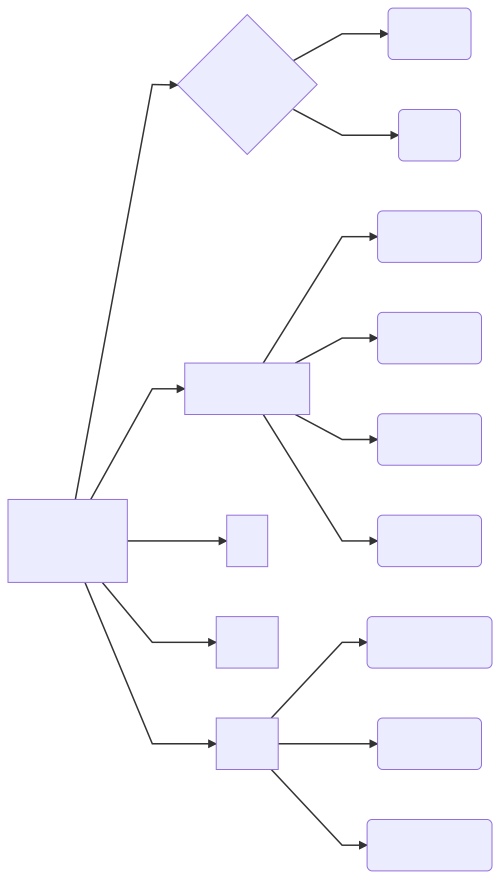
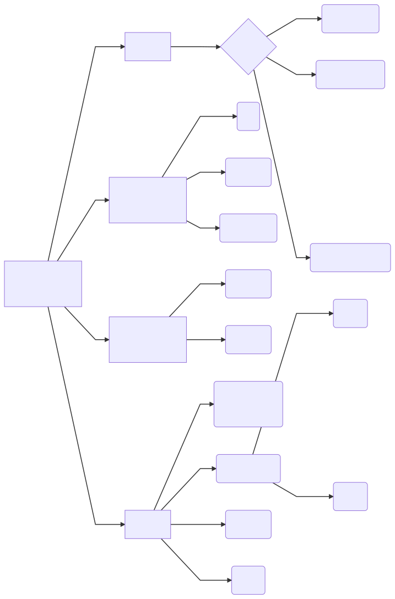
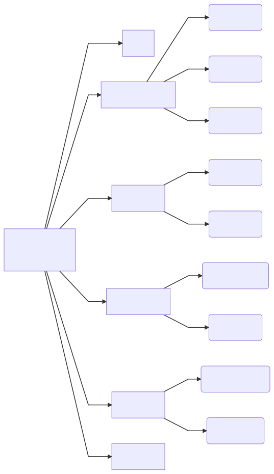

# REVIEW

## 1. 基本知识

维基百科上列出了下面的时间复杂度种类：

| 名称                                                         | 运行时间（$${\displaystyle T(n)}$$）                        | 算法举例                                                     |
| ------------------------------------------------------------ | ------------------------------------------------------------ | ------------------------------------------------------------ |
| 常数时间                                                     | $${\displaystyle O(1)}$$ | 判断一个二进制数的奇偶                                       |
| 反阿克曼时间 | $${\displaystyle O(\alpha (n))}$$                            | 并查集的单个操作的平摊时间 |
| 迭代对数时间 | $${\displaystyle O(\log ^{*}n)}$$ | 分布式圆环着色问题 |
| 对数对数时间                                                 | $${\displaystyle O(\log \log n)}$$ | 有界优先队列的单个操作 |
| 对数时间                                                     | $${\displaystyle O(\log n)}$$ | 二分搜索 |
| 幂对数时间 | $${\displaystyle (\log n)^{O(1)}}$$ |                                                              |
| （小于1次）幂时间                                            | $${\displaystyle O(n^{c})}$$，其中$${\displaystyle 0<c<1}$$ | K-d 树的搜索操作 |
| 线性时间 | $${\displaystyle O(n)}$$ | 无序数组的搜索 |
| 线性迭代对数时间                                             | $${\displaystyle O(n\log ^{*}n)}$$ | 莱姆德·赛德尔的三角分割多边形算法 |
| 线性对数时间                                                 | $${\displaystyle O(n\log n)}$$ | 最快的比较排序 |
| 二次时间                                                     | $${\displaystyle O(n^{2})}$$ | 冒泡排序、插入排序 |
| 三次时间                                                     | $${\displaystyle O(n^{3})}$$ | 矩阵乘法的基本实现，计算部分相关性 |
| 多项式时间                                                   | $${\displaystyle 2^{O(\log n)}=n^{O(1)}}$$                   | 线性规划中的卡马卡算法，AKS 质数测试 |
| 准多项式时间                                                 | $${\displaystyle 2^{(\log n)^{O(1)}}}$$ | 关于有向斯坦纳树问题最著名的$${\displaystyle O(\log ^{2}n)}!O(\log ^{2}n)$$近似算法 |
| 次指数时间（第一定义）                                       | $${\displaystyle O(2^{n^{\epsilon }})}$$对任意的$$\epsilon > 0​$$ | 假设复杂性理论推测。 |
| 次指数时间（第二定义）                                       | $$2^{o(n)}$$                                         | 用于整数分解与图形同构问题的著名算法 |
| 指数时间 | $$2^{O(n)}$$                                            | 使用动态规划解决旅行推销员问题 |
| 阶乘时间                                                     | $$O(n!)$$                                               | 通过暴力搜索解决旅行推销员问题 |
| 指数时间 | $$2^{poly(n)}$$                                           |                                                              |
| 双重指数时间                                                 | $$2^{2poly(n)}$$                                          | 在预膨胀算术中决定一个给定描述的真实性 |

## 2. 表结构

## 3. 树结构

概念：

- 树的高度或深度：从树的根节点开始到所有叶子结点中，最长路径中的结点个数；

- 度：
  - 树中一个元素的度是指其孩子的个数；
  - 树本身的度是指其中所有元素度的最大值。
- 满二叉树：高度为 h，含有 $$2^h - 1$$ 个元素的二叉树。
- 完全二叉树：顺序编号后，$$1 \le i \le n$$ 的结点 i 存在结点，$$n \lt i \le 2^h - 1$$ 的结点 i 均为空的二叉树。

## 4. 图结构

概念：

顶点、边、无向边、有向边、关联于、关联至、邻接于、邻接至、无向图、有向图、完全图、稀疏图、稠密图、带权图、子图、顶点的度、入度、出度、路径、路径长度、简单路径、回路、连通图、连通分量、强连通图、强连通分量、生成树、生成森林。

