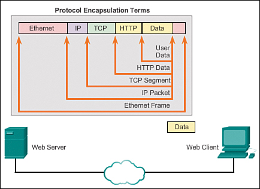
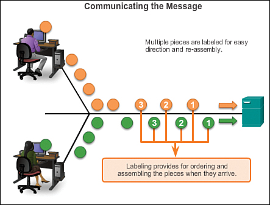
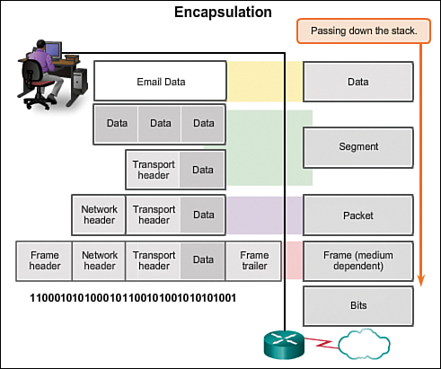
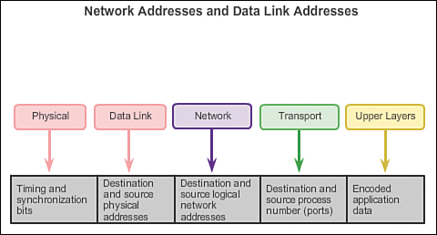
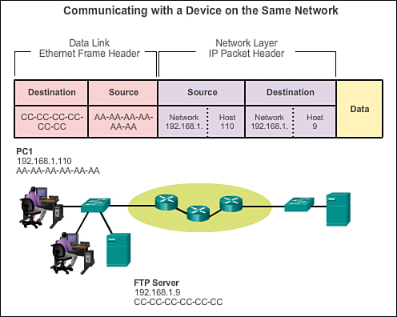
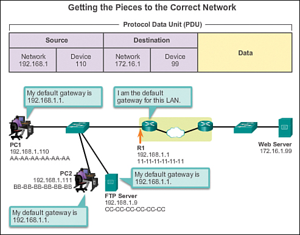

> 学习网址：https://www.kancloud.cn/wizardforcel/network-basic/135483

# 网络传输

## 传输流程

下图显示了一个网络服务器向客户端传送数据的完整过程：

1. 传送的**数据**是网络服务器的HTML页面。

2. 应用层协议 HTTP 报文头添加到 HTML 数据之前生成**报文**。报文头信息包括：服务器所使用的HTTP版本，以及表明它包含发给网络客户端信息的状态编码。

3. HTTP 应用层协议将 HTML 格式的网页数据发送给传输层。TCP 传输层用于管理网络服务器和客户端之间的 **TCP 会话**。

4. IP 信息添加到 TCP 信息之前。IP 指定适当的源和目的 IP 地址。这些信息就构成了 **IP 报文**。

5. 以太网协议添加到IP报文的两端之后，就形成了**数据链路帧**。上述帧发送至通向网络客户端的路径上的最近一个路由器。路由器移除以太网信息，观察IP报文，判定最佳路径，将报文插入一个新的帧，并发送至目标路径上下一个相邻路由器。每一个路由器在转发之前都移除并添加新的数据链路层信息。

6. 数据通过互联网络传输，互联网络包含媒介和中间设备。

7. 客户端接收到包含数据的数据链路帧，处理各层协议头，之后以添加时相反的顺序移除协议头。首先处理并移除以太网信息 &rarr; 之后是 IP 协议信息 &rarr; 接下来 TCP 信息 &rarr; 最后是 HTTP 信息。

8. 之后，将网页信息传递给客户端网页浏览器软件。

## 传输概念

### 数据封装

消息要在网络中传输，必须对它进行**编码**，以特定的**格式**进行**封装**，同时需要适当地封装以足够的**控制**和**地址信息**，以使它能够从发送方移动到接收方。

### 消息大小

理论上，视频或邮件信息是能够以大块非中断型流从网络源地址传送到目的地址，但这也意味着同一时刻同一网络其他设备就无法收发消息。这种大型数据流会造成显著延时。并且，如果传输过程中连接断开，整个数据流都会丢失需要全部重传。

因此，更好的方法是将数据流**分割**（**segmentation**）为较小的，便于管理的片段，能够带来两点好处：

- 对于发送端来说：发送较小片段，网络上同时可有多个会话交错进行。这种在网络上将不同会话片段交错进行的过程称为**多路传输（multiplexing）**。
- 对于接收端来说：“分割” 可以提高网络通讯的可靠性。各消息片段从源地址到目的地址无需经过相同路径，如果一条路径被堵塞或断开，其余消息可从替换路径到达目的地址。如果部分消息到不了目的地址，那只需重传丢失部分。

*PostScript*: 需要通过对片段打上标签的方式来保证顺序以及在接收时重组：

### 协议数据单元

**协议数据单元（Protocol Data Unit, PDU）**：数据片段在各层网络结构中采用的形式。

按照 TCP/IP 协议的命名规范，PDU 在不同网络层级结构中的名称如下：

| 所属网络层级   | 名称                |
| -------------- | ------------------- |
| 应用层 PDU     | **数据 Data**       |
| 传输层 PDU     | **分段 segment**    |
| 网络层 PDU     | **数据报 Datagram** |
| 数据链路层 PDU | **帧 Frame**        |
| 物理链路层 PDU | **比特 Bits**       |

他们加入的内容如下图所示：

## 访问本地资源

访问本地网络资源需要两种类型的地址：网络层地址和数据链路层地址。网络层和数据链路层负责将数据从发送设备传输至接收设备。**两层协议都有源和目的地址，但两种地址的目的不同**。

我们以以下的图举例：

### 网络地址

**网络层地址，即 IP 地址** &rarr; 包含两个部分：网络前缀和主机。路由器使用网络前缀部分将报文转发给适当的网络。最后一个路由器使用主机部分将报文发送给目标设备。同一本地网络中，网络前缀部分是相同的，只有主机设备地址部分不同。

对于以上的例子：

- 源 IP 地址：发送设备，上图中即 `192.168.1.110`
- 目的 IP 地址：接受设备，上图中即 `192.168.1.9`

### 数据链路地址

数据链路地址的目的是在同一网络中将数据链路帧从一个网络接口发送至另一个网络接口。以太网 LAN (Local Area Network) 和无线网 LAN 是两种不同物理介质的网络示例，分别有自己的数据链路协议。

当 IP 报文的发送方和接收方位于同一网络，数据链路帧直接发送到接收设备。以太网上数据链路地址就是**以太网 MAC 地址**。MAC 地址是物理植入网卡的 48 比特地址。

对于以上的例子：

- 源 MAC 地址：发送 IP 报文的 PC1 以太网卡 MAC 地址，AA-AA-AA-AA-AA-AA。
- 目的 MAC 地址：当发送设备与接收设备位于同一网络，即为接收设备的数据链路地址。本例中，FTP MAC 地址：CC-CC-CC-CC-CC-CC。

### MAC 地址与 IP 地址

为了访问一个本地资源，发送方必须知道接收方的物理和逻辑地址。

发送方主机能够以多种方式学习到接收方的IP地址：比如**域名系统（Domain Name System, DNS）**，或通过应用手动输入，如用户指定FTP地址。

以太网 MAC 地址是怎么识别的呢？发送方主机使用**地址解析协议（Address Resolution Protocol, ARP）**以检测本地网络的所有 MAC 地址。如下图所示，发送主机在整个 LAN 发送 ARP 请求消息，这是一条广播消息。ARP 请求包含目标设备的 IP 地址，LAN上的每一个设备都会检查该ARP请求，看看是否包含它自身的 IP 地址。只有符合该 IP 地址的设备才会发送 ARP 响应。ARP 响应包含 ARP 请求中 IP 地址相对应的 MAC 地址。

## 访问远程资源

### 默认网关

**默认网关**：是指位于发送主机同一网络上的路由器的接口 IP 地址。

当主机发送消息到远端网络，必须使用路由器。默认网关就是有一点很重要：**本地网络上的所有主机都能够配置自己的默认网关地址。如果该主机的 TCP/IP 设置中没有配置默认网关地址，或指定了错误的默认网关地址，则远端网络消息无法被送达**。

如下图所示，LAN 上的主机 PC 1 使用 IP 地址为 192.168.1.1 的 R1 作为默认网关，如果 PDU 的目的地址位于另一个网络，则主机将 PDU 发送至路由器上的默认网关：

### 网络地址

当报文的发送方与接收方位于不同网络，**源和目的IP地址将会代表不同网络上的主机**。

对于以上的例子：

- 源IP地址：发送设备即客户端主机PC 1的IP地址：192.168.1.110。

- 目的IP地址：接收设备即网络服务器的IP地址：172.16.1.99。

### 数据链路地址

当报文的发送方与接收方位于不同网络，以太网数据链路帧无法直接被发送到目的主机。以太网帧必须先发送给路由器或默认网关。本例中，默认网关是 R1，R1 的接口 IP 地址与 PC 1 属于同一网络，因此 PC 1 能够直接达到路由器。

对于以上的例子：

- 源MAC地址：发送设备即PC 1的MAC地址，PC1的以太网接口MAC地址为：AA-AA-AA-AA-AA-AA。

- 目的MAC地址：当报文的发送方与接收方位于不同网络，这一值为路由器或默认网关的以太网MAC地址。本例中，即R1的以太网接口MAC地址，即：11-11-11-11-11-11。

IP 报文封装成的以太网帧先被传输至 R1，R1 再转发给目的地址即网络服务器。R1 可以转发给另一个路由器，如果目的服务器所在网路连接至 R1，则直接发送给服务器。

发送设备如何确定路由器的 MAC 地址？每一个设备通过自己的 TCP/IP 设置中的默认网关地址得知路由器的 IP 地址。之后，它通过 ARP 来得知默认网关的 MAC 地址，该 MAC 地址随后添加到帧中。