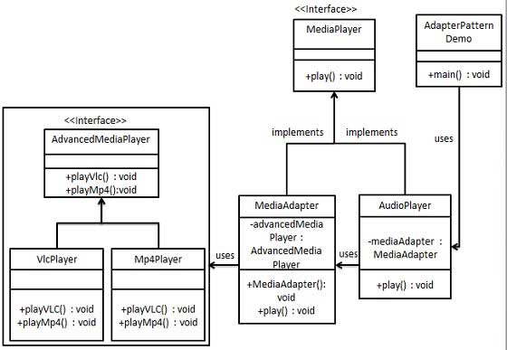

# 适配器模式

适配器模式（Adapter Pattern）是作为两个不兼容的接口之间的桥梁。这种类型的设计模式属于结构型模式，它结合了两个独立接口的功能。

举个真实的例子，读卡器是作为内存卡和笔记本之间的适配器。您将内存卡插入读卡器，再将读卡器插入笔记本，这样就可以通过笔记本来读取内存卡。

## 介绍

**意图：**

- 将一个类的接口转换成客户希望的另外一个接口。适配器模式使得原本由于接口不兼容而不能一起工作的那些类可以一起工作。

- 概括的说，它主要有以下的应用场景：
  1. 系统需要使用现有的类，而此类的接口不符合系统的需要
  2. 想要建立一个可以重复使用的类，用于与一些彼此之间没有太大关联的一些类，包括一些可能在将来引进的类一起工作，这些源类不一定有一致的接口。 
  3. 通过接口转换，将一个类插入另一个类系中。（比如老虎和飞禽，现在多了一个飞虎，在不增加实体的需求下，增加一个适配器，在里面包容一个虎对象，实现飞的接口。）

**优点：**

1. 可以让任何两个没有关联的类一起运行。
2. 提高了类的复用。
3. 增加了类的透明度。
4. 灵活性好。

**缺点：** 

1. 过多地使用适配器，会让系统非常零乱，不易整体进行把握。一个系统如果太多出现这种情况，无异于一场灾难。因此如果不是很有必要，可以不使用适配器，而是直接对系统进行重构。 
2. 由于 JAVA 至多继承一个类，所以至多只能适配一个适配者类，而且目标类必须是抽象类。

*PostScript*：

- 有动机地修改一个正常运行的系统的接口，这时应该考虑使用适配器模式。

- 适配器不是在详细设计时添加的，而是解决正在服役的项目的问题。

## 例子

比如下面的例子：

1. 原本：我们有一个 `MediaPlayer` 的接口，一个实现了这个接口的类 `AudioPlayer`。它只能播放 mp3。格式的音频文件；
2. 原本：我们还有一个 `AdvancedMediaPlayer` 的接口，实现了这个接口的类 `VlcPlayer`、`Mp4Player`。该类可以播放 vlc 和 mp4 格式的音频文件。
3. 现在我们需要：`AudioPlayer` 这个类可以播放其他格式的音频文件。
4. 为了实现这个功能：我们创建了一个实现了 `AdvancedMediaPlayer` 的一个适配器类 `MediaAdapter`，并使用这个接口定义的方法播所需要的格式。

这些类的结构图大致如下：

