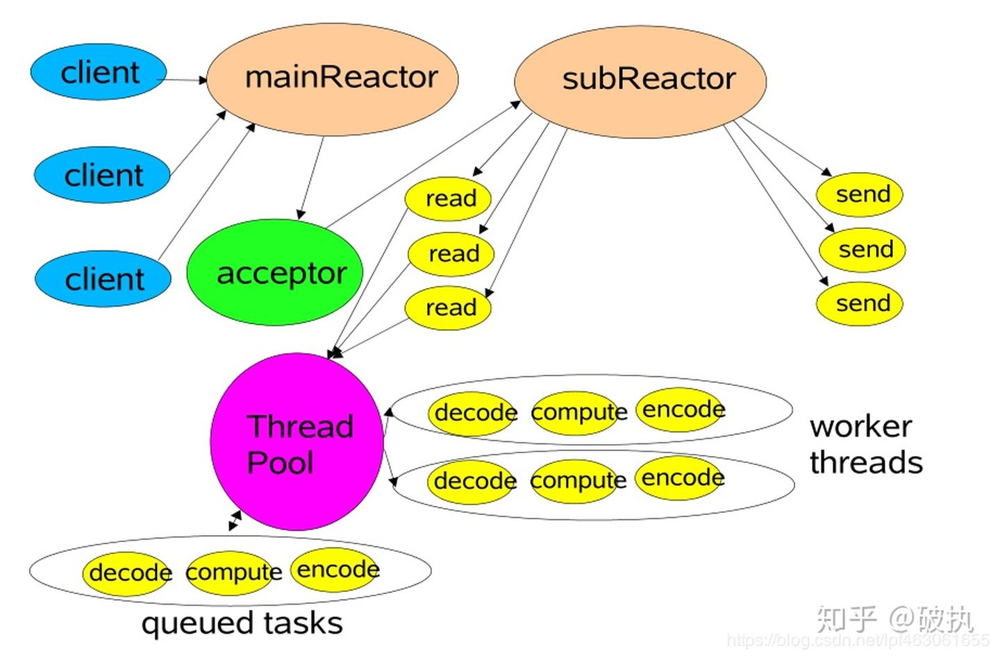

# Reactor 模式

一个网络连接对应于一个线程处理，是最原始的 Web 应用模型：

但是这种模型对每个连接都创造一个 handler 容易遇到瓶颈，负载增加时性能下降非常快：

1. `accept` 方法会阻塞等待 client 连接，直到 client 连接成功；
2. `read` 方法从 socket inputstream 读取数据，会阻塞线程直到完成数据读取；
3. `write` 方法会写入输入到 socket outstream，会阻塞线程直到数据写完；

上面列举的三种方法的特点是：都是引起 IO 的阻塞方法，这种原始的应用模式会导致大量线程空转。使用一个中心的 Reactor 来处理所有会引起阻塞的方法，就是 Reactor 模式：

而上面这种设计模式，Reactor 运行在单线程中，容易成为高并发计算机系统的性能瓶颈。

于是我们可以用一个线程池处理已经连接的所有客户端：

在多 CPU 的机器上 Reactor 又可以拆分成 mainReactor 和 subReactor：

