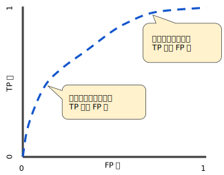
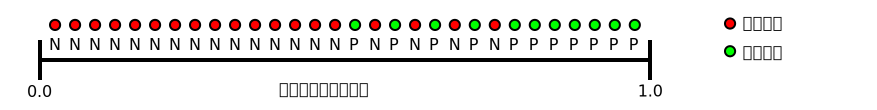

# 12.Classification

## 阈值

为了将逻辑回归值映射到二元类别，您必须指定**分类阈值**（也称为**判定阈值**）。

## 准确率

我们假设：

|    | $$H_0$$ 成立            | $$H_1$$ 成立            |
| -- | --------------------- | --------------------- |
| 接收 | 不犯错（**TP**）           | 第 II 类错误（取伪错误 **FP**） |
| 拒绝 | 第 I 类错误（弃真错误  **FN**） | 不犯错（**TN**）           |

**准确率**是指我们的模型预测正确的结果所占的比例：

* $$\displaystyle \text{Accuracy} = \frac{\text{Number of correct predictions}}{\text{Total number of predictions}}$$

对于二元分类，也可以根据正类别和负类别按如下方式计算准确率：

* $$\displaystyle \text{Accuracy} = \frac{TP+TN}{TP+TN+FP+FN}$$

当您使用**分类不平衡的数据集**（比如正类别标签和负类别标签的数量之间存在明显差异）时，单单准确率一项并不能反映全面情况。

## 精确率和召回率

精确率的定义如下：$$\displaystyle \text{Precision} = \frac{TP}{TP+FP}$$

从数学上讲，召回率的定义如下：$$\displaystyle \text{召回率} = \frac{TP}{TP+FN}$$

要全面评估模型的有效性，必须**同时**检查精确率和召回率。遗憾的是，精确率和召回率往往是此消彼长的情况。

我们已根据精确率和召回率指标制定了各种指标。有关示例，请参阅 [F1 值](https://wikipedia.org/wiki/F1\_score)。

## ROC 曲线

**ROC 曲线**（**接收者操作特征曲线**）是一种显示分类模型在所有分类阈值下的效果的图表，用于绘制采用不同分类阈值时的 TPR 与 FPR。

该曲线绘制了以下两个参数：

* 真正例率，即召回率：$$\displaystyle TPR = \frac{TP} {TP + FN}$$
* 假正例率：$$\displaystyle FPR = \frac{FP} {FP + TN}$$

下图显示了一个典型的 ROC 曲线：

**曲线下面积**的一种解读方式是看作模型将某个随机正类别样本排列在某个随机负类别样本之上的概率。

以下面的样本为例，逻辑回归预测从左到右以升序排列：

曲线下面积表示随机正类别（绿色）样本位于随机负类别（红色）样本右侧的概率。

曲线下面积因以下两个原因而比较实用：

* 曲线下面积的**尺度不变**。它测量预测的排名情况，而不是测量其绝对值。
* 曲线下面积的**分类阈值不变**。它测量模型预测的质量，而不考虑所选的分类阈值。

## 预测偏差

**预测偏差**指的是两个平均值之间的差值。即：

$$预测偏差 = 预测平均值 - 数据集中相应标签的平均值$$

如果出现非常高的非零预测偏差，则说明模型某处存在错误，因为这表明模型对正类别标签的出现频率预测有误。

您可能会通过对学习模型进行后期处理来纠正预测偏差，即通过添加**校准层**来调整模型的输出，从而减小预测偏差。

分桶偏差。

## 关键字词

[二元分类](https://developers.google.cn/machine-learning/crash-course/glossary#binary_classification)、[分类模型](https://developers.google.cn/machine-learning/crash-course/glossary#classification_model)、[混淆矩阵](https://developers.google.cn/machine-learning/crash-course/glossary#confusion_matrix)、[负类别](https://developers.google.cn/machine-learning/crash-course/glossary#negative_class)、[正类别](https://developers.google.cn/machine-learning/crash-course/glossary#positive_class)、\[假负例]\([https://developers.google.cn/machine-learning/crash-course/glossary#false_negative\_(FN))、\[假正例\]\(https://developers.google.cn/machine-learning/crash-course/glossary#false_positive\_(FP))、\[真负例\]\(https://developers.google.cn/machine-learning/crash-course/glossary#true_negative\_(TN))、\[真正例\]\(https://developers.google.cn/machine-learning/crash-course/glossary#true_positive\_(TP))、\[曲线下面积\]\(https://developers.google.cn/machine-learning/crash-course/glossary#AUC)、\[ROC](https://developers.google.cn/machine-learning/crash-course/glossary#false_negative_\(FN\)\)%E3%80%81\[%E5%81%87%E6%AD%A3%E4%BE%8B]\(https://developers.google.cn/machine-learning/crash-course/glossary#false_positive_\(FP\)\)%E3%80%81\[%E7%9C%9F%E8%B4%9F%E4%BE%8B]\(https://developers.google.cn/machine-learning/crash-course/glossary#true_negative_\(TN\)\)%E3%80%81\[%E7%9C%9F%E6%AD%A3%E4%BE%8B]\(https://developers.google.cn/machine-learning/crash-course/glossary#true_positive_\(TP\)\)%E3%80%81\[%E6%9B%B2%E7%BA%BF%E4%B8%8B%E9%9D%A2%E7%A7%AF]\(https://developers.google.cn/machine-learning/crash-course/glossary#AUC\)%E3%80%81\[ROC) 曲线]\([https://developers.google.cn/machine-learning/crash-course/glossary#ROC](https://developers.google.cn/machine-learning/crash-course/glossary#ROC))
