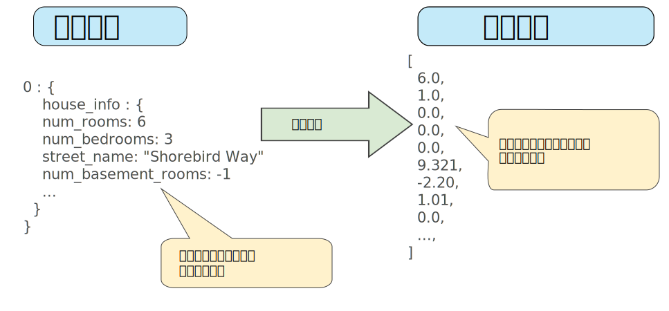
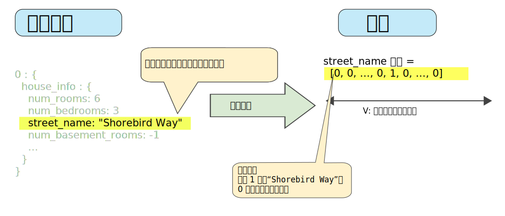
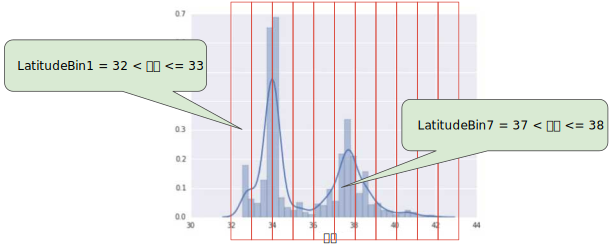

# 8.Representation

## 特征工程

### 将原始数据映射到特征

下图左侧表示来自输入数据源的原始数据，右侧表示**特征矢量**，也就是组成数据集中样本的浮点值集。 **特征工程**指的是将原始数据转换为特征矢量。进行特征工程预计需要大量时间。

许多机器学习模型都必须将特征表示为实数向量，因为特征值必须与模型权重相乘。



### 数据表示

映射数值：

* 整数和浮点数据不需要特殊编码，因为它们可以与数字权重相乘。

映射分类值：

* [分类特征](https://developers.google.cn/machine-learning/glossary#categorical_data)具有一组离散的可能值。
*   由于模型不能将字符串与学习到的权重相乘，因此我们使用特征工程将字符串转换为数字值：

    要实现这一点，我们可以定义一个从特征值（我们将其称为可能值的**词汇表**）到整数的映射。世界上的每条街道并非都会出现在我们的数据集中，因此我们可以将所有其他街道分组为一个全部包罗的“其他”类别，称为 **OOV（词汇表外）分桶**。
*   这种编码存在不能设置权重、不能同时表示多个等限制。

    要去除这些限制，我们可以为模型中的每个分类特征创建一个二元向量来表示这些值，如下所述：

    * 对于适用于样本的值，将相应向量元素设为 `1`。
    * 将所有其他元素设为 `0`。
* 该向量的长度等于词汇表中的元素数。当只有一个值为 1 时，这种表示法称为**独热编码**；当有多个值为 1 时，这种表示法称为**多热编码**。例子如下图：



### 稀疏表示法

假设数据集中有 100 万个不同的街道名称，您希望将其包含为 `street_name` 的值。如果直接创建一个包含 100 万个元素的二元向量，其中只有 1 或 2 个元素为 ture，则是一种非常低效的表示法，在处理这些向量时会占用大量的存储空间并耗费很长的计算时间。在这种情况下，一种常用的方法是使用[稀疏表示法](https://developers.google.cn/machine-learning/glossary#sparse_representation)，其中仅存储非零值。在稀疏表示法中，仍然为每个特征值学习独立的模型权重，如上所述。

### 关键词

[离散特征](https://developers.google.cn/machine-learning/glossary#discrete_feature)、[特征工程](https://developers.google.cn/machine-learning/glossary#feature_engineering)、[独热编码](https://developers.google.cn/machine-learning/glossary#one-hot_encoding)、[表示](https://developers.google.cn/machine-learning/glossary#representation)

## 良好的特征工程

### 1. 避免很少使用的离散特征值：

良好的特征值应该在数据集中出现大约 5 次以上。

相反，如果某个特征的值仅出现一次或者很少出现，则模型就无法根据该特征进行预测。

### 2. 最好具有明确清晰的含义：

每个特征对于项目中的任何人来说都应该具有清晰明确的含义。

### 3. 不要将“神奇”的值与实际数据混为一谈。

为解决神奇值的问题，需将该特征转换为两个特征：

* 一个特征只存储质量评分，不含神奇值。
* 一个特征存储布尔值，表示是否提供了 `quality_rating`。为该布尔值特征指定一个名称，例如 `is_quality_rating_defined`。

### 4. 考虑上游的不稳定性：特征的定义不应随时间发生变化。

例如：下列值是有用的，因为城市名称一般不会改变。（注意，我们仍然需要将 `“br/sao_paulo”` 这样的字符串转换为独热矢量。）

```
city_id: "br/sao_paulo"
```

但收集由其他模型推理的值会产生额外成本。可能值“219”目前代表圣保罗，但这种表示在未来运行其他模型时可能轻易发生变化：

```
inferred_city_cluster: "219"
```

## 清理数据

### 1. 缩放特征值

**缩放**是指将浮点特征值从自然范围（例如 100 到 900）转换为标准范围（例如 0 到 1 或 -1 到 +1）。如果某个特征集只包含一个特征，则缩放可以提供的实际好处微乎其微或根本没有。不过，如果特征集包含多个特征，则缩放特征可以带来以下优势：

* 帮助梯度下降法更快速地收敛。
* 帮助避免“NaN 陷阱”。在这种陷阱中，模型中的一个数值变成 [NaN](https://wikipedia.org/wiki/NaN)（例如，当某个值在训练期间超出浮点精确率限制时），并且模型中的所有其他数值最终也会因数学运算而变成 NaN。
* 帮助模型为每个特征确定合适的权重。如果没有进行特征缩放，则模型会对范围较大的特征投入过多精力。

您不需要对每个浮点特征进行完全相同的缩放。即使特征 A 的范围是 -1 到 +1，同时特征 B 的范围是 -3 到 +3，也不会产生什么恶劣的影响。不过，如果特征 B 的范围是 5000 到 100000，您的模型会出现糟糕的响应。

### 2. 处理极端的离群值

如何最大限度降低这些极端离群值的影响？

1.  一种方法是对每个值取对数。

    对数缩放可稍稍缓解这种影响，但仍然存在离群值这个大尾巴。
2. 只是简单地将的最大值“限制”为某个任意值（比如 4.0），所有大于 4.0 的值都将变成 4.0。

### 3. 分箱

为了将纬度变为一项实用的预测指标，我们对纬度“分箱”，如下图所示：



我们现在拥有 11 个不同的布尔值特征（`LatitudeBin1`、`LatitudeBin2`、…、`LatitudeBin11`），而不是一个浮点特征。拥有 11 个不同的特征有点不方便，因此我们将它们统一成一个 11 元素矢量。这样做之后，我们可以将纬度 37.4 表示为：

```
[0, 0, 0, 0, 0, 1, 0, 0, 0, 0, 0]
```

### 4. 清查

截至目前，我们假定用于训练和测试的所有数据都是值得信赖的。在现实生活中，数据集中的很多样本是不可靠的，原因有以下一种或多种：

* **遗漏值。** 例如，有人忘记为某个房屋的年龄输入值。
* **重复样本。** 例如，服务器错误地将同一条记录上传了两次。
* **不良标签。** 例如，有人错误地将一颗橡树的图片标记为枫树。
* **不良特征值。** 例如，有人输入了多余的位数，或者温度计被遗落在太阳底下。

### 关键词

关键字词：

[分箱](https://developers.google.cn/machine-learning/crash-course/glossary#binning)、[特征集](https://developers.google.cn/machine-learning/crash-course/glossary#feature_set) 、[NaN 陷阱](https://developers.google.cn/machine-learning/crash-course/glossary#NaN_trap)、[离群值](https://developers.google.cn/machine-learning/crash-course/glossary#outliers)、[缩放](https://developers.google.cn/machine-learning/crash-course/glossary#scaling)
