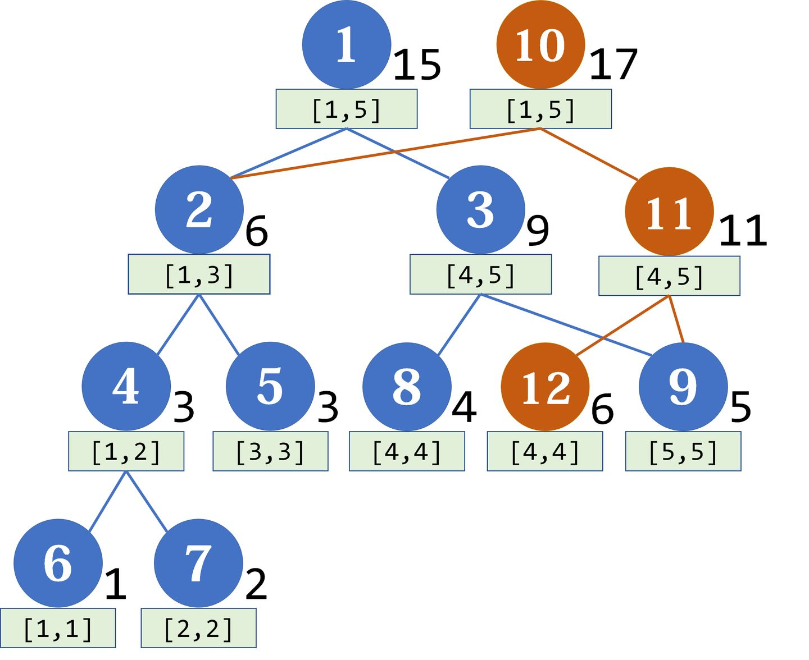

> 主席树全称“可持久化权值线段树”

什么是“可持久化数据结构”？

- 可持久化数据结构 (Persistent data structure) 总是可以保留每一个历史版本，并且支持操作的不可变特性 (immutable)。

一个最朴素的思路是每个版本都维护一个新的线段树：

```
		Root1				Root2			Root3
			｜					 |				  |
	 初始版本			更新操作1		更新操作2
```

一个显然的思路是：这个思路的空间复杂度特别高。

我们的某次更新操作只需要更改某个叶子结点的值，但是我们却需要复制整个线段树。“主席树”就是这样一个将提升空间复杂度利用率的数据结构。比如下图：



蓝色的是初始化的树结构，橙色的节点是进行了一次插入 `(value: 4, count: 2)` 之后的第二个版本的结构，可见第二个版本复用了第一个版本的需求节点。在查询时与普通的线段树类似，除了我们需要指定在哪个版本的根结点进行查询。
