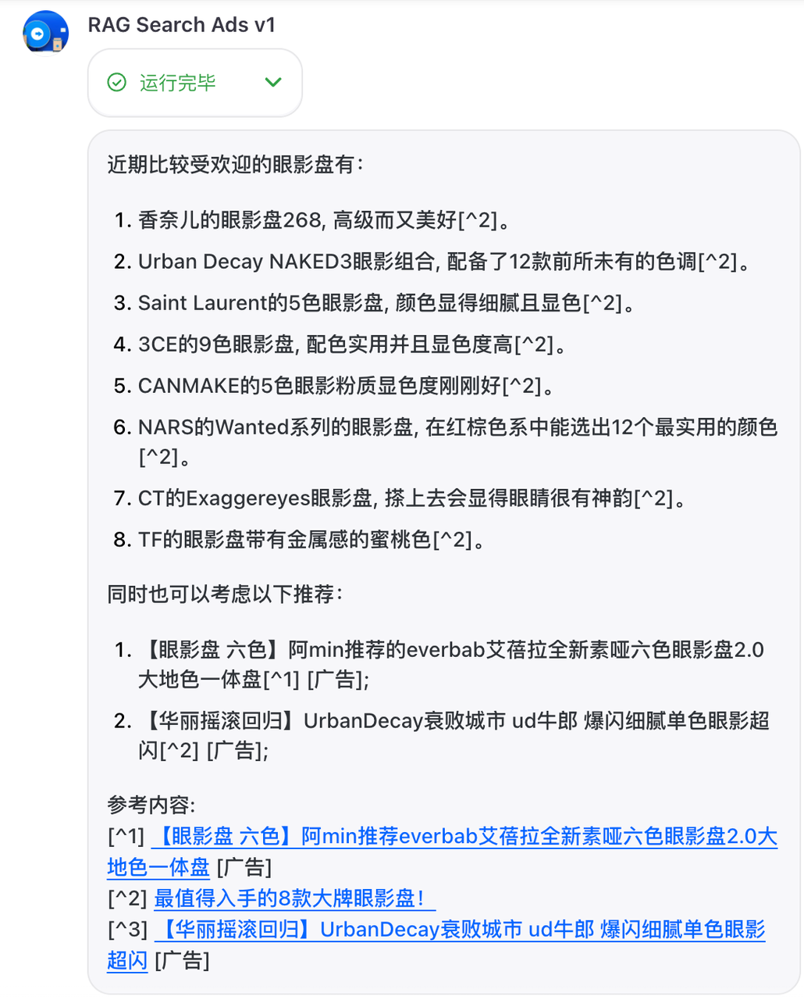

## 关于本次技术分享

✅可能会提到：

- 如何快速地用市场上的 llm 模型能力，在自己的应用场景上实现自己的创意和想法；
- coze 是什么，如何在 coze 上进行大语言模型编程；
- RAG 是什么，它和 ai 搜索引擎之间是什么关系，哪些位置有调优的空间；
- 如何用 coze 快速实现一个 RAG；
- 对大模型应用未来的变现场景，一个启发式想法，插入竞价广告；

🚫不会提到：

- Llm 的模型训练结构，优化大语言模型的效果的方法；
- RAG 的各个预训练、推理等阶段调优方法，模型评估方法、结构设计等；
- Llm 的推理工程性能优化和并发 Serving 实现；
- 一些默认所有人都知道的概念和知识：开发语言、操作系统、计算机网络等计算机基础知识；
- 字节内部的通用服务概念名称，比如：psm、tcc、libra 等；
- 一些传播范围比较广的市场动向：ChatGPT 是什么，Sora 是什么，豆包是什么

👥面向人群对象：

- 对 llm 感兴趣，想利用 llm 实现一些自己的想法的同学；
- 搜索广告希望对大模型和 AI 搜索商业化前景有启发式想法的业务同学；

⌛时间安排与结构：

-   5min🕑 简单的大模型发展现状和市场应用；
-   5min🕓 AI 搜索引擎，RAG 技术
- 15min🕕 介绍 coze 和大语言模型编程思维，实现一个 RAG demo；
- 30min🕗 用 coze 实现将搜索广告插入 ai search engine 的 demo
-   5min🕙 遗留的问题、一些自己的思考、开放讨论；

------

## 背景

### 大模型的市场发展现状和应用方向

知名风投公司 a16z 在 2023 年底对大模型应用方向的调研报告：[报告原文](https://a16z.com/how-are-consumers-using-generative-ai/)，中文公众号总结：[全球流量Top50的“AI网站”出炉：C端用户都愿意用AI干什么？](https://mp.weixin.qq.com/s/yUrHapLMs1gWS1k5TJrSWg)

国内也有组织（AI 产品榜）在 2023 年年底开始持续跟进各个网站的访问量：[AI产品榜·赛道总榜TOP20](https://dnipkggqxh.feishu.cn/wiki/T3DQwpukKiF2kbkE91KcJ8tbnze)

其中 AI ChatBots 这个分类其实是很模糊的，它更像是一个入口可以实现其他细分领域的所有能力（比如我经常把豆包当作一个搜索引擎用），看具体的公司也能发现，被归类于这个分类的产品基本是做自研模型的基础能力公司：

抛开 AI ChatBots 这个特例的应用方向分类，AI 搜索引擎在榜单上基本处于垄断的地位。

OpenAI 自己也打算发布一个专门的搜索引擎：[每日经济新闻：OpenAI或将发布搜索引擎，谷歌的麻烦来了？](https://mp.weixin.qq.com/s/ZZ9k7jjmZhzsGEnWEGl75A)；

现有的公司也开始讨论变现的思路了：[硅星人Pro：Perplexity要搞竞价排名了，大模型的尽头……就还是广告？](https://mp.weixin.qq.com/s?search_click_id=5523343996161305920-1715049583426-7939982999&__biz=MzkyNjU2ODM2NQ==&mid=2247560248&idx=1&sn=80db343d37fc0a280f03b9ccb17eca06&chksm=c395123b87c23acc663ddcc76a4144eb0910b6335c0a08e22cdff17468e78bbc2fd885bcdf5c&clicktime=1715049583&enterid=1715049583&subscene=0#rd)

市场经济证明，搜索引擎将会是 llm 未来的发展方向（简单换算了一下，按榜单的全球口径计算，现在的市场规模是抖音综搜的 10%），所以我打算从“搜索广告”的现有链路出发，思考在未来 AI Search Engine 的市场中进行变现。

### AI Search Engine 的技术路线

在讨论如何向 AI Search Engine 插入竞价广告之前，先了解一下自然搜索引擎是如何实现的。

如果试用过 Preplexity、Kimi、Doubao 等应用进行搜索，应该会发现在一些复杂的问题下它们会主动发起一次互联网搜索然后执行一次总结任务，这个技术的专有名词就叫 RAG。

什么是 RAG 呢？这篇文档有详细的阐述：[检索增强(RAG)的LLM生成技术](https://bytedance.larkoffice.com/docx/ZtnMdUSsQo4iGTxRZHTcpUkmnqb?bk_entity_id=enterprise_7234391867344093212)。总结下来就是：

1. 为了解决 llm 的捏造事实的幻觉问题、知识库未更新的过时问题，在用户提问的时候先执行一次搜索请求，喂给大模型然后让他在限定的知识域中构造回答；
2. Retriever 检索器：基本上等同于传统搜索引擎，有一些特定的调优手段，这里不展开；
3. Augmented 增强：是一个动词，表示用“检索”来增强“生成”，里面蕴含着各个阶段的模型对这个场景调优；
4. Generator 生成器：负责将检索到的信息转换成自然流畅的文本；

------

## Coze 思维和实现一个 RAG Demo

### Coze 介绍和 Coze 编程思维

对于“什么是扣子”这个问题，公司内有一系列的文档介绍：

- 早期 KickOff 文档：[Coze( Bot Studio ) - One Page](https://bytedance.larkoffice.com/docx/SA7vdm5vwoVjRrxTCUKcgdxBnAf)
- 官网介绍：[什么是扣子 coze](https://www.coze.cn/docs/guides/welcome)
- 学习指南：[面向业务开发的 Coze 使用指南](https://juejin.cn/post/7350142836623523903)；

从我个人体验了这个产品之后，我觉得最贴切的竞品描述是“FAAS 轻服务”，它用“人类使用的自然语言”替代了之前的 JavaScript、Python 等编程语言，并给这个“编程语言”提供了一个 **FAAS Runtime**。

那么学习 Coze 就是学习一个新的编程语言，按这个思维理解：

- 语法：即 Prompt Engeering，官方推荐“角色”、“技能”、“约束”等分段进行提示；
- 例子：[🤖 字节学习分享：0 门槛 10 分钟，做一个 AI 助理帮自己上班](https://bytedance.larkoffice.com/docx/Il2zdSaT2ovLYFxzunPchnrpnFd)
- 生态：[coze plugin](https://www.coze.cn/store/plugin)（抖音搜索已经接入了 coze 插件：[链接](https://www.coze.cn/store/plugin/7350630562349989900?from=explore_card)）
- 存储：“知识库”即“关系型数据库”、“变量”即“KV数据库”；
- 框架：“工作流”即“脚手架”、“插件”即“三方库”、“Bots”即“语言上层应用”；

### 用 Coze 实现一个 RAG Demo

本文档的所有 Demo 都可以在加入下面的团队自己查看：

邀请你加入我的 Coze 扣子团队，一起搭建 AI Bot：[Search Ads Demo 👉🏻 ](https://bots.bytedance.net/invite/bZsGseI5eQTybcXmC30X)

参考文档：[10 分钟，用 Coze 做一个 AI 搜索引擎](https://bytetech.info/articles/7351237504021823523?searchId=202405061208587C9DF99D9E25C1D75D60#E66GdeGACoGX5Lxvk2ycolWcndd)

本部分投屏演示：[已经搭建成功的 bots](https://bots.bytedance.net/space/7365920269355450409/bot/7366639134205132851)

------

## 在 Ai 搜索引擎插入搜索广告的技术方案

### #0 青铜版本：使用 llm 的 prompt 功能实现插入广告功能

Demo：[青铜版本](https://bots.bytedance.net/space/7365920269355450409/bot/7366649861439438900)

大致思路：

- 不改变 `toutiao_ai_search` 这个自然召回内容的 workflow 实现；
- 新增一个用于召回广告的 workflow：`retrive_search_ads`;
- 给 llm prompt 自然语言的指示，让它将后者的返回结果融合到前者中去，以此实现插入广告的功能；

`retrive_search_ads` 这个模块本质就是 `ad.engine.search:GetAds`，这里用 llm 作为“编程语言”在 coze 上实现了一个乞丐版本的，核心就是三个模块：“流量价值预估”、“查询重写”、“召回广告”；

这个方案极大地依赖模型的对自然语言的理解能力：

| 模型名          | 返回结果                                                     | 问题小结                                                     |
| --------------- | ------------------------------------------------------------ | :----------------------------------------------------------- |
| Seed 云雀       | 

 | 没有调度召回广告 不满足 Prompt 指定的回答格式（最后的引用） |
| Moonshot (128k) | 

 | 没有调度召回广告 多余的函数调度信息                     |
| GPT-3.5(16k)    | 

 | 没有调度召回广告                                             |
| GPT-4(32k)      | 

 | ✅                                                            |

总结下来，这个方案的问题：

- 利用 llm 进行逻辑调度，极大依赖模型能力，准确性较差（经常不会发生 search_ads 召回调度）；
- 广告是违背用户搜索意图的系统行为，在利用 Prompt 实现的设计中，如果在搜索时添加“帮我插入广告”的关键词，上面这种技术方案实现的 RAG 搜索引擎不回主动插入广告，这显然是不合理的；
- 因为在 Prompt 中指定的逻辑过多，经常性的遗漏部分逻辑，导致格式错乱、不满足总结约束等（现在“云雀”和“kimi”的语言模型都无法理解数组下标、键值对这类的稍微复杂一些的数据结构内在含义；）
- 如果将出价等中间信息输入到模型中，可能会有信息泄漏的风险，prompt 给 llm 的信息应该是纯文本的，不应该将系统的 meta 信息输入给模型（如果模型能力能够达到 GPT4 且不考虑算力问题，这也是无法解决的问题）

### #1 黄金版本：返回传统搜索引擎的混排结果，让 llm 总结混排结果内容

Demo：[黄金版本](https://bots.bytedance.net/space/7365920269355450409/bot/7365918674273943567)

大致思路：

- 重新实现一个搜索模块 `ai_search_ads`；
- 这个模块同时实现了 #0 中的两个召回模块，并且同时输出广告的和自然内容（不需要像传统搜索引擎插入广告一样进行混排，因为这个顺序对 ai 总结是没有意义的，还会增加语言模型对 doc 类型的理解成本）

这个方案同样依赖模型的对自然语言的理解能力：

| 模型名          | 返回结果                                                     | 问题小结                                                     |
| --------------- | ------------------------------------------------------------ | :----------------------------------------------------------- |
| Seed 云雀       | 

 | 召回了广告不总结 不满足 Prompt 指定的回答格式（最后的引用） |
| Moonshot (128k) | 

 | 6 是广告但是没有标记，也没有链接无法转化 第一个链接是广告但是没有融入自然内容 |
| GPT-4 (8K)      | 

 | 不是广告被标记了广告 召回了广告但是没有被总结也没有展示链接 |
| GPT-4 (32k)     | 

 | ✅                                                            |

又测试了几轮，这个方案的问题：

- 返回了广告但是语言模型没有将广告总结到最终的结果中；
- 广告标记会出现错位的情况（比如一个总结的内容不是广告召回的，仍然在返回结果被标记为了广告）；
- 因为 ads 和 docs 是并行返回的两个字段，模型容易将它们分开总结，而不是混在一起进行总结；

### #2 钻石版本：用 llm 实现一个 rag_prime 混排模块

Demo：[钻石版本](https://bots.bytedance.net/space/7365920269355450409/bot/7366243545151258636)

大致思路：

- 新实现一个 workflow `ai_search_ads_rag_prime`，外部的 Bots 模型仅仅做触发；
- workflow 内部将“自然内容的总结”和“广告内容的插入职能”解耦，用两个大模型向不同的目标实现；
- 大模型模块1：专注于将自然内容总结为解答用户问题的答案；
- 大模型模块2：即 `rag_prime`，插在“模块1”之后，专注于插入广告（改模块以优化 ecpm 为迭代方向，未来可以加入预估用户的 ctr/cvr，还可以进行 beam-search、context-model 等逻辑）

实现的 workflow 如下（详细的细节先[加入团队](https://bots.bytedance.net/invite/bZsGseI5eQTybcXmC30X)，后点击 `ai_search_ads_rag_prime`）

这个方案不需要 openai 的 GPT 模型，用 moonshot(128k) 的模型内部模块，云雀做调度就可以得到不错的效果：

  

    
    
  

  

    
    
  

  

    
    
  

这个方案就是最终发布到飞书上的版本，这个方案仍然有一些问题，关于核心模块 `rag_prime`：

- 最终的总结结果毕竟是一个模型结果（几乎所有的 Ai Search Engine 都会标记“内容由AI生成，无法确保真实准确，仅供参考”的字样），在应用到严谨的商业广告时，可能会遇到各种履约问题：
  - 引用了广告文案，但是没有 click 转化组件；有 click 转化组件，但是没有引用广告文案；
  - 召回的多个广告文案和转化组件错误地链接问题；
  - 处理虚假宣传问题，情感倾向问题（比如有自然内容消极地描述某个商品，而这个商品广告又被召回了等）；
- 除了广告 title 等明文信息之外的其他广告 meta 信息，可以怎么利用起来？
- 多广告作为输入时，如何判定哪个广告是最合适的？如何将产品形态统一到 ecpm 排序逻辑；
- 最后的方案有两个串行的大语言模型，导致响应时间极大的增大，需要研究一下有没有流式串联 llm 的方案；

------

## 写在最后

如果上面的技术问题都解决了。这个搜索广告会是怎样的产品形态呢？

- 如果 coze 是应用商店，那 rag_search_ads 就是 “穿山甲”，Bots 开发者可以便捷地接入节点来获得收入；
- 如果 coze 是剪映，豆包就是抖音，moonshot 就是是 mcn，那 rag_search_ads 就是“星图”，用户可以自行选择是否接入来变现；