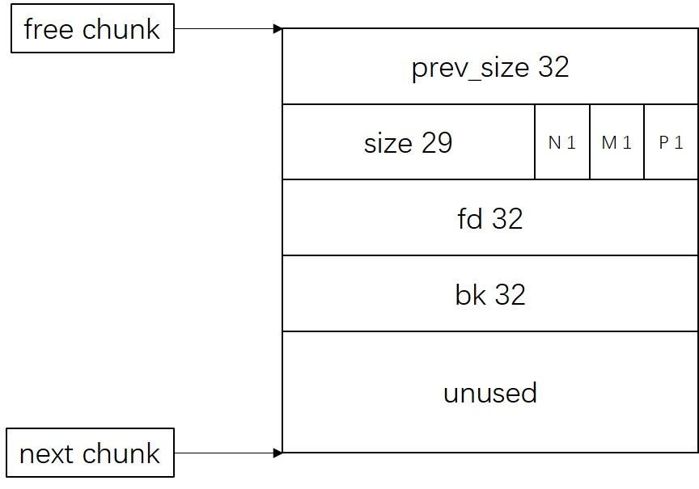
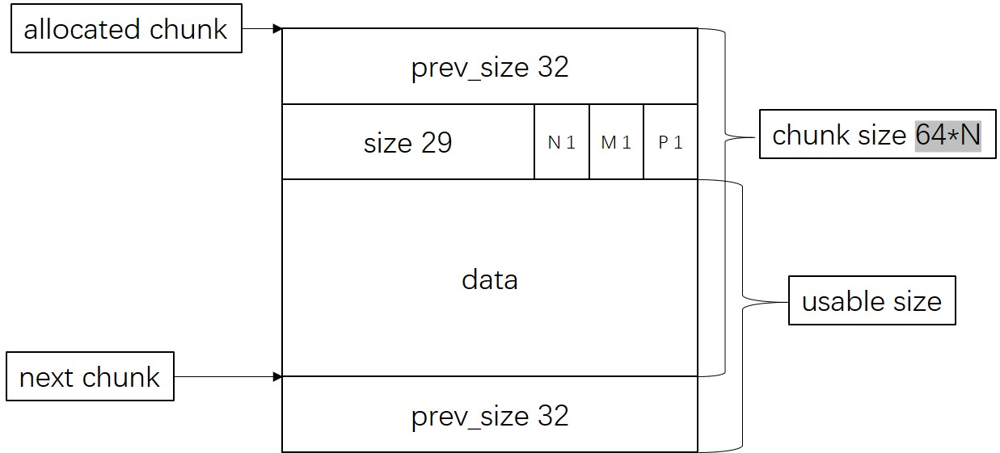
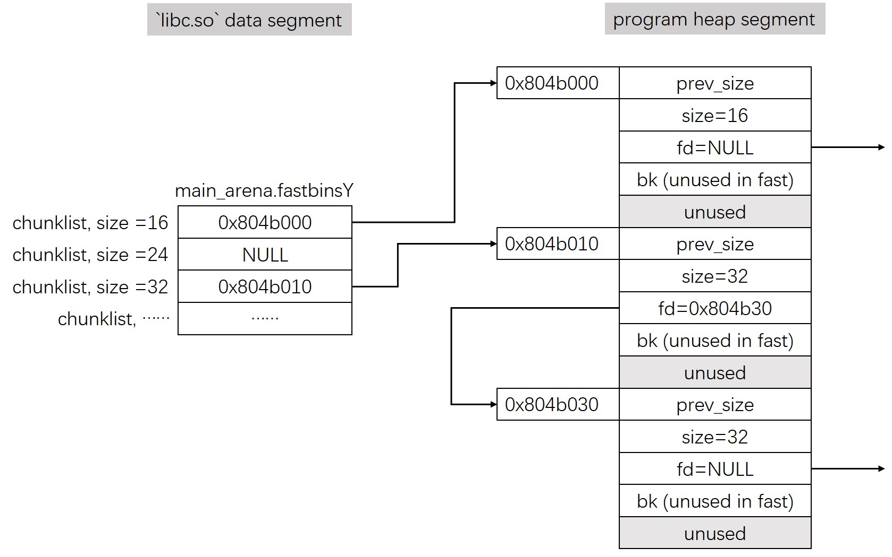
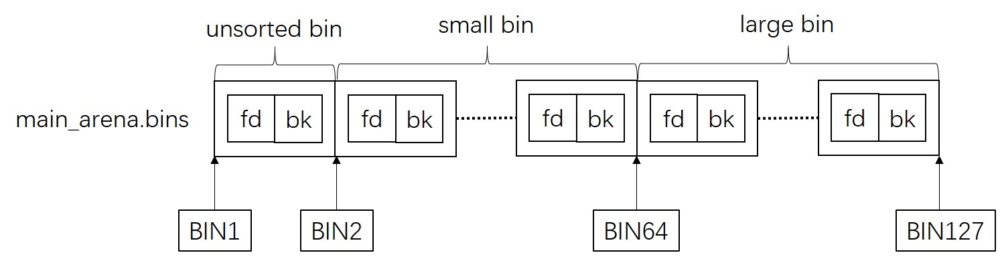

> 参考：
> 
> - 长亭科技, 堆的概念
> - <http://p4nda.top/2018/03/20/tcache/>
> - <https://ctf-wiki.github.io/ctf-wiki/pwn/linux/glibc-heap/tcache_attack-zh/>


## 什么是堆

堆的一些特点：

- 堆是可以根据运行时的需要进行动态分配和释放的内存，大小可变；
- 堆的实现重点关注内存块的组织和管理方式（尤其时空闲的内存块）：
  - 如何提高分配和释放的时间效率；
  - 如何降低碎片化，提高空间利用率；

常见堆的实现：

- `dlmalloc`：通用分配器；
- **`ptmalloc2`：`glibc` 函数，基于 `dlmalloc`，支持多线程**；
- `jemalloc`：`FreeBSD`、`FireFox`、`Android`；内存占用更高，但是在多核多线程下的表现也最为优异。
- `tcmalloc`：`Google Chrome`、`Golang`；针对多核情况有所优化，性能有所提高，但是内存占用稍高，大内存分配容易出现 CPU 飙升。
- `libumem`：`Solaris`；
- `Windows 10`：`segment heap`。

> 相关资料：
>
> - https://www.cyningsun.com/07-07-2018/memory-allocator-contrasts.html#%E7%B3%BB%E7%BB%9F%E5%90%91%E7%9C%8Bptmalloc%E5%86%85%E5%AD%98%E7%AE%A1%E7%90%86


## Glibc 相关结构

下面介绍管理 `glic` 堆的各种数据结构：

### `arena`

`arena` 指的是内存区域本身，并非一个结构：

1. 主线程的堆由 `sbrk` 创建，称为 **`main arena`**；
2. 其他线程的堆由 `mmap` 创建，称为 **`per thread arena`**；

`arena` 的数量受 CPU 核数的限制：

- 对于 32 位系统：`数量上限 = 2 * 核数`
- 对于 64 位系统：`数量上限 = 8 * 核数`

### `malloc_state`

它是管理 `arena` 的核心结构，其定义在 `glibc`  源码的 `/malloc/malloc.c` 这个文件中：

```c
struct malloc_state
{
  /* Serialize access.  */
  __libc_lock_define (, mutex);

  /* Flags (formerly in max_fast).  */
  int flags;

  /* Set if the fastbin chunks contain recently inserted free blocks.  */
  /* Note this is a bool but not all targets support atomics on booleans.  */
  int have_fastchunks;

  /* Fastbins */
  mfastbinptr fastbinsY[NFASTBINS];

  /* Base of the topmost chunk -- not otherwise kept in a bin */
  mchunkptr top;

  /* The remainder from the most recent split of a small request */
  mchunkptr last_remainder;

  /* Normal bins packed as described above */
  mchunkptr bins[NBINS * 2 - 2];

  /* Bitmap of bins */
  unsigned int binmap[BINMAPSIZE];

  /* Linked list */
  struct malloc_state *next;

  /* Linked list for free arenas.  Access to this field is serialized
     by free_list_lock in arena.c.  */
  struct malloc_state *next_free;

  /* Number of threads attached to this arena.  0 if the arena is on
     the free list.  Access to this field is serialized by
     free_list_lock in arena.c.  */
  INTERNAL_SIZE_T attached_threads;

  /* Memory allocated from the system in this arena.  */
  INTERNAL_SIZE_T system_mem;
  INTERNAL_SIZE_T max_system_mem;
};
```

同样在文件 `/malloc/malloc.c` 中，定义了全局变量 `main_arena` 管理主线程的 `malloc_state`：

```c
static struct malloc_state main_arena =
{
  .mutex = _LIBC_LOCK_INITIALIZER,
  .next = &main_arena,
  .attached_threads = 1
};
```

### `malloc_chunks`

内存块的结构，`glibc` 源码的 `./malloc/malloc.c` 这个文件中定义：

```c
struct malloc_chunk {

  INTERNAL_SIZE_T      mchunk_prev_size;  /* Size of previous chunk (if free).  */
  INTERNAL_SIZE_T      mchunk_size;       /* Size in bytes, including overhead. */

  struct malloc_chunk* fd;         /* double links -- used only if free. */
  struct malloc_chunk* bk;

  /* Only used for large blocks: pointer to next larger size.  */
  struct malloc_chunk* fd_nextsize; /* double links -- used only if free. */
  struct malloc_chunk* bk_nextsize;
};
```

空闲内存块的结构大致如下（字段右侧为32 位平台下的比特位长）：



1. 第一个字段 `prev_size` 存储了，物理地址上的前一个 `chunk` 的大小。
2. 第二个字段 `size` 记录了当前 `chunk` 的大小。最后三个比特位被用作其他含义：
   1. `P` 代表 `PREV_INUSE`，指明前一个 `chunk` 是否被使用；
   2. `M` 代表 `IS_MAPPED`，代表当前的 `chunk` 是否通过 `mmap` 方式创建出来的；
   3. `N` 代表 `NON_MAIN_ARENA`，代表当前 `chunk` 是否属于其他线程堆（主线程值为 0）；
3. 第三四个字段为前向指针与后向指针，这两个字段用于 `bin` 链表中。

已分配内存块的结构大致如下：



1. 前两个字段与空闲的内存块大致相同；

2. 用户可用的数据是第三个字段开始一直到下一个 `chunk` 的第一个字段。这是因为：
   
   - `prev_size` 只有当前一个字段是空闲的时候才有意义，如果前一个字段已经分配，堆管理器不关心；
   
   这也就是说，在 32 位程序中，如果用户申请了 16 个字节的空间，其对应的 `chunk` 数据结构的 `data` 段只会有 12 个字节，用户加上下一个 `chunk` 的 `prev_size` 空间，一共可以使用 16 个字节。
   
   但是 `size` 记录的是 `prev_size` 起始到下一个 `prev_size` 起始之间的大小。
   
3. 在 32 位平台下，`chunk` 的大小一定是 8 字节的整数倍（所以 `size` 的最低三个比特位是无用的）。`malloc` 返回地址指针为 `data` 的起始位置。

### `fastbins`

`bins` 是根据 `chunk` 的大小和状态，用来管理和组织空闲块的，链表的数组结构。

`fastbins` 用于管理最小的 `chunk`。他存储在了 `malloc_state` 中的数组变量 `fastbinsY` 中。它同样定义在 `/malloc/malloc.c` 这个文件中：

```c
/*
   Fastbins

    An array of lists holding recently freed small chunks.  Fastbins
    are not doubly linked.  It is faster to single-link them, and
    since chunks are never removed from the middles of these lists,
    double linking is not necessary. Also, unlike regular bins, they
    are not even processed in FIFO order (they use faster LIFO) since
    ordering doesn't much matter in the transient contexts in which
    fastbins are normally used.

    Chunks in fastbins keep their inuse bit set, so they cannot
    be consolidated with other free chunks. malloc_consolidate
    releases all chunks in fastbins and consolidates them with
    other free chunks.
 */

typedef struct malloc_chunk *mfastbinptr;
#define fastbin(ar_ptr, idx) ((ar_ptr)->fastbinsY[idx])
```

可以得出它有以下这些特点：

1. 它是一个单向链表（因为从来不会需要从中间移除元素的操作，不需要双向链表）；
2. 后进先出（其他的垃圾回收结构是先进先出）；
3. `chunk` 被清理时，`PREV_INUSE` 标志位不会被清零；
4. 32 位系统中，`fastbin` 中默认支持最大的 chunk 的数据空间大小为 64 字节。但是 `glibc` 可以支持的 chunk 的数据空间最大为 80 字节。
5. 一共有十个 `fastbins`；
6. 相邻的空闲的 `fastbin chunk` 不会被合并。

下面是一个 32 位程序在运行时的 `fastbins` 示例图：



### `bins` (`small & large & unsorted`)

源码中有一段注释解释这些 `bins`：

```c
/*
   Bins

    An array of bin headers for free chunks. Each bin is doubly
    linked.  The bins are approximately proportionally (log) spaced.
    There are a lot of these bins (128). This may look excessive, but
    works very well in practice.  Most bins hold sizes that are
    unusual as malloc request sizes, but are more usual for fragments
    and consolidated sets of chunks, which is what these bins hold, so
    they can be found quickly.  All procedures maintain the invariant
    that no consolidated chunk physically borders another one, so each
    chunk in a list is known to be preceeded and followed by either
    inuse chunks or the ends of memory.

    Chunks in bins are kept in size order, with ties going to the
    approximately least recently used chunk. Ordering isn't needed
    for the small bins, which all contain the same-sized chunks, but
    facilitates best-fit allocation for larger chunks. These lists
    are just sequential. Keeping them in order almost never requires
    enough traversal to warrant using fancier ordered data
    structures.

    Chunks of the same size are linked with the most
    recently freed at the front, and allocations are taken from the
    back.  This results in LRU (FIFO) allocation order, which tends
    to give each chunk an equal opportunity to be consolidated with
    adjacent freed chunks, resulting in larger free chunks and less
    fragmentation.

    To simplify use in double-linked lists, each bin header acts
    as a malloc_chunk. This avoids special-casing for headers.
    But to conserve space and improve locality, we allocate
    only the fd/bk pointers of bins, and then use repositioning tricks
    to treat these as the fields of a malloc_chunk*.
 */
```

其中 `small bins` 有以下的特点：

1. `chunk` 的大小小于 512 字节；
2. 共有 62 个双向循环链表，每个链表中存储着相同大小的 `chunk`；
3. 先进先出；
4. 当有相邻的空闲内存块时，`chunk` 会被合并成一个更大的 `chunk`。

`large bins` 有以下的特点：

1. `chunk` 的大小大于 512 字节；
2. 共有 63 个双向循环链表，大小相近的 `chunk` 放在同一个 `bin` 中；
3. `chunk` 按照大小从大到小排序；
4. 先进先出；
5. 当有相邻的空闲内存块时，`chunk` 会被合并成一个更大的 `chunk`。

`unsorted bins` 有以下的特点：

1. `chunk` 的大小大于 64 个字节；
2. 只有唯一一个双向循环链表；
3. 当一个非 `fastbin` 的 `chunk` 被释放之后，它首先被放入 `unsorted bin` 等后续整理时，才会放入对应的 `small bin/fast bin`。

这三个 `bins` 共享一个 `malloc_state` 中的变量：

```c
/* Normal bins packed as described above */
  mchunkptr bins[NBINS * 2 - 2];
```

其中三种 `bins` 的排列大致如下图所示：



## Glibc 相关函数

### `malloc()`

工作流程：

1. 在 `fast bins` 中寻找 `fast chunk`，如果找到则结束；
2. 在 `small bins` 中寻找 `small chunk`，如果找到则结束；
3. 循环：
   1. 检查 `unsorted bin` 中的 `last_remainder`。如果它足够大大则分配这个 `chunk`，并将剩余的 `chunk` 标记为新的 `last_remainer`；
   2. 在 `unsorted bin` 中搜索，同时进行整理。如果遇到精确大小则返回，否则将 `chunk` 整理到它对应大小的 `small/large bins` 中去；
   3. 在 `small bin` 和 `large bin` 中搜索最合适的 `chunk`（不一定精确）；
4. 使用 `top chunk`。

### `free()`

工作流程：

1. 如果是 `fast chunk`，则放入 `fast bin`；
2. 如果前一个 `chunk` 是空闲的：
   1. `unlink` 前面的 `chunk`；
   2. 合并两个 `chunk`，并且放入 `unsorted bin`；
3. 如果后一个 `chunk` 是 `top chunk`，则将当前 `chunk` 并入 `top chunk`；
4. 如果后一个 `chunk` 是空闲的：
   1. `unlink` 后面的 `chunk`；
   2. 合并两个 `chunk`，并且放入 `unsorted bin`；
5. 前后两个 `chunk` 都不是空闲的，直接放入 `unsorted bin`；

### `unlink()`

`unlink` 函数用来将双向链表中的一个元素取出来，它源码如下：

```c
/* Take a chunk off a bin list */
// unlink p
#define unlink(AV, P, BK, FD) {                                            \
    // 由于 P 已经在双向链表中，所以有两个地方记录其大小，所以检查一下其大小是否一致。
    if (__builtin_expect (chunksize(P) != prev_size (next_chunk(P)), 0))      \
      malloc_printerr ("corrupted size vs. prev_size");               \
    FD = P->fd;                                                                      \
    BK = P->bk;                                                                      \
    // 防止攻击者简单篡改空闲的 chunk 的 fd 与 bk 来实现任意写的效果。
    if (__builtin_expect (FD->bk != P || BK->fd != P, 0))                      \
      malloc_printerr (check_action, "corrupted double-linked list", P, AV);  \
    else {                                                                      \
        FD->bk = BK;                                                              \
        BK->fd = FD;                                                              \
        // 下面主要考虑 P 对应的 nextsize 双向链表的修改
        if (!in_smallbin_range (chunksize_nomask (P))                              \
            // 如果P->fd_nextsize为 NULL，表明 P 未插入到 nextsize 链表中。
            // 那么其实也就没有必要对 nextsize 字段进行修改了。
            // 这里没有去判断 bk_nextsize 字段，可能会出问题。
            && __builtin_expect (P->fd_nextsize != NULL, 0)) {                      \
            // 类似于小的 chunk 的检查思路
            if (__builtin_expect (P->fd_nextsize->bk_nextsize != P, 0)              \
                || __builtin_expect (P->bk_nextsize->fd_nextsize != P, 0))    \
              malloc_printerr (check_action,                                      \
                               "corrupted double-linked list (not small)",    \
                               P, AV);                                              \
            // 这里说明 P 已经在 nextsize 链表中了。
            // 如果 FD 没有在 nextsize 链表中
            if (FD->fd_nextsize == NULL) {                                      \
                // 如果 nextsize 串起来的双链表只有 P 本身，那就直接拿走 P
                // 令 FD 为 nextsize 串起来的
                if (P->fd_nextsize == P)                                      \
                  FD->fd_nextsize = FD->bk_nextsize = FD;                      \
                else {                                                              \
                // 否则我们需要将 FD 插入到 nextsize 形成的双链表中
                    FD->fd_nextsize = P->fd_nextsize;                              \
                    FD->bk_nextsize = P->bk_nextsize;                              \
                    P->fd_nextsize->bk_nextsize = FD;                              \
                    P->bk_nextsize->fd_nextsize = FD;                              \
                  }                                                              \
              } else {                                                              \
                // 如果在的话，直接拿走即可
                P->fd_nextsize->bk_nextsize = P->bk_nextsize;                      \
                P->bk_nextsize->fd_nextsize = P->fd_nextsize;                      \
              }                                                                      \
          }                                                                      \
      }                                                                              \
}
```

它可能在以下函数中被调用：

- `malloc`：

  - 从恰好大小合适的 large bin 中获取 chunk。

    - **这里需要注意的是 `fastbin` 与 `small bin` 就没有使用 `unlink`**

    - 依次遍历处理 unsorted bin 时也没有使用 unlink 的。

  - 从比请求的 chunk 所在的 bin 大的 bin 中取 chunk。

- `free`：

  - 后向合并，合并物理相邻低地址空闲 chunk。
  - 前向合并，合并物理相邻高地址空闲 chunk（除了 top chunk）。

- `malloc_consolidate`：

  - 后向合并，合并物理相邻低地址空闲 chunk。
  - 前向合并，合并物理相邻高地址空闲 chunk（除了 top chunk）。

- `realloc`：

  - 前向扩展，合并物理相邻高地址空闲 chunk（除了 top chunk）。

## 多线程优化手段 `tcache`

### 简介

`tcache`，全称是 `thread local caching`，是 `libc 2.26` 版本中新增加的内存管理机制，属于一种用于加速 `malloc` 分配的缓存机制。

它由 64 个链表组成，处理逻辑位于 `malloc` 函数和 `free` 函数中，优先级较高，会先于全部的 `bin` 来处理，当缓存链表装满时，分配方式就与之前版本的 `malloc` 相同。

### `tcache_entry` && `tcache_perthread_struct`

在 `tcache` 中新增了两个数据结构，它们的定义源码如下：

```c
/* We overlay this structure on the user-data portion of a chunk when
   the chunk is stored in the per-thread cache.  */
typedef struct tcache_entry
{
  struct tcache_entry *next;
  /* This field exists to detect double frees.  */
  struct tcache_perthread_struct *key;
} tcache_entry;

/* There is one of these for each thread, which contains the
   per-thread cache (hence "tcache_perthread_struct").  Keeping
   overall size low is mildly important.  Note that COUNTS and ENTRIES
   are redundant (we could have just counted the linked list each
   time), this is for performance reasons.  */
typedef struct tcache_perthread_struct
{
  uint16_t counts[TCACHE_MAX_BINS];
  tcache_entry *entries[TCACHE_MAX_BINS];
} tcache_perthread_struct;

static __thread bool tcache_shutting_down = false;
static __thread tcache_perthread_struct *tcache = NULL;
```

可见源码中直接定义了一个后者的一个对象 `tcache`，假设前者有两个垃圾对象，其内存布局大致如下：

```
                                                                                       
     tcache_perthread_struct *tcache                                                   
                               |                                                       
                               |                                                       
                               v                                                       
      +---------------------------+---+                                                
 2*64 |    uint16_t counts[64]    | 0 |<----------------------------------------------+
      +--------------------------------                                               |
                                  | 2 |                                               |
                                  -----                                               |
                                  |...|                                               |
                                  -----                                               |
                                  | 0 |                                               |
                                  -----                                               |
                                  | 0 |                                               |
      +---------------------------+------+                                            |
 4*64 | tcache_entry *entries[64] | null |                                            |
      +-----------------------------------     +------------------------------+       |
                                  | ptr  |---->|      tcache_entry *next      |-+     |
                                  --------     -------------------------------- |     |
                                  | ...  |     | tcache_perthread_struct *key |-|-----+
                                  --------     +------------------------------+ |     |
                                  | null |  +-----------------------------------+     |
                                  --------  |  +------------------------------+       |
                                  | null |  +->|      tcache_entry *next      |->null |
                                  +------+     --------------------------------       |
                                               | tcache_perthread_struct *key |-------+
                                               +------------------------------+        
```

### `tcache_get` && `tcache_put`

两个比较重要的函数，`tcache_get()` 与 `tcache_put()`：

```c
/* Caller must ensure that we know tc_idx is valid and there's room
   for more chunks.  */
static __always_inline void
tcache_put (mchunkptr chunk, size_t tc_idx)
{
  tcache_entry *e = (tcache_entry *) chunk2mem (chunk);

  /* Mark this chunk as "in the tcache" so the test in _int_free will
     detect a double free.  */
  e->key = tcache;

  e->next = tcache->entries[tc_idx];
  tcache->entries[tc_idx] = e;
  ++(tcache->counts[tc_idx]);
}

/* Caller must ensure that we know tc_idx is valid and there's
   available chunks to remove.  */
static __always_inline void *
tcache_get (size_t tc_idx)
{
  tcache_entry *e = tcache->entries[tc_idx];
  tcache->entries[tc_idx] = e->next;
  --(tcache->counts[tc_idx]);
  e->key = NULL;
  return (void *) e;
}
```

- 前者将一个元素插入了单向链表的头部，并且将对应位置的 `counts` 大小自增一；
- 后者单向链表头部节点取出并返回，并且将对应位置的 `counts` 大小自减一。

### `_int_free`

在内存释放的 `free` 函数中，对 `tcache` 的相关调用只有以下的一处，该处在函数的最开始执行：

```c
#if USE_TCACHE
  {
    size_t tc_idx = csize2tidx (size);
    if (tcache != NULL && tc_idx < mp_.tcache_bins)
      {
	/* Check to see if it's already in the tcache.  */
	tcache_entry *e = (tcache_entry *) chunk2mem (p);

	/* This test succeeds on double free.  However, we don't 100%
	   trust it (it also matches random payload data at a 1 in
	   2^<size_t> chance), so verify it's not an unlikely
	   coincidence before aborting.  */
	if (__glibc_unlikely (e->key == tcache))
	  {
	    tcache_entry *tmp;
	    LIBC_PROBE (memory_tcache_double_free, 2, e, tc_idx);
	    for (tmp = tcache->entries[tc_idx];
		 tmp;
		 tmp = tmp->next)
	      if (tmp == e)
		malloc_printerr ("free(): double free detected in tcache 2");
	    /* If we get here, it was a coincidence.  We've wasted a
	       few cycles, but don't abort.  */
	  }

	if (tcache->counts[tc_idx] < mp_.tcache_count)
	  {
	    tcache_put (p, tc_idx);
	    return;
	  }
      }
  }
#endif
```

可见，在执行 `tcache_put` 操作之前，函数主要进行了三个检测：

1. 当前的 `tcache` 存在，并且目标块的大小在范围内；
2. 目标块的 `key` 是否指向了 `tcache`，若已经指向了目标地址，则有可能是 `Double Free`；
3. 目标的垃圾箱链表长度是否已经达到上限（源码中将上限定义为 7）。

### `_int_malloc`

而在内存分配的 `malloc` 函数中，对 `tcache` 的调用有五处，根据 `ctf-wiki` 中的介绍，主要有以下的几点：

1. 首先，申请的内存块符合 `fastbin` 大小时并且找到在 `fastbin` 内找到可用的空闲块时，会把该 `fastbin` 链上的其他内存块放入 `tcache` 中。

2. 其次，申请的内存块符合 `smallbin` 大小时并且找到在 `smallbin` 内找到可用的空闲块时，会把该 `smallbin` 链上的其他内存块放入 `tcache` 中。
3. 当在 `unsorted bin` 链上循环处理时，当找到大小合适的链时，并不直接返回，而是先放到 `tcache` 中，继续处理。
