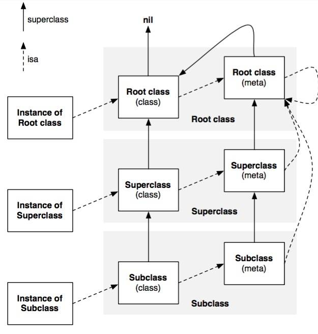

# 2.NSObject

> 参考：
>
> * [https://halfrost.com/objc_runtime_isa_class/](https://halfrost.com/objc_runtime_isa_class/)
> * [http://www.cocoawithlove.com/2010/01/what-is-meta-class-in-objective-c.html](http://www.cocoawithlove.com/2010/01/what-is-meta-class-in-objective-c.html)

## NSObject

`NSObject` 协议中定义的多种方法，是 OC 代码与 Runtime 发生交互的重要位置。

### NSObject 基类

这个类与 `NSObject` 协议定义在了一个文件 `Public Headers/NSObjects.h` 中：

```
OBJC_ROOT_CLASS
OBJC_EXPORT
@interface NSObject <NSObject> {
    Class isa  OBJC_ISA_AVAILABILITY;
}
```

其中：

*   `OBJC_ROOT_CLASS` 是一个宏：

    ```
    #if !defined(OBJC_ROOT_CLASS)
    #   if __has_attribute(objc_root_class)
    #       define OBJC_ROOT_CLASS __attribute__((objc_root_class))
    #   else
    #       define OBJC_ROOT_CLASS
    #   endif
    #endif
    ```

    它为 `NSObject` 这个类附加了 `objc_root_class` 这个属性，这是 GNU C 的特性，见：[Attribute](../../cplusplus/attribute.md)
* `OBJC_EXPORT` 也是一个宏，它标记了这个类可以被任意外部位置访问到；
* `isa` 是一个变量名，`Class` 是一个变量类型，`OBJC_ISA_AVAILABILITY` 也是一个宏，在 ObjC2 版本以后，`isa` 这个变量被标记为过期的属性，具体在 `objc_object` 中实现（下面详细解释）。

`Class` 与 `id` 的定义在 `Public Headers/objc.h` 这个文件中：

```c
#if !OBJC_TYPES_DEFINED
/// An opaque type that represents an Objective-C class.
typedef struct objc_class *Class;

/// Represents an instance of a class.
struct objc_object {
    Class isa  OBJC_ISA_AVAILABILITY;
};

/// A pointer to an instance of a class.
typedef struct objc_object *id;
#endif
```

### `objc_class` 或 `Class`

这个类是所有**Objective-C 类的夫类**。

在 Objc2 之前，该类的定义在 `Public Headers/runtime.h` 中，参考意义不大就不列举了，就是一个简单的字段组合。在 2006 年苹果公司发布 Objcive-C 2.0 之后，该类的定义在 `Public Headers/objc-runtime-new.h` 这个文件中：

```
struct objc_class : objc_object {
    // Class ISA;
    Class superclass;
    cache_t cache;             // formerly cache pointer and vtable
    class_data_bits_t bits;    // class_rw_t * plus custom rr/alloc flags

        // 此处有省略一些类方法...
}
```

* `superclass` 是用于指向夫类的指针（`NSObject` 中也有一个同名的类方法）；
* `cache` 是方法缓存；
* `class_data_bits_t` 是一个封装了比特位的类，`bits` 是这个类对应实例的方法链表。

这个类主要封装了与面向对象相关的方法，比如继承、哈希化等。

### `objc_object` 或 `id`

这个类是**包括 `object_class` 在内的所有实例对象的夫类**。

它定义在了文件 `Project Headers/objc-private.h`，是一个不对外暴露的私有类（对外暴露为 `id`）：

```c
struct objc_object {
private:
    isa_t isa;
      // 此处有省略一些类方法...
}
```

`isa` 这个变量是这个类最核心的功能，它用于指定实例实现的类。观察函数也会发现，它主要实现 `dealloc` / `retain` / `release` 等析构、初始化、内存管理相关的工作。

### MetaClass

由上面的分析我们得出一个重要的结论：**Objective-C 中类也是一个对象**，这个对象是单例模式。实际上这些单例模式的对象是在 main 函数执行之前，从 `dyld` 到 `runtime` 这期间创建的。

既然 OC 类派生自 `objc_object`，它就一定有 `isa` 这个成员，那么 OC 类的 `isa` 指针应该指向哪里呢？

这就牵涉到 `isa` 最重要的作用：消息传递。这里简单介绍一下消息传递的流程：

1. 当源代码向一个对象发送消息时，会首先查找这个这个对象的 `isa` 参数；
2. `isa` 参数指向一个类，Runtime 查找这个类的方法链表中查找并执行这个方法；

因此为了使 `Objective-C` 中的类也可以同样接受消息，`Objective-C` 将类方法分离了出去，称作元类（即 Meta Class）。Instance、Class、Meta-Class 三者的关系大致如下图：



其中的 superclass 为 `nil` 的 Root class 即为 `NSObject`。`NSObject` 本质是 `objc_class` 这个类的单例。

### `isa_t`

### 小结
