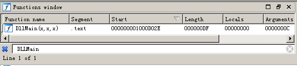
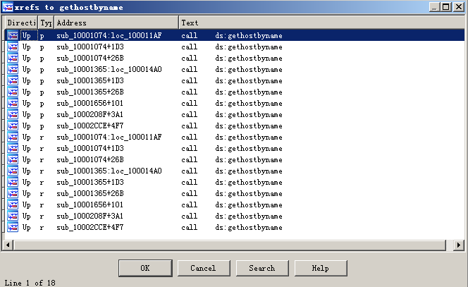
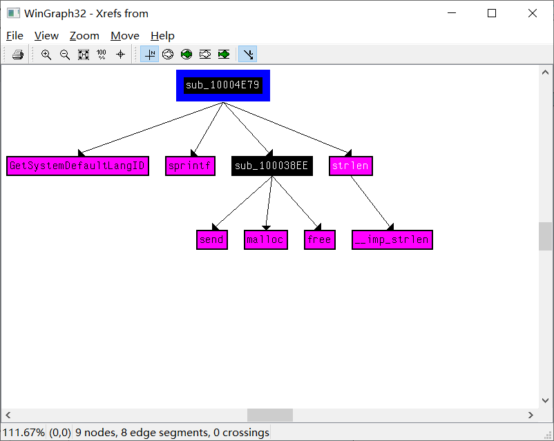
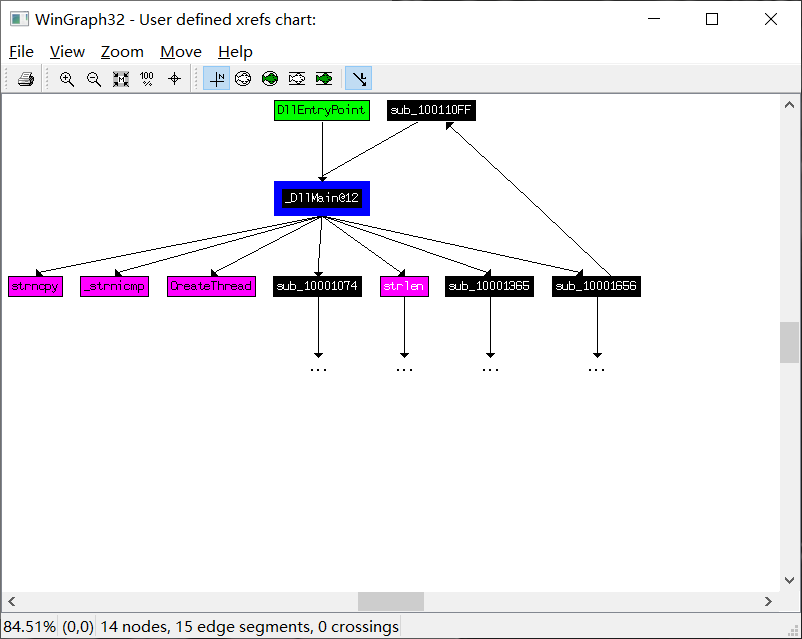

# lab5-1

## QUESTION 1

> What is the address of `DllMain`?

我们用 `Ida Pro` 加载这个动态链接库，在左侧的函数窗口点击 `Ctrl+F`，输入函数名 `DLLMain`，即可搜索：



可见其入口地址是 `.text:1000D02E`。

## QUESTION 2

> Use the Imports window to browse to `gethostbyname`. Where is the import located?

同样的方法在 `Import windows` 中点击 `Ctrl + F`，双击进入后：

```
.idata:100163CC ; struct hostent *__stdcall gethostbyname(const char *name)
.idata:100163CC                 extrn gethostbyname:dword
```

可见其地址是 `.idata:100163CC`

## QUESTION 3

> How many functions call `gethostbyname`?

可以在 `Ida Pro` 中使用 `xrefs` 工具查看调用的函数，在上一题的函数定义位置右键可以选择 `list cross refrence to ...`：



可见这个函数调用了 18 次。按名称排序之后可以得到一共有 9 个不同的函数

## QUESTION 4

> Focusing on the call to `gethostbyname` located at `0x10001757`, can you figure out which DNS request will be made?

在 `0x10001757` 处的调用即上图函数 `sub_10001656` 在 `101` 行的调用：

```
.text:1000174E                 mov     eax, off_10019040
.text:10001753                 add     eax, 0Dh
.text:10001756                 push    eax             ; name
.text:10001757                 call    ds:gethostbyname
```

根据之前函数的定义的观察我们可以发现，`gethostname` 的参数是一个 `const char *`，于是我们知道这个 DNS 函数解析的是 `off_10019040` 这个位置的字符串：

```
.data:10019040 off_10019040    dd offset aThisIsRdoPics_
.data:10019040                                         ; DATA XREF: sub_10001656:loc_10001722r
.data:10019040                                         ; sub_10001656+F8r ...
.data:10019040                                         ; "[This is RDO]pics.praticalmalwareanalys"...
```

该处存储的也是一个地址，它指向 `10019040` 这个位置：

```
.data:10019194 aThisIsRdoPics_ db '[This is RDO]pics.praticalmalwareanalysis.com',0
.data:10019194                                         ; DATA XREF: .data:off_10019040o
```

可见它要解析的是 `pics.praticalmalwareanalys.com`

## QUESTION 5

> How many local variables has IDA Pro recognized for the subroutine at `0x10001656`?

在 `Ida Pro` 中按 `g`，输入地址 `0x10001656` 即可看到位于这个地址的子过程：

```
.text:10001656
.text:10001656 ; =============== S U B R O U T I N E =======================================
.text:10001656
.text:10001656
.text:10001656 ; DWORD __stdcall sub_10001656(LPVOID lpThreadParameter)
.text:10001656 sub_10001656    proc near               ; DATA XREF: DllMain(x,x,x)+C8o
.text:10001656
.text:10001656 var_675         = byte ptr -675h
.text:10001656 var_674         = dword ptr -674h
.text:10001656 hModule         = dword ptr -670h
.text:10001656 timeout         = timeval ptr -66Ch
.text:10001656 name            = sockaddr ptr -664h
.text:10001656 var_654         = word ptr -654h
.text:10001656 Dst             = dword ptr -650h
.text:10001656 Str1            = byte ptr -644h
.text:10001656 var_640         = byte ptr -640h
.text:10001656 CommandLine     = byte ptr -63Fh
.text:10001656 Str             = byte ptr -63Dh
.text:10001656 var_638         = byte ptr -638h
.text:10001656 var_637         = byte ptr -637h
.text:10001656 var_544         = byte ptr -544h
.text:10001656 var_50C         = dword ptr -50Ch
.text:10001656 var_500         = byte ptr -500h
.text:10001656 Buf2            = byte ptr -4FCh
.text:10001656 readfds         = fd_set ptr -4BCh
.text:10001656 buf             = byte ptr -3B8h
.text:10001656 var_3B0         = dword ptr -3B0h
.text:10001656 var_1A4         = dword ptr -1A4h
.text:10001656 var_194         = dword ptr -194h
.text:10001656 WSAData         = WSAData ptr -190h
.text:10001656 lpThreadParameter= dword ptr  4
.text:10001656
.text:10001656                 sub     esp, 678h
```

地址小于栈帧地址的是局部变量，地址大于栈帧的是参数，因此一共有 23 个局部变量。

## QUESTION 6

> How many parameters has IDA Pro recognized for the subroutine at `0x10001656`?

跟第五题同样分析，有 1 个。

## QUESTION 7

> Use the Strings window to locate the string `\cmd.exe /c` in the disassembly. Where is it located?

在 `Ida Pro` 中 `shift + F12` 打开字符串窗口，按 `Ctrl + F` 搜索 `\cmd.exe /c` 这个字符串：

```
xdoors_d:10095B34 0000000D C \\cmd.exe /c
```

所以这个字符串位于 `xdoors_d:10095B34` 这个地址上。

## QUESTION 8

> What is happening in the area of code that references `\cmd.exe /c`?

我们首先寻找调用这个字符串的位置：

```
Up o sub_1000FF58+278 push    offset aCmd_exeC; "\\cmd.exe /c "
```

可见调用的函数是 `sub_1000FF58+278`：

```
.text:100101C8                 cmp     dword_1008E5C4, ebx
.text:100101CE                 jz      short loc_100101D7
.text:100101D0                 push    offset aCmd_exeC ; "\\cmd.exe /c "
.text:100101D5                 jmp     short loc_100101DC
.text:100101D7 ; ---------------------------------------------------------------------------
.text:100101D7
.text:100101D7 loc_100101D7:                           ; CODE XREF: sub_1000FF58+276j
.text:100101D7                 push    offset aCommand_exeC ; "\\command.exe /c "
.text:100101DC
.text:100101DC loc_100101DC:                           ; CODE XREF: sub_1000FF58+27Dj
.text:100101DC                 lea     eax, [ebp+CommandLine]
```

就这几行的代码看，应该是进行了一次 if 判断之后复制了一次字符串的操作。

## QUESTION 9

> In the same area, at `0x100101C8`, it looks like `dword_1008E5C4` is a global variable that helps decide which path to take. How does the malware set `dword_1008E5C4`? (Hint: Use `dword_1008E5C4`’s cross-references.)

我们根据以下的操作：

1. 双击进入这个变量存储的位置；
2. 右键查找调用这个变量的位置，发现其中仅有一个 `mov` 的赋值指令；
3. 双击进入这个位置，发现 `eax` 是一个函数的返回值，我们接着查看这个函数的汇编代码；

```
.text:100036C2 sub_10003695    endp
.text:100036C2
.text:100036C3
.text:100036C3 ; =============== S U B R O U T I N E =======================================
.text:100036C3
.text:100036C3 ; Attributes: bp-based frame
.text:100036C3
.text:100036C3 sub_100036C3    proc near               ; CODE XREF: sub_10001656+27p
.text:100036C3                                         ; PSLIST+Ap
.text:100036C3
.text:100036C3 VersionInformation= _OSVERSIONINFOA ptr -94h
.text:100036C3
.text:100036C3                 push    ebp
.text:100036C4                 mov     ebp, esp
.text:100036C6                 sub     esp, 94h
.text:100036CC                 lea     eax, [ebp+VersionInformation]
.text:100036D2                 mov     [ebp+VersionInformation.dwOSVersionInfoSize], 94h
.text:100036DC                 push    eax             ; lpVersionInformation
.text:100036DD                 call    ds:GetVersionExA
.text:100036E3                 cmp     [ebp+VersionInformation.dwPlatformId], 2
.text:100036EA                 jnz     short loc_100036FA
.text:100036EC                 cmp     [ebp+VersionInformation.dwMajorVersion], 5
.text:100036F3                 jb      short loc_100036FA
.text:100036F5                 push    1
.text:100036F7                 pop     eax
.text:100036F8                 leave
.text:100036F9                 retn
.text:100036FA ; ---------------------------------------------------------------------------
```

大概是在比较系统的版本。

## QUESTION 10

> A few hundred lines into the subroutine at `0x1000FF58`, a series of comparisons use `memcmp` to compare strings. What happens if the string comparison to robotwork is successful (when `memcmp` returns 0)?

`F5` 分析伪代码，搜索字符串 `robotwork`，可知若其值为 0，则会将查询注册表项 `HKET_LOCAL_MACHINE\SOFTWARE\Microsoft\Windows\CurrentVersion 中的aWorktime` 和 `aWorktimes` ,并将其值输出。

## QUESTION 11

> What does the export `PSLIST` do?

在 `export` 函数表中查找 `PSLIST`，分析其伪代码：

```
int __stdcall PSLIST(int a1, int a2, char *Str, int a4)
{
  int result; // eax

  dword_1008E5BC = 1;
  result = sub_100036C3();
  if ( result )
  {
    if ( strlen(Str) )
      result = sub_1000664C(0, Str);
    else
      result = sub_10006518(0);
  }
  dword_1008E5BC = 0;
  return result;
}
```

其中 `sub_100036C3` 这个函数就是之前分析的判断系统版本号的函数，进一步观察 `sub_1000664` 的内容大概就是创建了一个给套接字创建了一个 `shell`。

## QUESTION 12

> Use the graph mode to graph the cross-references from `sub_10004E79`. Which API functions could be called by entering this function? Based on the API functions alone, what could you rename this function?

我们在左侧的函数窗口中找到 `sub_10004E79` 这个函数，然后在 hex view 中右键点击函数名然后查看 `xref greph from...`，查看函数的调用图可以得到下面的信息：



可见这个函数调用了 `GetSystemDefaultLangID` 这个函数，还调用了 `sub_100038EE` 这个函数，后者应该是一个自定义函数，根据这些信息我们猜测这个函数应该是获取系统语言的一个函数，我们将其命名为 `GetSystemLanguage`。

## QUESTION 13

> How many Windows API functions does `DllMain` call directly? How many at a depth of 2?

在 `Ida Pro` 中依次点击：`view-->graphs-->Users xrefs charts`，选择函数的调用栈深为 1 即为直接调用：



可见直接调用的函数有 7 个。

我们可以用同样的方式将函数调用深度设置为 2，发现函数太多了，根本数不过来。

## QUESTION 14

> At `0x10001358`, there is a call to Sleep (an API function that takes one parameter containing the number of milliseconds to sleep). Looking backward through the code, how long will the program sleep if this code executes?

在 `Ida Pro` 中按 g 然后输入地址 `.text:10001358`：

```
.text:10001357                 push    eax             ; dwMilliseconds
.text:10001358                 call    ds:Sleep
.text:1000135E                 xor     ebp, ebp
.text:10001360                 jmp     loc_100010B4
```

按 `F5` 查看伪代码：

```
...
v14 = atoi(off_10019020[0] + 13);
Sleep(1000 * v14);
...
```

然后对于 `off_10019020` 这个全局数据区的字符串：

```
.data:10019020 off_10019020    dd offset aThisIsCti30  ; DATA XREF: sub_10001074:loc_10001341↑r
.data:10019020                                         ; sub_10001365:loc_10001632↑r ...
.data:10019020                                         ; "[This is CTI]30"
```

```
.data:100192AC aThisIsCti30    db '[This is CTI]30',0  ; DATA XREF: .data:off_10019020↑o
```

所以观察程序逻辑我们知道 `v14 = 30`，所以 睡眠时间等于 `30 * 1000ms = 30s`

## QUESTION 15

> At 0x10001701 is a call to socket. What are the three parameters?

按照同样的方法，我们先跳到 `0x10001701` 这个地址：

```
.text:100016FB                 push    6               ; protocol
.text:100016FD                 push    1               ; type
.text:100016FF                 push    2               ; af
.text:10001701                 call    ds:socket
```

据此我们已经知道 `push` 的三个内容，我们可以通过 `Google` 来查看它们对应的宏。

## QUESTION 16

> Using the MSDN page for socket and the named symbolic constants functionality in IDA Pro, can you make the parameters more meaningful? What are the parameters after you apply changes?

15 题中的常量被定义在 `winsock2.h` 中，`Google` 以下内容 `MSDN socket symbol` 即可搜到 MSDN 的网址：[https://docs.microsoft.com/en-us/windows/desktop/api/winsock2/nf-winsock2-socket](https://docs.microsoft.com/en-us/windows/desktop/api/winsock2/nf-winsock2-socket)。所以三个参数：

|       af=2      |      type=1      |       protocol=6      |
| :-------------: | :--------------: | :-------------------: |
| `AF_INET`（IPv4） | `SOCK_STREAM`（流） | `IPPROTOCOL_TCP`（TCP） |

## QUESTION 17

> Search for usage of the `in` instruction (opcode 0xED). This instruction is used with a magic string `VMXh` to perform VMware detection. Is that in use in this malware? Using the cross-references to the function that executes the `in` instruction, is there further evidence of VMware detection?

按 `alt+B` 之后输入指令 `in` 的 opcode `0xED` 可以在搜索结果中找到一个 `in` 指令：

```
.text:100061DB    sub_10006196    in      eax, dx
```

我们查看这个调用位置的伪代码：

```
char sub_10006196()
{
  unsigned __int32 v0; // eax

  v0 = __indword(0x5658u);
  return 0;
}
```

通过 `cross refrence` 查看这个函数的被调用位置，发现有三处被调用，我们查看其中第一个的伪代码：

```
  if ( atoi(off_10019034[0] + 13) && ((unsigned __int8)sub_10006119() || sub_10006196()) )
  {
    sub_10003592(unk_1008E5F0, v7);
    sub_10003592(aFoundVirtualMa, v4);
    result = sub_10005567(Format);
  }
```

如果这个函数 `sub_10006196()` 调用了返回为真，则会调用：`Found Virtual Machine,Install Cancel.` 这个字符串，可见这个函数就是用于检测是否为虚拟机的函数。

## QUESTION 18

> Jump your cursor to `0x1001D988`. What do you find?

一个存储着看起来很随机的字符串：

```
.data:1001D988 a1UUU7461Yu2u10 db '-1::',27h,'u<&u!=<&u746>1::',27h,'yu&!',27h,'<;2u106:101u3:',27h,'u'
```

## QUESTION 19

> If you have the IDA Python plug-in installed (included with the commercial version of IDA Pro), run `Lab05-01.py`, an IDA Pro Python script provided with the malware for this book. (Make sure the cursor is at 0x1001D988.) What happens after you run the script?

在 `File-->Script` 中选择 `Lab05-01.py` 这个文件：

```
.data:1001D988 a1UUU7461Yu2u10 db 'xdoor is this backdoor, string decoded for '
```

可以看到 `0x1001D988` 这个地址的内容发生了变化。

## QUESTION 20

> With the cursor in the same location, how do you turn this data into a single ASCII string?

按下键盘上的 `A`。

## QUESTION 21

> Open the script with a text editor. How does it work?

打开：

```python
sea = ScreenEA()

for i in range(0x00,0x50):
        b = Byte(sea+i)
        decoded_byte = b ^ 0x55
        PatchByte(sea+i,decoded_byte)
```

`ScreenEA()` 函数获取了光标所在的位置，`PatchByte()` 函数用于写入一个字节。

这个 python 脚本的作用是将光标之后的 `0x50` 个字节的内容与 `0x55` 做异或操作，并写入原来的位置。
