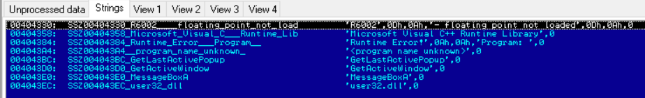

# lab9-2

## QUESTION 1

> What strings do you see statically in the binary?

首先使用 `PEexplorer` 中的反汇编功能查看其中的 `.rdata` 段：

## QUESTION 2

> What happens when you run this binary?

运行程序，没有任何反应。 使用 `Process Monitor` 查看，存在一些文件和注册表操作。

## QUESTION 3

> How can you get this sample to run its malicious payload?

## QUESTION 4
