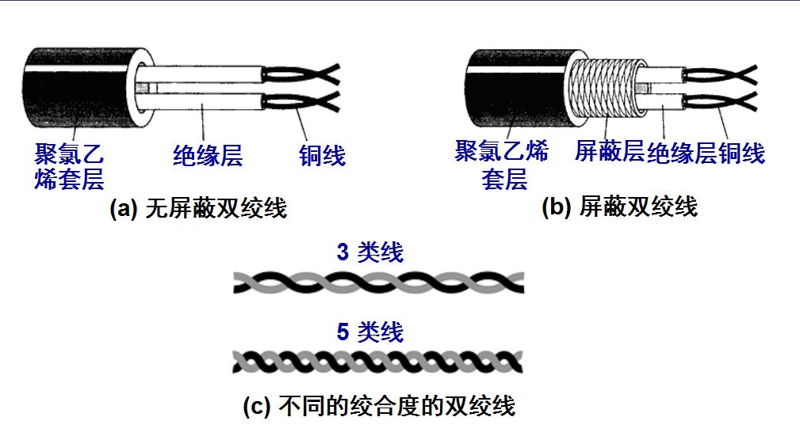
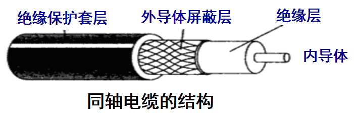

# 物理层

## 常见的传输介质

### 引导型传输媒介

#### 双绞线

即常用的网线，最常用的 UTP 是 5 类线 CTA5：

有许多种不同的标准适用于这种基于的[铜](https://zh.wikipedia.org/wiki/%E9%93%9C)线的物理介质。最广泛使用的包括 `10BASE-T`、`100BASE-TX` 和`1000BASE-T` ([吉比特以太网](https://zh.wikipedia.org/wiki/%E5%90%89%E6%AF%94%E7%89%B9%E4%BB%A5%E5%A4%AA%E7%BD%91)), 速率分别为10 [Mbit/s](https://zh.wikipedia.org/w/index.php?title=Megabit_per_second\&action=edit\&redlink=1), 100 Mbit/s, and 1000 Mbit/s (1 [Gbit/s](https://zh.wikipedia.org/w/index.php?title=Gbit/s\&action=edit\&redlink=1))。

**双绞线有一个“无法逾越”的“100米”传输距离**。无论是 10M 传输速率的三类双绞线，还是 100M 传输速率的五类双绞线，甚至 1000M 传输速率的六类双绞线，最远有效传输距离为 100 米。

#### 同轴电缆

同轴电缆具有很好的抗干扰特性，**被广泛用于传输较高速率的数据**：

#### 光缆

通信容量非常大、传输损耗小，中继距离长、抗雷电和电磁干扰性能好、无串音干扰，保密性好、体积小，重量轻。

1. 光纤由三层材料组成，中心高折射率玻璃芯，中间为低折射率硅玻璃包层，最外是加强用的树脂涂层。
2. 包层的材料一般用纯二氧化硅，也有掺极微量的三氧化二硼。掺杂的作用是降低材料的光折射率。
3. 涂层是用来保护光纤不受外来的损害，增加光纤的机械强度。

### 非引导型传输媒介

## 协议

### 10BASE-T

`10BASE－T` 是[双绞线](https://baike.baidu.com/item/%E5%8F%8C%E7%BB%9E%E7%BA%BF)以太网，1990年由IEEE新认可的，编号为 `IEEE802.3i`，T 表示采用双绞线，现 `10BASE-T` 采用的是无屏蔽双绞线（`UTP`）。

1. [数据传输速率](https://baike.baidu.com/item/%E6%95%B0%E6%8D%AE%E4%BC%A0%E8%BE%93%E9%80%9F%E7%8E%87) 10Mbps基带传输，10表示10兆比特每秒，Bas e表示基带传输，T 代表双绞线（F 表示光纤）
2. 每段[双绞线](https://baike.baidu.com/item/%E5%8F%8C%E7%BB%9E%E7%BA%BF)最大有效长度 100m，采用高质量的双绞线（5类线），最大长度可到 150m（HUB与工作站间及两个HUB之间）。
3. 一条通路允许连接HUB数 4个
4. [**拓扑结构**](https://baike.baidu.com/item/%E6%8B%93%E6%89%91%E7%BB%93%E6%9E%84) **星形或总线形**
5. [访问控制](https://baike.baidu.com/item/%E8%AE%BF%E9%97%AE%E6%8E%A7%E5%88%B6)方式 [CSMA/CD](https://baike.baidu.com/item/CSMA%2FCD)
6. 帧长度 可变，最大1518个字节
7. 最大传输距离 500m
8. 每个HUB可连接的工作站 96个

`10BASE-T` 的连接主要以[集线器](https://baike.baidu.com/item/%E9%9B%86%E7%BA%BF%E5%99%A8)HUB作为枢纽(HUB将在第5节中介绍)，[工作站](https://baike.baidu.com/item/%E5%B7%A5%E4%BD%9C%E7%AB%99)通过网卡的 RJ45 插座与 RJ45 接头相连，另一端 HUB 的端口都可供 RJ45 的接头插入，装拆非常方便。
