# 运输层

> 学习地址：
>
> * 《计算机网路，自顶向下的方法》

## 运输层

### 无连接运输：UDP

`UDP` stands for `User Data Protocol`.

#### 报文结构

UDP 首部只有四个字段，每个字段首部由两个字节组成。

UDP 的报文段结构如下图所示，它由 [RFC 768](https://tools.ietf.org/html/rfc768) 定义：

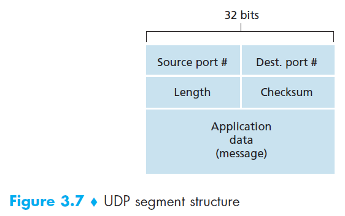

#### UDP 校验和

伪协议头：

* 用于计算 checksum
* 包括源 IP 地址和目的 IP 地址。

NOTICE：

1. UDP 校验和是可选项，IPv6 中将变成强制性的（UDP 校验和覆盖的范围超出了 UDP 数据报本身）
2. 使用伪首部的目的是检验 UDP 数据报是否真正到达目的地。正确的目的地包括了特定的主机和该主机上特定的端口
3. 伪首部不随用户数据报一起传输
4. 接收方需自己形成伪首部进行校验
5. 伪首部的使用破坏了层次划分的基本前提，即每一层的功能独立
6. 目的主机的 IP 地址 UDP 通常知道，源 IP 的使用需要通过路由选择决定

### 可靠信息传输原理

可靠数据传输协议：reliable data transfer protocol

#### 构造可靠信息传输协议

**经完全可靠信道的可靠数据传输 rdt 1.0**

发送方和接收方的有限状态机（Finite-State Machine, FSM）如下：

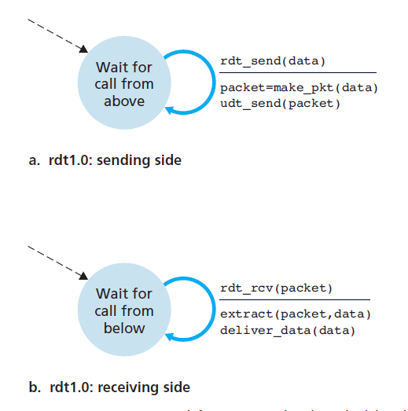

**经具有比特差错信道的可靠数据传输 rdt 2.0**

我们引入自动重传请求（Automatic Repeat reQuest, ARQ）协议，主要加入了以下的三种功能：

* **差错检查**：需要一种机制以使接收方检测到合适出现了比特差错；
* **接收方反馈**：引入了接收到方回答的 “肯定确认”（ACK）和 “否定确认”（NAK），理论上，这些分组只需要一个比特长：如 0 表示否定，1 表示肯定。
* **重传**：接收方受到由差错的分组时，发送方将重传该分组。

`rdt 2.0` 的 FSM 如下：

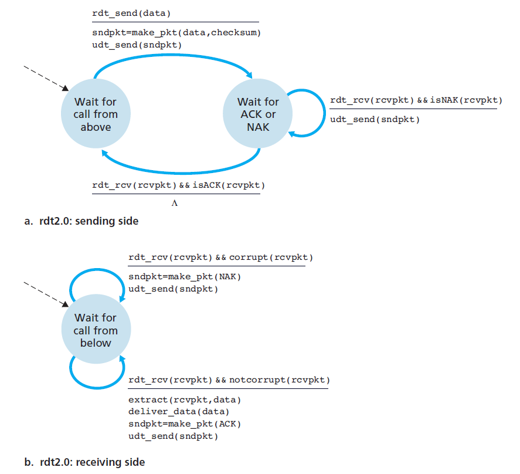

可见发送方存在一个等待回答的状态，所以 `rdt2.0` 又称作 “停等（stop-and-wait）协议”。

但是，`rdt2.0` 存在一个致命缺陷：它没有考虑 ACK 和 NAK 分组受损的情况，我们提出以下三种解决方法：

* 发送方收到来自接收方的损坏 ACK 或 NAK 的请求再次发送。但是如果该包也在传输过程中受损的话，逻辑就陷入了死循环。
* **增加足够的校验比特位**，使得发送方不仅可以检测差错，还可以恢复差错。
* 当发送方收到含糊不清的 ACK 或 NAK 分组时，只需**重传当前数据分组**即可。
  * 然而这种方法在发送方和接收方的信道中引入了 冗余分组（duplicate packet），解决这一问题的一个简单方法是：让发送方对其数据分组进行编号，即添加序号（sequence number）字段，接收方则只需要检查序号来判断是否为一次重传。

`rdt2.1` 的 FSM 如下（注意到发送方每次发送仅与 `当前分组` 和 `前一分组` 有关，所以只需要两个序列状态）：

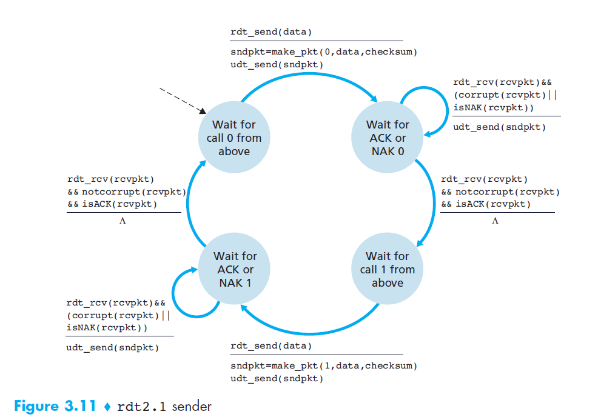

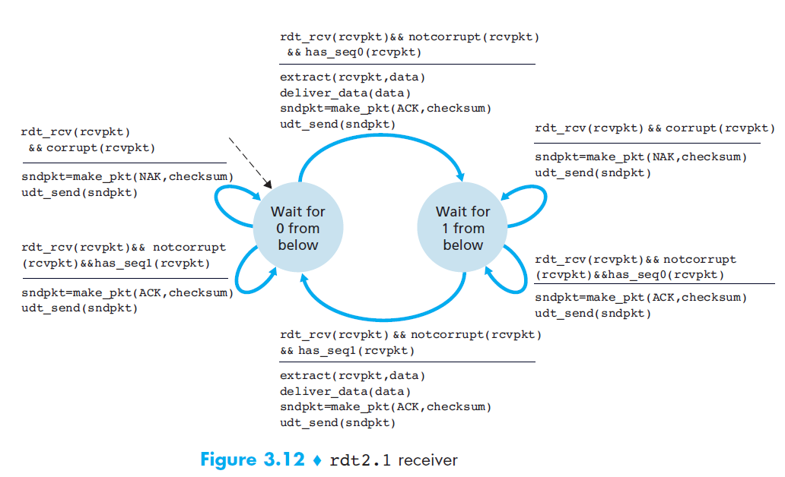

`rdt2.2` 通过更改包装函数，在 ACK 中加入了对应的序列号信息，其 FSM 如下（发送方关键在 `isACK(rcvpkt, 0)` 与 `isACK(rcvpkt, 1)`，接收方关键在 `has_seq0` 与 `has_seq1`）：

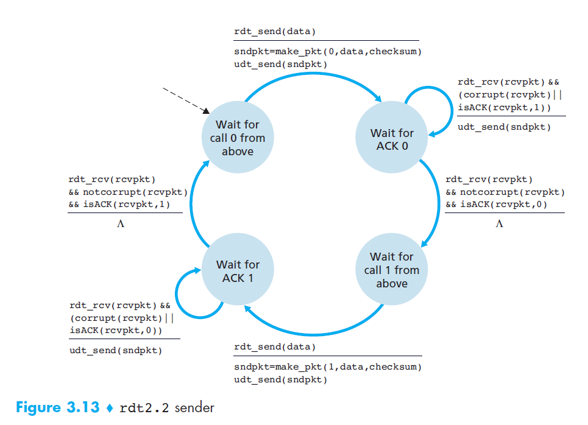

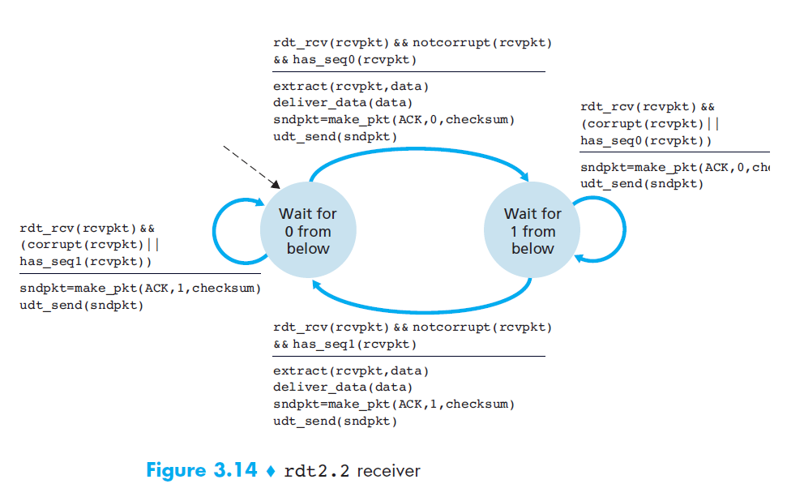

**经具有比特差错和丢包信息信道的可靠数据传输 rdt 3.0**

我们使用一个基于时间的重传机制来解决丢包问题，需要一个倒数计数定时器（countdown timer），在一个给定的时间量过期后，可中断发送。因此发送方的工作流程大致如下：

1. 每次发送一个分组（包括第一次分组和重传分组）时，便启动一个计时器；
2. 相应计时器中断（采取适当的动作）
3. 终止计时器

因为分组序号在 0 和 1 之间交替，因此 `rdt3.0` 有时又被称作比特交替协议（alternating-bit protocol），其 FSM 如下：

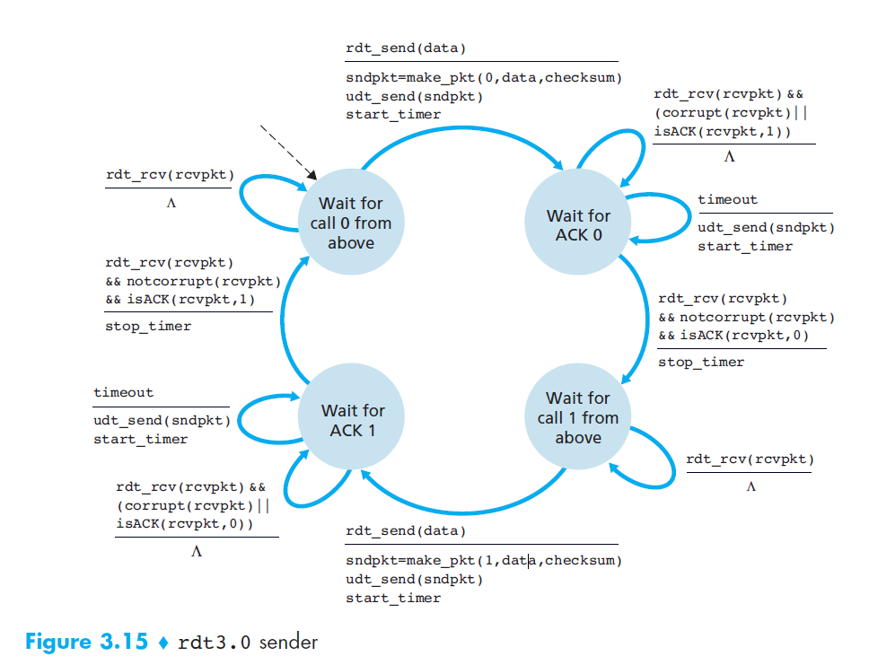

#### 流水线可靠数据传输协议

`rdt3.0` 是一个功能正确的协议，但并非人人对它的性能满意，它性能的核心在于他是一个停等协议。这种协议的发送方信道利用率（$${\displaystyle U_{sender} = \frac{L/R}{RTT + L/R}, where\ R \Rightarrow sendrate, L \Rightarrow datalength}$$）极低。

因此许多协议采用一种技术，数据流可以被看成是填充到一条流水线中，故这种技术被称作流水线（pipelining），它对可靠数据传输协议带来如下影响：

* 必须增加序列号的范围；
* 发送方和接收方两端也许必须缓存多个分组；
*   一个如何处理丢失、损坏以及延时过大分组的方法。

    解决流水线的差错恢复有两种基本方法：**回退 N 步**（Go-Back-N, GBN）和**选择重传**（Selective Repeat, SR）。

**回退 N 步**

我们定义：

* 窗口大小（`windows size`） `N`：GBN 协议中，未确认分组数不能超过的某个最大允许数目。
* 基序号（`base`）：最早的未确认分组的序号；
* 下一序号（`nextseqnum`）：最小的未使用序号（即 下一个待发送的分组）

那么，可以将序号范围划分为以下的四个部分：

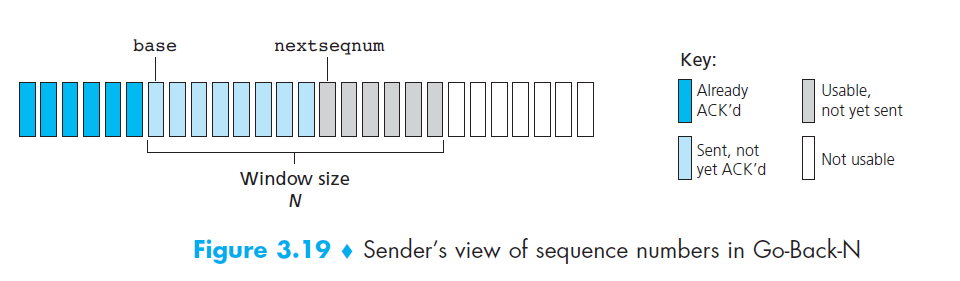

* 因为 N 的滑动窗口的存在，GBN 通常又被称作滑动窗口协议（sliding-windows protocol）
* 在实践中，一个分组的序号存放在分组的首部一个固定的字段（长度为 k）中，所有涉及字段的运算都必须使用模 $$2^k$$ 运算。

加入变量扩展后，GBN 协议下的 FSM 如下：

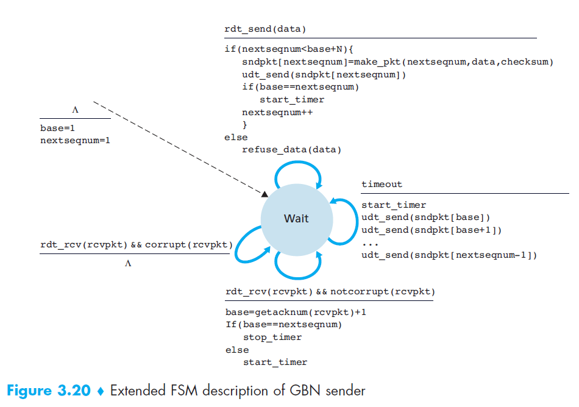

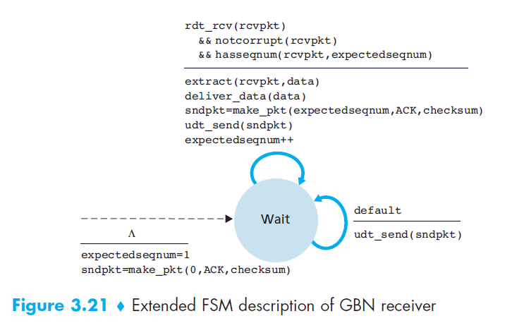

GBN 协议下的发送方必须响应三种类型的事件：

* **上层的调用**：当上层调用 `rdt_send` 时，发送方首先检查发送窗口是否已满，未满则产生一个新的分组将其发送，已满则拒绝请求或缓存数据。
* **收到一个 ACK**：在 GBN 协议中，对序列号为 n 分组的确认采用累计确认（cumulative acknowledgment）的方式：收到序列号为 n 的 ACK $$\Leftrightarrow$$ 接收方正确接收到序号为 n 以及小于 n 的所有分组。
* **超时事件**：如果出现超时，发送方将重传所有已发送但还未被确认过的分组。

_Notice_：接收方会丢弃所有的失序分组（因为分组未被确认，所以该分组会被发送发重传一遍）。

一个 GBN 协议下的示例如下：

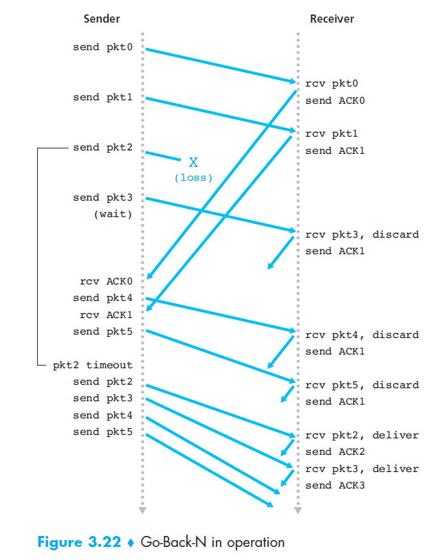

**选择重传**

在 GBN 中，单个分组的差错就会引起 GBN 重传大量分组。那么序列范围将通过以下的方式划分：

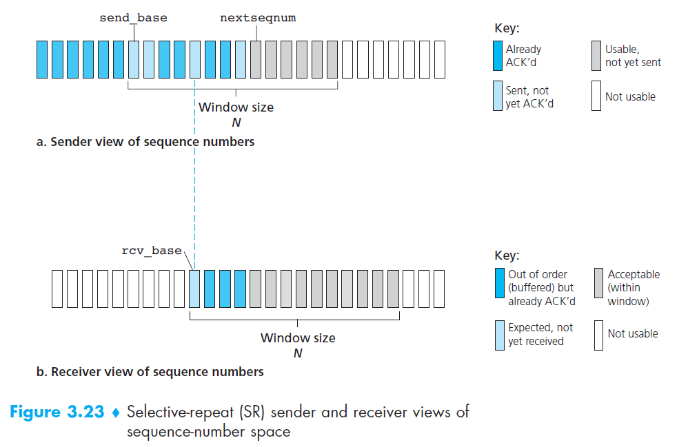

_NOTICE_：接收方收到重传的数据包后，亦必须回复 ACK。

因为接收方观察发送方的行为是一个黑盒，所以会出现以下两种情况，对于接收方无法辨认：

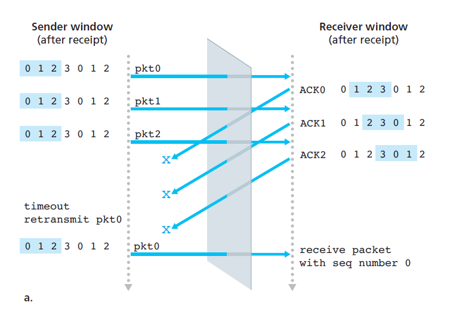

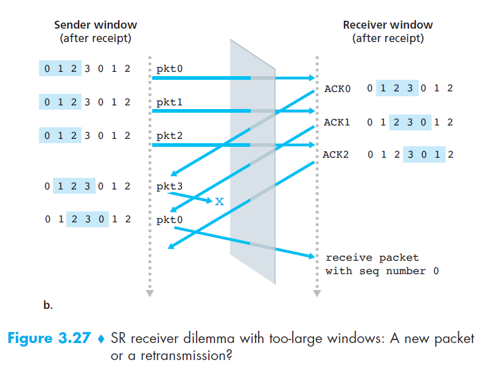

为了避免这种二义性的情况，**窗口长度必须小于或等于序列号空间的一半**。

### 面向连接的运输：TCP

#### TCP 连接

概念：

* TCP 的链接过程通常被称作三次握手。
* 最大报文段长度（Maximum Segment Size, MSS）：TCP 可以从缓存中取出并放入缓存中的数据数量。
* 最大传输单元（Maximum Transmission Unit, MTU）：最大链路层帧长度。

#### 报文结构

除了源端口号、目的端口号、检验和字段，TCP 报文首段还包括以下的结构：

1. 32 比特的序号字段（sequence number field）和 32 比特的确认号字段（acknowledgment number field）；
2. 16 比特的接收窗口字段（receive window field），该字段用于流量控制；
3. 4 比特的首部长度字段（header length field），指示了以 32 比特的字为单位的 TCP 首部长度。
4. 可选与变长的选项字段（options field），用于协商 MSS。
5. 6 比特的标志字段：ACK、RST、SYN、FIN、URG、PSH。

序号：

* 因为序号是建立在传送的字节流上，而不是建立在传送报文段的序列之上。所以**一个报文段的序号是该报文段首字节的字节流编号**。
* 比如：一个 MSS 为 1000 字节的数据流，若首字节编号为 0，则第一个报文段分配序号 0，第二个报文段分配序号 1000。

确认号：

* 主机 A 填充进报文段的确认号是主机 A 期望从主机 B 收到的下一字节的序号。

在报文无序到达接收端时，TCP 的 RFC 并没有对次操作进行明确的规定，而是把这一问题留给实现编程的人处理，他们有两个基本的选择：

1. 接收方立即丢弃失序报文段（这可以简化接收方的设计）；
2. 接收方保留失序的报文，并等待缺少的字节以填补该间隔。

在理论讨论中，我们假设初始序号为 0。**事实上，一条 TCP 连接的双方均可以随机地选择初始序号**。这样做可以减少那些仍然在网络中存在的来自两台主机之间先前已经终止的连接的报文段，误认为是后来这两台主机新建连接所产生的有效报文的可能性。

#### 估计往返时间与超时

**估计往返时间**

TCP 维持一个 `SampleRTT` 的均值（称为 `EstimatedRTT`），一旦获取一个新的 `SampleRTT`，TCP 就会根据以下的公式来更新 `EstimatedRTT`：

$$EstimatedRTT = (1- \alpha) \cdot EstimatedRTT + \alpha \cdot SampleRTT$$

在 \[RFC 6298] 中给出的 $$\alpha$$ 参考值是 $$\alpha = 0.125$$。

在统计学观点来讲，这种平均叫做指数加权移动平均（Exponential Weighted Moving Average, EWMA）

另外，\[RFC 6298] 中还定义了 RTT 偏差 DevTT，用于估算 SampleRTT 一般会偏离 EstimatedRTT 的程度：

$$DevRTT = (1-\beta) \cdot DevRTT + \beta \cdot |SampleRTT - EstimatedRTT|$$

其中，$$\beta$$ 的推荐值为 0.25。

**设置和管理重传时间**

综合了几个方面的考虑（略），TCP 的重传时间通过下面的公式给出：

$$TimeoutInterval = EstimatedRTT + 4 \cdot DevRTT$$

#### 可靠数据连接

**一些有趣的情况**

情况一，ACK 丢失时，接收方会收到冗余的数据报，如下图：

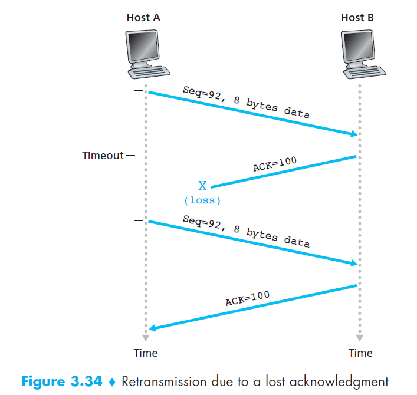

情况二，重传时间设置过短时，会导致在 ACK 到达发送方之前出发重传，如下图：

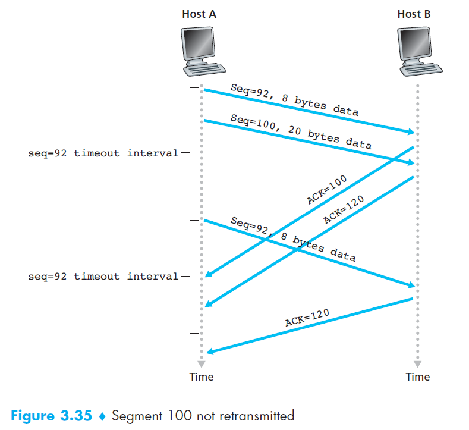

情况三，连续发送字节数据时，即使前面的 ACK 丢失，因为累计确认的缘故则不会导致重传，如下图：

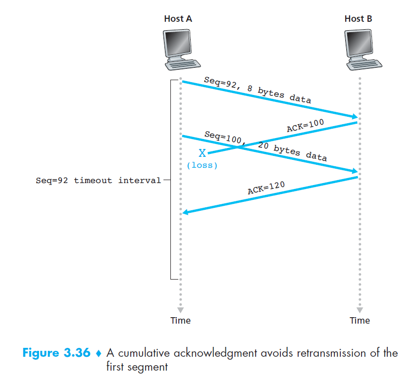

**超时间隔加倍**

大多数 TCP 实现中都会做这样一个参数修改：TCP 重传时，TimeoutInterval 会使用 DevRTT 和 EstimatedRTT 计算出时间的两倍；而当定时器在另外两个事件（收到上层应用的数据和收到 ACK）中的任意一个启动时，TimeoutInterval 则直接使用 DevRTT 和 EstimatedRTT 计算得到的值。

**快速重传**

发送方可以通过注意接收方发送的冗余 ACK （这是因为 TCP 不使用否定确认）来较好的检测到丢包情况。

在 \[RFC 5681] 中，给出了接收方产生 ACK 的几个建议：

| Event                                                                                                                    | TCP Receiver Action                                                                                                                                     |
| ------------------------------------------------------------------------------------------------------------------------ | ------------------------------------------------------------------------------------------------------------------------------------------------------- |
| Arrival of in-order segment with expected sequence number. All data up to expected sequence number already acknowledged. | **Delayed** ACK. Wait up to `500 msec` for arrival of another in-order segment. If next in-order segment does not arrive in this interval, send an ACK. |
| Arrival of in-order segment with expected sequence number. One other in-order segment waiting for ACK transmission.      | 
<strong>Immediately</strong> send single cumulative ACK, ACKing both in-order segments. （用累积 ACK 同时确认缓存和新到达报文段）
                               |
| Arrival of out-of-order segment with higher-than-expected sequence number. Gap detected.                                 | **Immediately** send duplicate ACK, indicating sequence number of next expected byte (which is the lower end of the gap).                               |
| Arrival of segment that partially or completely fills in gap in received data.                                           | **Immediately** send ACK, provided that segment starts at the lower end of gap.                                                                         |

在 \[RFC 5681] 中，一旦收到 3 个冗余 ACK，TCP 就会执行快速重传（fast retransmit），即在该报文的定时器过期之前重传丢失的报文。

#### 流量控制

TCP 为它的应用程序提供了流量控制服务以消除发送方使接收方缓存溢出的可能。TCP 通过让发送方维护乐意称为接收窗口（receiver window）的变量来提供流量控制。

接收窗口用 `rwnd` 表示，根据缓存可用空间的数量来设置：

$$rwnd = RcvBuffer - [LastByteRcvd - LastByteRead]$$

即可以用如下图表示：

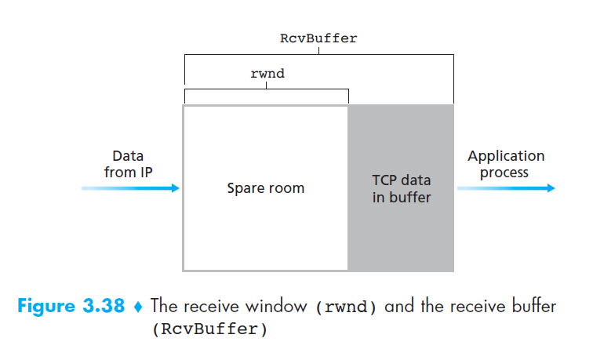

一个问题：TCP 的接收方仅当在它有数据或有确认要发时才会发送报文段给发送方，发送方可能会不知道接收方有新的空间，导致发送方被阻塞而不饿能再发数据。

为了解决这个问题，TCP 的规范中要求：当主机 B 的接收窗口为 0 时，主机 A 继续发送只有一个字节数据的报文段。这些报文段将会被主机 B 确认，其中会含有一个非 0 的 `rwnd` 值。

#### TCP 连接管理

客户端中的 TCP 会用以下的方式与服务器中的 TCP 建立一条 TCP 连接：

1.  第一步，发送一个特殊的 TCP 报文段，包括以下特点：

    * 不含应用层数据；`SYN=1`；随机的一个初始序号（client_isn）。

    因为 SYN，这个特殊的报文称作 **SYN 报文段**。
2.  第二步，服务器为该 TCP 连接分配 TCP 缓存和变量，并向客户 TCP 发送允许连接的报文段，包括以下特点：

    * 不包含应用层数据；`SYN=1`；`ACK=client+1`；选择服务器自己的初始序号（server_isn）。

    该特殊的报文有时称作 **SYNACK 报文段**。
3. 第三步，客户也要给该连接分配缓存和变量，客户端向服务端发送另外一个报文段，包括以下特点：
   * `ACK=server_isn+1`；`SYN=0`；可以携带应用层的数据。

具体如下图所示：

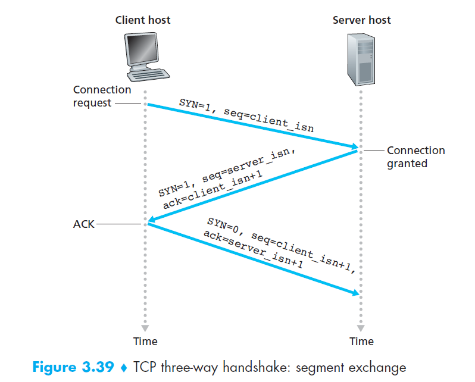

TCP 关闭连接的流程图如二图所示：

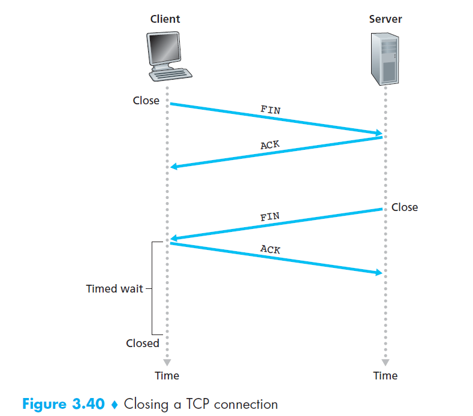

客户端的 FSM 在关闭时如下图所示：

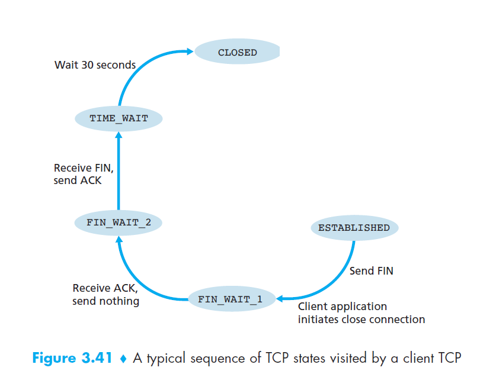

### 拥塞控制原理

#### 拥塞控制方法

我们根据网络层是否为运输层提供了显式的帮助，来区分拥塞控制的方法：

* **端到端拥塞控制**（网络层没有为运输层提供显式帮助 $$\Rightarrow$$ 即使网络中存在拥塞，端系统也必须通过对网络行为的观察来推断之）：3 次冗余 ACK 后，认为 TCP 报文的丢失，TCP 会相应地减小其窗口长度。
* **网络辅助的拥塞控制**（网络层构件向发送方提供关于网络层中拥塞状态的显式反馈信息，一个比特）。

### TCP 拥塞控制

TCP 必须使用端到端拥塞控制而不是使网络辅助的拥塞控制，因为 IP 层不向端系统提供显式的网络拥塞反馈。

TCP 发送方通过维护一个额外的变量来控制向网络中发送流量的速率，即拥塞窗口（congestion window, cwnd），则发送的数据量需要满足下面的关系：

$$LastByteSent - LastByteAcked \le min\{cwnd, rwnd\}$$

我们将 “丢包事件” 定义为：出现超时或收到三个冗余 ACK。TCP 使用下面的指导性原则：

* 一个丢失报文即意味着拥塞，应当降低 TCP 发送方的速率；
* 对先前未确认报文段的确认到达时，应当增加发送方的速率；
* 带宽探测，TCP 发送方不断提升发送速率直到出现丢包事件。

在 \[RFC 5681] 中提出的 TCP 拥塞控制算法（TCP congestion control algorithm）中包括了三个主要部分：慢启动、拥塞避免和快速恢复。其中前两者是强制部分，后者是推荐部分。

#### 慢启动

当一条 TCP 连接开始时，cwnd 的值通常初始置为一个 MSS 的较小值 \[RFC 3390]。

在慢启动状态，cwnd 值以 1 个 MSS 开始，每当收到一个确认就增加一个 MSS。这样一个过程中，每过一个 RTT，发送速率将会翻倍，如下图所示：

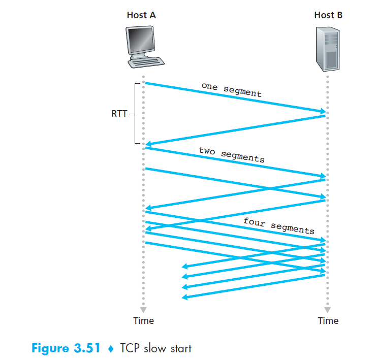

何时结束这种指数级的增长呢？

1. 如果存在**超时**，则 TCP 发送方将 $$ssthresh$$（“慢启动阈值”）设置为 $$cwnd/2$$，将 $$cwnd$$ 设置为 1，并重新开始慢启动过程。
2. 当 $$ssthresh == cwnd$$ 时，结束慢启并且 TCP 转移到拥塞避免模式；
3. 当**检测到三个冗余 ACK** 时，TCP 执行一个快速重传，并且进入快速恢复模式。

即用如下的 FSM 来描述：

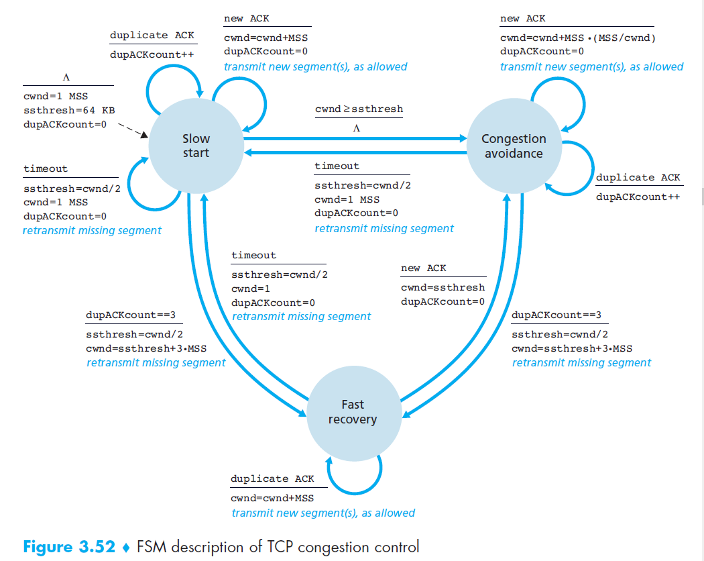
