# C++

> 复习地址:
>
> * [https://github.com/huihut/interview](https://github.com/huihut/interview)

## C++ 知识结构系统梳理

### 关键字

### 零碎知识

### 面向对象

> 有关虚函数指针和虚函数表的资料：[https://blog.twofei.com/496/](https://blog.twofei.com/496/)
>
> 如何定义一个只能分配在栈（堆）上的类：[https://www.nowcoder.com/questionTerminal/0a584aa13f804f3ea72b442a065a7618](https://www.nowcoder.com/questionTerminal/0a584aa13f804f3ea72b442a065a7618)

### 智能指针

智能指针定义在头文件 `memory` 中。

### 强制类型转换

