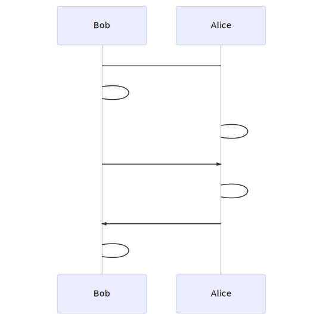

# 1.Introduction

## Chapter 1. Introduction

Terminologies in this Class:

* **Confidentiality, Integrity, Authenticity** etc.
* 安全三要素：保密性、完整性、认证性（真实性）

### Communication System Security

Communication system security is achieved in two aspects:

1. Make each **node** a trusted platform: robust hardware, validated system software, authorized applications.
2. Protect communications on each **link**: mutual authentication, key establishment, cipher suite negotiation, failure detection.

## 课堂笔记

### Diffie-Hellman key exchange (DH)

用于在两个终端之间共享一个私密的数字：

此时两个终端直接就共享了一个私密信息：$$\displaystyle g^{X_A X_B}\pmod{p}$$

### public-key crypto-systems (RSA)

The keys for the RSA algorithm are generated the following way:

1. Choose two distinct prime numbers `p` and `q`
   * For security purposes, the integers `p` and `q` should be chosen at random, and should be similar in magnitude but differ in length by a few digits to make factoring harder.\[\[2]]\([https://en.wikipedia.org/wiki/RSA\_(cryptosystem)#cite_note-rsa-2](https://en.wikipedia.org/wiki/RSA_\(cryptosystem\)#cite_note-rsa-2)) Prime integers can be efficiently found using a [primality test](https://en.wikipedia.org/wiki/Primality_test).
2. Compute `n = pq`
   * _n_ is used as the [modulus](https://en.wikipedia.org/wiki/Modular_arithmetic) for both the public and private keys. Its length, usually expressed in bits, is the [key length](https://en.wikipedia.org/wiki/Key_length).
3. Compute $$\phi(n) = lcm(\phi(p), \phi(q)) = lcm(p − 1, q − 1)$$, where $$\phi$$ is [Carmichael's totient function](https://en.wikipedia.org/wiki/Carmichael's_totient_function). This value is kept private.
4. Choose an integer _e_ such that 1 < _e_ < _λ_(_n_) and [gcd](https://en.wikipedia.org/wiki/Greatest_common_divisor)(_e_, _λ_(_n_)) = 1; i.e., _e_ and _λ_(_n_) are [coprime](https://en.wikipedia.org/wiki/Coprime).
5. Determine _d_ as _d_ ≡ _e_−1 (mod _λ_(_n_)); i.e., _d_ is the [modular multiplicative inverse](https://en.wikipedia.org/wiki/Modular_multiplicative_inverse) of _e_ modulo _λ_(_n_).
