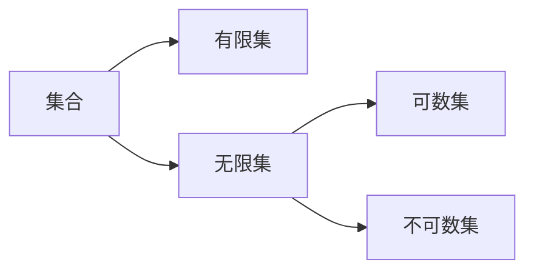

# 第一周

## 概念

集合的大小：集合的势。

基数：

[可数集](https://en.wikipedia.org/wiki/Countable_set)（countable set）： a **countable set** is a [set](https://en.wikipedia.org/wiki/Set_(mathematics)) with the same [cardinality](https://en.wikipedia.org/wiki/Cardinality) ([number](https://en.wikipedia.org/wiki/Cardinal_number) of elements) as some [subset](https://en.wikipedia.org/wiki/Subset) of the set of [natural numbers](https://en.wikipedia.org/wiki/Natural_number). A countable set is either a [finite set](https://en.wikipedia.org/wiki/Finite_set) or a **countably infinite** set. 

同余。

同余关系，等价关系。

