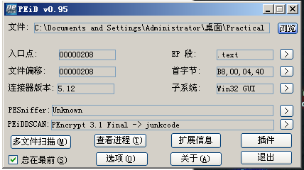
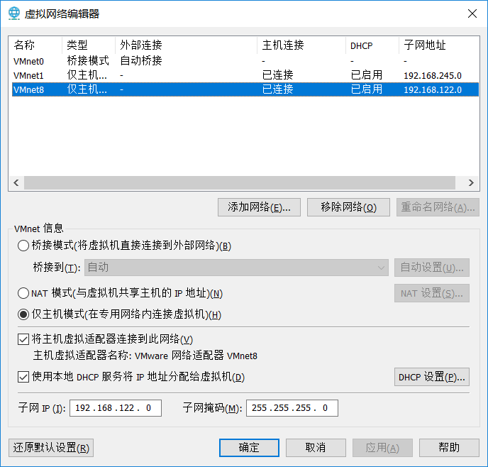
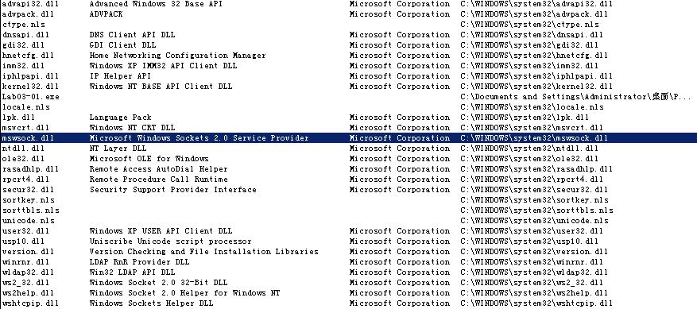
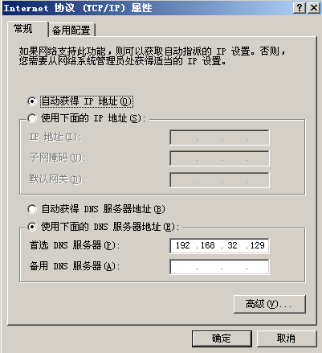
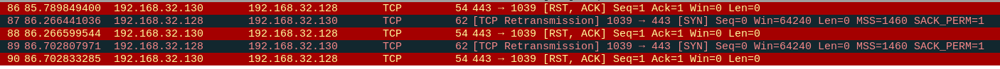
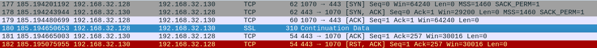

# lab 3-1

## QUESTION 1

> What are this malware’s imports and strings?

通过 `PEiD` 这个软件分析这个病毒：



发现这个病毒使用了 `PEncrypt 3.1` 加壳了。所以我们并不知道它实际的导入函数。

于是我们通过 `strings` 命令分析里面的可见字符串：

```bash
$ strings Lab03-01.exe
!This program cannot be run in DOS mode.
Rich
.text
`.data
ExitProcess
kernel32.dll
ws2_32
# ...
CONNECT %s:%i HTTP/1.0
# ...
QQVP
advpack
StubPath
SOFTWARE\Classes\http\shell\open\commandV
Software\Microsoft\Active Setup\Installed Components\
test
 www.practicalmalwareanalysis.com
admin
VideoDriver
WinVMX32-
vmx32to64.exe
SOFTWARE\Microsoft\Windows\CurrentVersion\Run
SOFTWARE\Microsoft\Windows\CurrentVersion\Explorer\Shell Folders
AppData
V%X_
```

可见加壳后还有一些注册表位置、域名等字符串。

## QUESTION 2

> What are the malware’s host-based indicators?

下面将通过动态技术分析这个病毒的网络状态，因此我们需要将虚拟机的网络设置为主机模式：



在主机中扫描局域网，可以看到虚拟机的网络号：

```cmd
$ nmap -sP 192.168.122.0/24
Starting Nmap 7.70 ( https://nmap.org ) at 2019-05-03 13:57 ?D1ú±ê×?ê±??
Nmap scan report for 192.168.122.254
Host is up (0.00s latency).
MAC Address: 00:50:56:E8:EC:7F (VMware)
Nmap scan report for 192.168.122.1
Host is up.
Nmap done: 256 IP addresses (2 hosts up) scanned in 12.31 seconds
```

先使用 `Process Explorer` 这个工具分析这个病毒。分析这个病毒导入的 `dll` 中，我们发现了与网络相关的动态链接库 `mswsock.dll`：



我们恢复虚拟机快照，重启虚拟机再在虚拟机中打开 `Procmon`，添加 `Process Name - is - lab03-01.exe` 的过滤器，然后运行这个病毒，我们可以在 `Procmon` 中检测到病毒的行为特征：


可见在 `Operation` 一栏中，在 `Procmon` 记录了从 `Process Start` 开始病毒调用的所有 API 函数。分析这一栏调用的 API 函数，发现这个病毒大量地调用了 `CreateFile` 函数和 `RegOpenKey` 这两个 API 函数。并没有发现与网络请求相关的函数调用。

所以被感染的主机会有以上分析出的不寻常文件的创建、以上注册表项的更改、可能与 `www.practicalmalwareanalysis.com` 建立了连接这些特征。

## QUESTION 3

> Are there any useful network-based signatures for this malware? If so, what are they?

### 分析

为了分析这个病毒的网络请求，使用 `ApateDNS` 这个工具，可以用于劫持本地的所有 DNS 请求，[下载以及介绍地址](<https://www.aldeid.com/wiki/Mandiant-ApateDNS>)。

但是这个工具似乎并不可以在 Windows XP 虚拟机上运行（年代久远的系统还有很多网络不兼容的问题），于是我在南开大学[正版软件]([http://ca.nankai.edu.cn](http://ca.nankai.edu.cn/))上下载了 `Windows 7` 的镜像。然后在虚拟机上运行 `ApateDNS` 劫持本地的所有 DNS 请求，打开浏览器测试：


**但是这个病毒竟然无法在 `Windows 7` 上运行**。

于是我决定同时打开 `Windows XP` 和 `Windows 7` 系统，使用 `vmware` 中的 NAT 中，使得两个虚拟机位于同一局域网中，关闭 `Windows 7` 的防火墙，让 `Windows XP` 的 `DNS` 流量流向 `Windos 7`。同时，为了处理病毒可能会请求的 `HTTP` 流量，我们打开 `Kali Linux`，也用同样的方式至于局域网中。我们先通过 `nmap & ipconfig` 查看 `DHCP` 服务器分配给三个虚拟机的 `IP`：

```cmd
$ nmap -sP 192.168.32.0/24
Starting Nmap 7.70 ( https://nmap.org ) at 2019-05-05 08:55 ?D1ú±ê×?ê±??
Nmap scan report for 192.168.32.128     # ===> Windows XP (病毒)
Host is up (0.0010s latency).
MAC Address: 00:0C:29:07:DB:FB (VMware)
Nmap scan report for 192.168.32.129     # ===> Windows 7 (DNS 服务器)
Host is up (0.0050s latency).
MAC Address: 00:0C:29:62:3E:4E (VMware)
Nmap scan report for 192.168.32.130
Host is up (0.0010s latency).           # ===> Kali Linux (WEB 服务器)
MAC Address: 00:0C:29:62:3E:4E (VMware)
Nmap scan report for 192.168.32.254
Host is up (0.00s latency).
MAC Address: 00:50:56:F6:6C:A8 (VMware)
Nmap scan report for 192.168.32.1       # ===> 主机
Host is up.
Nmap done: 256 IP addresses (4 hosts up) scanned in 9.63 seconds
```

这其中 `192.168.32.128` 是 `Windows XP` 的局域网 IP、`192.168.32.129` 是 `Windows 7` 的局域网 `IP`。我们保持 `Windows 7` 的 `ApateDNS` 处于运行状态，并且设置 `Windows XP` 的 `DNS` 地址：



使用 `nslookup` 以确定我们已经正确地设置了 `DNS` 地址：

```cmd
$ nslookup www.baidu.com
Server:  129.32.168.192.in-addr.arpa
Address:  192.168.32.129

Non-authoritative answer:
Name:    www.baidu.com.localdomain
Address:  127.0.0.1
```

很显然这个 `127.0.0.1` 的应答是我们的 `Win7` 系统给出的。为了避免病毒直接通过 IP 访问，我们简单地把主机的网络切断。至此我们已经设置好了 `DNS` 的环境，于是我们可以愉快地分析病毒了。

运行病毒，我们再 `Windows 7` 上发现，这个病毒尝试解析 `www.practicalmalwareanalysis.com` 这个域名：


接着我们在 `Kali Linux` 搭建一个简单的 WEB 服务器：

```bash
$ iptables -A INPUT -p tcp --dport 80 -j ACCEPT

$ iptables-save

$ mkdir /var/www/malware

$ cd /var/www/malware

$ python3 -m http.server 80
Serving HTTP on 0.0.0.0 port 80 (http://0.0.0.0:80/) ...
```

然后我们呢在 `Win7` 中，把 `DNS` 解析的结果指向 `Kali`，然后再在 `XP` 中运行病毒：我们发现 `Win7` 中有 `DNS` 的解析结果，但是 `Kali` 中却没有来自病毒的访问记录。

于是开始怀疑病毒访问的不是标准端口，因为 `Kali` 是默认安装了 `wireshark` 的，我们使用下面的过滤器直接使用 `wireshark` 抓包：

```sql
ip.addr == 192.168.32.128
```



如上图，我们发现它竟然访问的是 `443` 端口，于是我们先尝试把 `HTTP` 服务部署在 `443` 端口：


发现这个病毒是真实使用的 `HTTPS` 服务进行访问。我们再搭建一个简单的 `HTTPS` 服务：

```bash
$ openssl req -x509 -newkey rsa:2048 -keyout key.pem -out cert.pem -days 365

$ cat << _EOF_ > httpsserver.py
from http.server import HTTPServer, BaseHTTPRequestHandler
import ssl


httpd = HTTPServer(('localhost', 4443), BaseHTTPRequestHandler)

httpd.socket = ssl.wrap_socket (httpd.socket, 
    keyfile="./key.pem", certfile='path/to/cert.pem', server_side=True)

httpd.serve_forever()
_EOF_

$ python3 httpsserver.py
```

再用 `wireshark` 抓包，发现服务器拒绝了病毒的连接申请：



这说明病毒访问的根本不是真正的 `HTTPS` 服务，但是 `HTTP` 同样也无法处理这个请求。

### 结论

病毒运行之后首先会请求解析 `www.practicalmalwareanalysis.com` 的 IP，与目标主机建立了 `TCP` 连接之后，以一个非 `HTTPS & HTTP` 协议访问目标服务器的 443 端口。

