> 学习途径：
>
> - 欧阳星明、华中科技大学出版社 《数字逻辑》

# 低密度可编程逻辑器件

## 可编程只读存储器

### 1. 半导体存储器分类

按功能分类可以分为随机存取存储器 RAM（Random Access Memory, RAM）和只读存储器 ROM（Read Only Memory）两大类。

1. RAM 是一种既可读又可写的存储器，故称为读写存储器。

   - 优点是读写方便，使用灵活
   - 缺点是一旦断点，所存储的信息便会丢失，它属于**易失性存储器**。

2. ROM 是一种在正常工作时只能读出、不能写入的存储器。

   - 只读存储器存储属于的过程通常称为编程，根据编程方法的不同可以分为：掩膜编程 ROM（MROM）和用户可编程 ROM 两类。

   - 只读存储器 ROM 属于**非易失性存储器**，即使切断电源，ROM 内的信息也不会丢失。

### 2. 可编程 ROM 的结构

可编程 ROM 主要由地址译码器和存储体两大部分组成：

其中：

- $$A_0, A_1, ..., A_{n-1}$$ 称为地址输入线；
- $$W_0, W_1, ..., W_{2^n-1}$$ 称为地址译码输出线，一般称为字线；
- $$D_0, D_1, ..., D_{m-1}$$ 称为数据输出线，一般称为位线。

### 3. 可编程 ROM 的类型

1. 一次编程的 ROM
2. 可抹可编程 ROM
3. 电可抹可编程 ROM
4. 快闪存储器