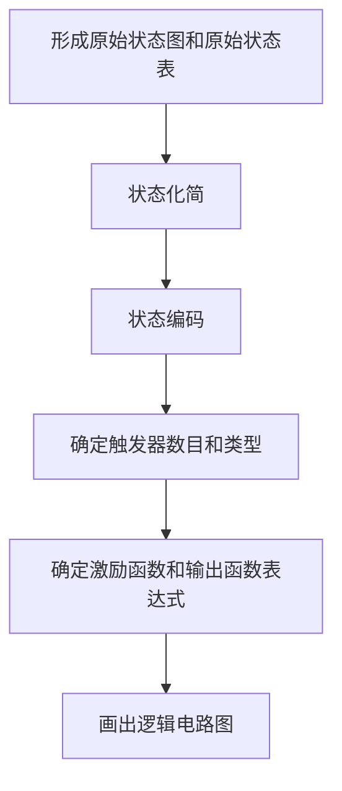

# 同步时序逻辑电路设计

## 1、设计的一般步骤

```mermaid
graph TB;
A[形成原始状态图和原始状态表]-->B[状态化简];
B-->C[状态编码]; C-->D[确定触发器数目和类型];
D-->E[确定激励函数和输出函数表达式]
E-->F[画出逻辑电路图]
```

## 2、完全确定同步时序逻辑电路设计

### 2.1、形成原始状态图和原始状态表

1. 确定电路模型：`Mealy` 模型、`Moore` 模型。

2. 设立初始状态
3. 根据需要记忆的信息增加新的状态
4. 确定各时刻电路的输出

### 状态化简