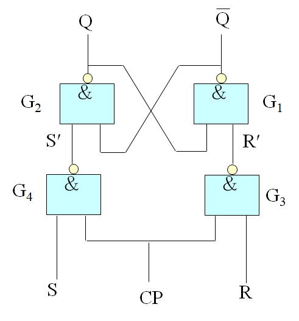
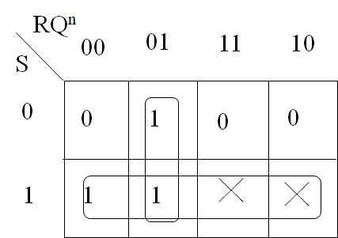
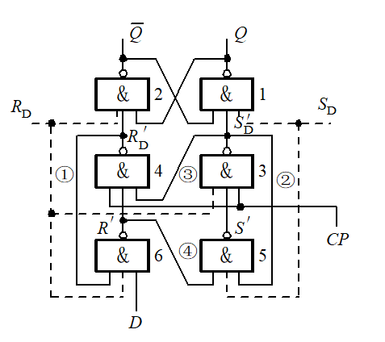
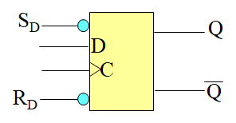
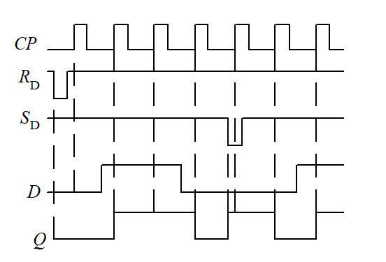

> 学习地址：http://210.45.192.19/kecheng/2004/11/courseware/chapter4.ppt

# 触发器

## 分类

按动作特点分类：

- 基本 RS 触发器
- 同步 RS 触发器
- 主从触发器
- 边沿触发器

按功能分类：

- RS 触发器
- JK 触发器
- D 触发器
- T 触发器

## 基本 RS 触发器

### 电路结构

### 动作特点

功能表：

| R    | S    | Qn+1 | 功    能 |
| ---- | ---- | ---- | -------- |
| 0    | 0    | ╳    | 不    定 |
| 0    | 1    | 0    | 置   “0” |
| 1    | 0    | 1    | 置   “1” |
| 1    | 1    | Qn   | 保  持   |

$$Q_{n+1}$$ 卡诺图：

逻辑公式：

$$Q^{n+1} = RQ^{n} + \overline{S}\ where\ R + S = 1$$

### 逻辑符号

## 同步 RS 触发器

### 电路结构

### 动作特点

功能表：

| S    | R    | $$S′=\overline{S}$$ | $$R′=\overline{R}$$ | $$Q_{n+1}$$ | 功  能   |
| ---- | ---- | ------------------- | ------------------- | ----------- | -------- |
| 0    | 0    | 1                   | 1                   | $$Q_{n}$$   | 保   持  |
| 0    | 1    | 1                   | 0                   | 0           | 置   “0” |
| 1    | 0    | 0                   | 1                   | 1           | 置   “1” |
| 1    | 1    | 0                   | 0                   | x           | 不   定  |

卡诺图：

逻辑公式：

$$Q_{n+1} = \overline{R}Q^{n} + S\ where\ RS = 0$$

### 逻辑符号

### 波形图

## 主从 RS 触发器

主从RS触发器状态的翻转发生在 CP 脉冲的下降沿，即 CP 由 1 跳变到 0 的时刻。

- 当 CP=1 时，CP‘=0，主触发器动作，从触发器被封锁；

- 当 CP=0 时，CP’=1，主触发器被封锁，从触发器动作。

### 电路结构

### 动作特点

**主从 RS 触发器**的逻辑功能与**同步 RS 触发器**的逻辑功能相同，因此特性表、特性方程、状态图和驱动表也完全相同。

## 主从 JK 触发器

### 电路结构

### 动作特点

功能表：

| J    | K    | Qn+1                 | 功    能 |
| ---- | ---- | -------------------- | -------- |
| 0    | 0    | Qn                   | 保    持 |
| 0    | 1    | 0                    | 置   “0” |
| 1    | 0    | 1                    | 置   “1” |
| 1    | 1    | $$\overline{Q_{n}}$$ | 计  数   |

逻辑公式：

1. 同步 RS 触发器：$$Q_{n+1} = \overline{R}Q^{n} + S\ where\ RS = 0$$

2. 又由图片信息：$$R = KQ_{n}, S = J\overline{Q_{n}}$$

所以逻辑公式：

$$Q^{n+1} = \overline{K}Q_{n} + J\overline{Q_{n}}$$

### 逻辑符号

### 波形图

## D 边沿触发器

### 电路结构

### 动作特点

功能表：

| D    | $$Q_{n+1}$$ | 功能   |
| ---- | ----------- | ------ |
| 0    | 0           | 置 “0” |
| 1    | 1           | 置 "1" |

逻辑公式：$$Q_{n+1} = D$$

### 逻辑符号

- RD      直接置0端
- SD      直接置1端

### 波形图

