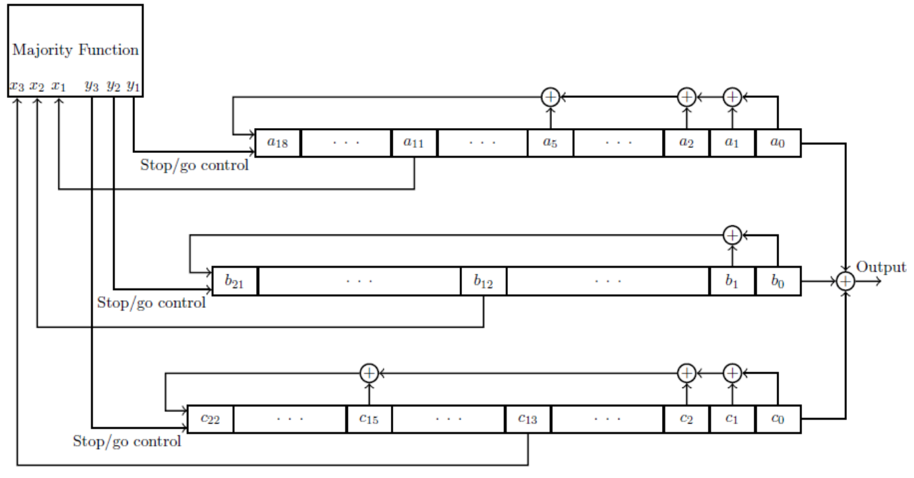

# Chapter 3. Design of Stream Ciphers

## Overview

Two phases in stream cipher:

1. key initialization phase.(`KIA`)
2. `PRSG` running phase.

## Design princinple

## Typical stream Ciphers

### `A5/1` in `GSM`

Cipher flow:


上图中，`A5/1` 部分就是基于一个密钥的随机数生成器，它主要由以下三个部分组成：

1. It uses three `LFSRs` generating m-sequences of large periods

   which is: $$\displaystyle \begin{cases} f_1(x) = x^{19} + x^5 + x^2 + x + 1 \\ f_2(x) = x^{22} + x + 1 \\ f_3(x) = x^{23} + x^{16} + x^2 + x +1 \end{cases}$$

2. Tap positions: $$d_1 = 11, d_2 = 12, d_3 = 13$$.

3. Majority function.

`LFSR` working flow:



KIA phase:

- For session key $$K = (k_0, \cdots, k_{63})$$, and a frame counter number $$N = (n_0, \cdots, n_{21})$$. Let `S` be the concatenation of `K` and `N`.
- （这里还有，懒得写了）

`A5/1` is very weak. (Weakness: short period, majority rule, short key length.)

### `E0` in Bluetooth

### `RC4` in `WEP`

`WEP`:

- The **wire equivalent privacy (`WEP`)** algorithm is used to protect wireless communication from eavesdropping; prevent unauthorized access to a wireless network.

`KIA` phase pseudocode：

```pseudocode
KIA(K)
Initialization:
	for i in range(2^n):
		S[i] = i
Scrambling:
	j = 0
	for i in range(2^n):
		j = j + S[i] + K[i % l]
		swap(S[i], S[j])
```

`PRSG` phase pseudocode:

```pseudocode
PRSG(S):
Initialization:
	i =0, j = 0
Generation Loop:
	i = i+1
	j = j + S[i]
	swap(S[i], S[j])
	t = (S[i] + S[j]) mod N
	yield S[t]
```

Implement in python from [github](<https://github.com/bozhu/RC4-Python>):

```python
#!/usr/bin/env python

def KSA(key):
    keylength = len(key)

    S = range(256)

    j = 0
    for i in range(256):
        j = (j + S[i] + key[i % keylength]) % 256
        S[i], S[j] = S[j], S[i]  # swap

    return S


def PRGA(S):
    i = 0
    j = 0
    while True:
        i = (i + 1) % 256
        j = (j + S[i]) % 256
        S[i], S[j] = S[j], S[i]  # swap

        K = S[(S[i] + S[j]) % 256]
        yield K


def RC4(key):
    S = KSA(key)
    return PRGA(S)

if __name__ == '__main__':
    # test vectors are from http://en.wikipedia.org/wiki/RC4

    # ciphertext should be BBF316E8D940AF0AD3
    key = 'Key'
    plaintext = 'Plaintext'

    # ciphertext should be 1021BF0420
    #key = 'Wiki'
    #plaintext = 'pedia'

    # ciphertext should be 45A01F645FC35B383552544B9BF5
    #key = 'Secret'
    #plaintext = 'Attack at dawn'

    def convert_key(s):
        return [ord(c) for c in s]
    key = convert_key(key)

    keystream = RC4(key)

    import sys
    for c in plaintext:
        sys.stdout.write("%02X" % (ord(c) ^ keystream.next()))
    print
```

`PRSG` phase can be illustrated by the following state transition graph:


### `WG` Stream Cipher

The `WG`  stream cipher can be explained as following formula:

- Initialize $$a_0, \cdots, a_l$$ with given key with l length.

- Updating: $$\displaystyle a_{k+l} = \begin{cases}\displaystyle \sum_{i=0}^{l-1}c_i a_{i+k} + WGperm(a_{k+l-1}) & 0 \le k < 2l,& \text{KIA phase} \\ \displaystyle \sum_{i=0}^{l-1} c_i a_{i+k} & k \ge 2l, & \text{running phase}\end{cases}$$

- Output: $$s_k = WG(a_{k +2l + l-1})$$

Cipher flow:


