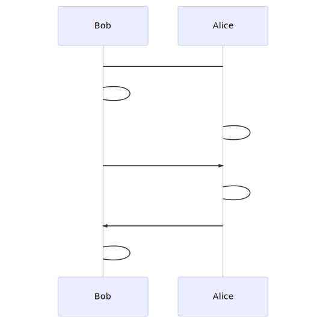

# Chapter 5. Public-Key Cryptographic Algorithms

Security is based on the difficulty of some computational hard problems: factorization large integer, discrete algorithm.

## Diffie-Hellman Key Exchange

用于在两个终端之间共享一个私密的数字：

此时两个终端直接就共享了一个私密信息：$$\displaystyle g^{X_A X_B}\pmod{p}$$

## RSA

### RSA encrypt algorithm

### RSA digital signature algorithm (RSA-DSA)

Signed message m:

- Compute: $$H(m)$$ and $$r = (H(m))^d \pmod{n}$$

- `r` is the digital signature of message `m`

Verify the digital signature `r`:

- Compute $$H(m)$$ and $$s = r^e \pmod{n}$$

- Check if $$H(m) = s$$

## ElGamal digital signature

### Digital signature algorithm (ElGamal-DSA)

在线文档：[ElGamal](https://resources.saylor.org/wwwresources/archived/site/wp-content/uploads/2011/03/ElGamal-signature-scheme.pdf)

见信息安全数学基础中搜集的教程：[ElGamal](../信息安全数学基础/COLLECTION/ElGamal.md)

### How to attack ElGamal `DSA`?

ElGamal `DSA` is much more complicated than `RSA-DSA`:

1. Forgery if `DL` is easy. Simply solve y from x using $$y = g^x \pmod{p}$$
2. Forgery from attacking `PRNG`.
3. Forgery from attacking hash function.
4. Directly solve the signing equation: $$H(m) = xr + ks \pmod{p - 1}$$

### Digital signature standard (ElGamal `DSS`)

`NIST`, authentication of electronic documents.

## Elliptic curve crypto-system

### Elliptic curve over finite field

设 $$\Z_p$$ 为特征大于 3 的素域，在密码学实践中，将 $$E(\Z_p)$$ 上的 `weierstrass` 方程定义为：

- $$y^2 = x^3 +ax +b$$ 或者记做 $$y^2 \equiv x^3 +ax +b \pmod{p}$$

根据对 `Weierstrass` 方程的研究，可以导出这个椭圆曲线上的负元公式和加法公式：

- 设 $$P_1 = (x_1, y_1), P_2 = (x_2, y_2)$$ 是 $$E(\Z_p)$$ 上异于无穷远点 O 的两个点。则：
- 负元公式：$$-P_1 = (x_1, y_1)$$
- 加法公式：考虑 $$P_3 = (x_3, y_3) = P_1 + P_2$$：
  - 可得 $$\begin{cases} x_3 = k^2 -x_1 - x_2 \\ y_3 = k(x_1 - x_3) - y_1\end{cases}$$
  - 其中 $$k = \begin{cases}\displaystyle \frac{y_2 - y_1}{x_2 - x_1} & x_1 \not= x_2 \\ \displaystyle \frac{3x_1^2 + a}{2y_1} & x_1 = x_2\end{cases}$$

### Elliptic curve digital signature algorithm (EC-DSA)

### Identity-Based Cryptography (`IBC`)

