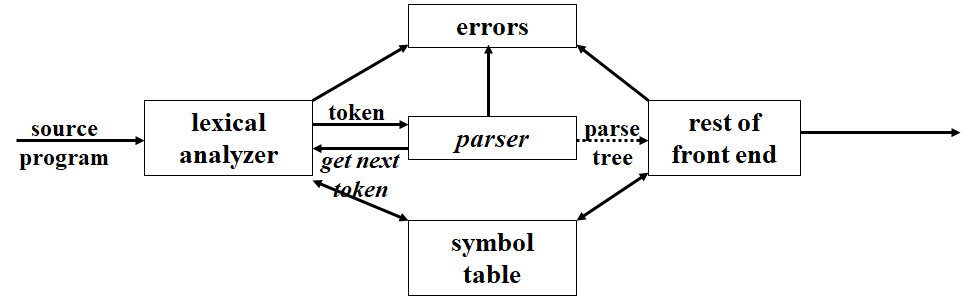

> 学习途径：老师的课件

# Chapter 4 语法分析

学习重点：

- 上下文无关文法
- 自顶向下的分析方法：递归实现、表驱动
- 自底向上的分析方法：算符优先级分析方法、`LR` 分析方法（`SLR`/`规范LR`/`LALR`）。

## 语法分析器的角色



`parser` 功能：

- 利用语法检查单词流的语法结构 &rarr; 构造语法分析树 &rarr; 语法错误和修正 &rarr; 识别正确语法 &rarr; 报告错误

### 错误处理

`LL` 与 `LR` 可最快速度发现错误：

- 活前缀特性，`viable-prefix-property`
- 一个输入前缀不是任何语言中任何符号串的前缀——发生错误错误

错误恢复策略：

1. `Panic` 模式：丢弃单词直至发现同步单词。一个同步单词集的例子如下：

   ```
   {end, ";", "}", ...}
   ```

   - 缺点：丢弃输入，遗漏定义，造成更多错误；
   - 优点：简单，适合于每个语句错误的情况。

2. `phrase level` 短语级：局部修正，继续分析。与 `Panic` 模式相结合，可以避免丢弃过多单词。

3. `error production` 错误产生式：文法添加生成错误语句的产生式。错误产生与自动修正。

4. `global correction`

## 上下文无关文法

### 定义

一个上下文无关文法由终结符号、非终结符号、一个开始符号和一组产生式组成：

1. `终结符号`：或 `词法单元名字`。是组成串的基本符号。
2. `非终结符号`：用于表示串集合的语法变量。
3. `开始符号`：某个非终结符被指定为开始符号，这个符号表示的串集合就是这个文法生成的语言。
4. `产生式`：描述了将终结符和非终结符组合成串的方法。每个产生式由下列元素产生：
   1. 一个被称为`产生式头或左部`的非终结符号；
   2. 符号 '&rarr;'；
   3. 一个由零个或多个终结符号与非终结符号组成的`产生式体或右部`

### 推导

 将产生式看作重写规则。从开始符号出发，每个重写规则把一个非终结符替换为它的某个产生式体。这个推导思想对应于自顶向下构造语法分析树的过程。

### 语法分析树

语法分析树是推导的图形化表现形式（它不计推导过程中对非终结符号应用产生式的顺序）。

### 正则表达式

文法是比正则表达式更强的表示方法 &rarr; 每个可以使用正则表达式描述的构造都可以使用文法来描述，反之不成立。

对于正则表达式，我们可以使用以下的方法构造出一个不确定有穷自动机（NFA）识别同样语言的文法：

1. 对于 NFA 的每个状态 i，创建一个非终结符号 $$A_i$$
2. 如果状态 i 有一个在输入 $$a$$ 上到达状态 j 的转化，则加入产生式 $$A_i \rightarrow aA_j$$。如果状态 i 在输入 $$\epsilon$$ 上达到 j，则加入产生式 $$A_i \rightarrow A_j$$。
3. 如果 i 是一个接受状态，则加入产生式 $$A_i \rightarrow \epsilon$$
4. 如果 i 是自动机的开始状态，令 $$A_i$$ 为所得文法的开始符号。

## 设计文法

### 消除二义性

### 消除左递归

### 提取左公因子

## 自顶向下的语法分析

自顶向下的语法分析可以被看做是为输入串构造语法分析树的问题。

它从语法树的根节点开始，按照先根次序（深度优先地）创建这颗语法分析树的各个节点。

### 递归下降的语法分析

### FIRST 和 FOLLOW

$$FIRST(\alpha)$$

- $$FIRST(\alpha)$$ 被定义为可以从 $$\alpha$$ 推导得到的串的首符号集合，其中 $$\alpha$$ 是任意文法符号串。

- 如果有 $$\alpha \Rightarrow \epsilon$$，那么 $$\epsilon$$ 也在 $$FIRST(\alpha)$$ 集中。


$$FOLLOW(A)$$

- 对于非终结符号 A，$$FOLLOW(A)$$ 被定义为可能在某些句型中紧跟着 A 右边的终结符号的集合。
- 如果 A 是某些句型的最右符号，那么 $$ \$ $$ 也将出现在 $$FOLLOW(A)$$ 中。这是一个特殊的 “结束标记”，我们假设它不是任何文法的符号。

### LL(1) 文法

`L` &rarr; 从左到右扫描输入；

`L` &rarr; 产生最左推导；

`1` &rarr; 表示在每一步中，只需要向前看一个输入符号来决定语法分析动作。

