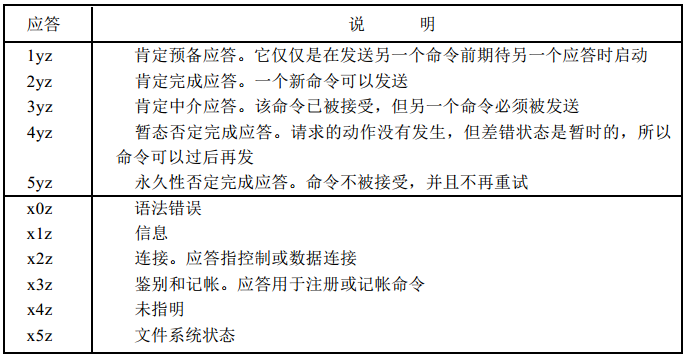

> 学习网址：
>
> - https://www.cnblogs.com/luoxn28/p/5585458.html
> - https://en.wikipedia.org/wiki/File_Transfer_Protocol

# 文件传输协议 FTP

文件传输协议有基于 **TCP** 的FTP和基于**UDP** 的简单文件传输协议 **TFTP**，它们都是文件共享协议中的一大类，即复制整个文件，其特点是：若要存取一个文件，就必须先获得一个本地的文件副本。如果要修改文件，只能对文件的副本进行修改，然后再将修改后的文件传回到原节点。

## 基本工作原理

FTP 使用客户端-服务器模型，一个 FTP 服务器进程可以为多个客户提供服务。

FTP 有两大组成部分：

- 一个主进程，负责接受新的请求，其工作步骤如下：
  1. 打开众所周知的 21 端口，使客户进行可以连接上；
  2. 等待客户进程发送连接请求；
  3. 启动从属进程处理客户进程发送的连接请求，从属进程处理完请求后结束，从属进程在运行期间可能根据需要可创建其他一些子进程；
  4. 回到等待状态，继续接受其他客户进程发起的请求，主进程与从属进程的处理是并发进行的。
- 若干个从属进程，负责处理单个请求。

FTP 控制连接在整个会话期间都保持打开，只用来发送连接/传送请求。当客户进程向服务器发送连接请求时，寻找连接服务器进程的熟知端口 21，同时还要告诉服务器进程自己的另一个端口号码，用于建立数据传送连接。接着，服务器进程用自己传送数据的熟知端口 20 与客户进程所提供的端口号码建立数据传送连接，FTP使用了2个不同的端口号，所以数据连接和控制连接不会混乱。

## Communication and data transfer

### Working Mode

FTP may run in `active` or `passive` mode, which determines how the data connection is established:

- In active mode, the client starts listening for incoming data connections from the server on port `M`. It sends the FTP command `PORT M` to inform the server on which port it is listening. The server then initiates a data channel to the client from its port `20`, the FTP server data port.

- In situations where the client is behind a firewall and unable to accept incoming TCP connections, passive mode may be used. 

  In passive mode, the client uses the control connection to send a `PASV` command to the server and then receives a server IP address and server port number from the server, which the client then uses to open a data connection from an arbitrary client port to the server IP address and server port number received.

在这两种情况下，客户端都使用一个未注册的任意端口 N 连接到服务器的 21 端口，并且使用任意端口连接到服务器 20 端口。

### Response

The server responds over the control connection with [three-digit status codes](https://en.wikipedia.org/wiki/List_of_FTP_server_return_codes) in ASCII with an optional text message. 

For example, `200` (or `200 OK`) means that the last command was successful. The numbers represent the code for the response and the optional text represents a human-readable explanation or request (e.g. `Need account for storing file`).

### Data Representation

While transferring data over the network, four data representations can be used:

- **ASCII mode**: Used for text. Data is converted, if needed, from the sending host's character representation to "8-bit ASCII" before transmission, and (again, if necessary) to the receiving host's character representation.

  As a consequence, this mode is inappropriate for files that contain data other than plain text.

- **Image mode** (commonly called `Binary mode`): The sending machine sends each file byte by byte, and the recipient stores the [bytestream](https://en.wikipedia.org/wiki/Bytestream) as it receives it. (Image mode support has been recommended for all implementations of FTP).

- **EBCDIC mode**（Extended Binary Coded Decimal Interchange Code）: Used for plain text between hosts using the EBCDIC character set.

- **Local mode**: Allows two computers with identical setups to send data in a proprietary format without the need to convert it to ASCII.

Data transfer can be done in any of three modes:

- **Stream mode**: Data is sent as a continuous stream, relieving FTP from doing any processing. Rather, all processing is left up to TCP. No End-of-file indicator is needed, unless the data is divided into records.
- **Block mode**: FTP breaks the data into several blocks (block header, byte count, and data field) and then passes it on to TCP.
- **Compressed mode**: Data is compressed using a simple algorithm (usually [run-length encoding](https://en.wikipedia.org/wiki/Run-length_encoding)).

### Authentication

> Login

FTP login uses normal username and password scheme for granting access.

The username is sent to the server using the `USER` command, and the password is sent using the `PASS` command. This sequence is unencrypted "on the wire", so may be vulnerable to a network sniffing attack. If the information provided by the client is accepted by the server, the server will send a greeting to the client and the session will commence. If the server supports it, users may log in without providing login credentials, but the same server may authorize only limited access for such sessions.

> Anonymous FTP

A host that provides an FTP service may provide anonymous FTP access. Users typically log into the service with an 'anonymous' (lower-case and case-sensitive in some FTP servers) account when prompted for user name. Although users are commonly asked to send their email address instead of a password, no verification is actually performed on the supplied data. Many FTP hosts whose purpose is to provide software updates will allow anonymous logins.

### FTP 命令和应答

命令和应答在客户和服务器的控制连接上以 `NVT` ASCII 码形式传送。这就要求在每行结尾都要返回 CR、LF 对（也就是每个命令或每个应答）。这些命令都是3或4个字节的大写ASCII字符，其中一些带选项参数。

从客户向服务器发送的FTP命令超过30种。下图是比较常用的几种命令：

应答都是 ASCII 码形式的3位数字，并跟有报文选项。其原因是软件系统需要根据数字代码来决定如何应答，而选项串是面向人工处理的。由于客户通常都要输出数字应答和报文串，一个可交互的用户可以通过阅读报文串（而不必记忆所有数字回答代码的含义）来确定应答的含义。

