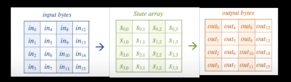

> 学习网址：
>
> - https://www.youtube.com/watch?v=2y_tidbY-Lw

# AES

## demo

## flow

## Concept

### State

Internally, the `AES` algorithm's operations are performed on a two-dimensional array of bytes called the State.

## Cipher

