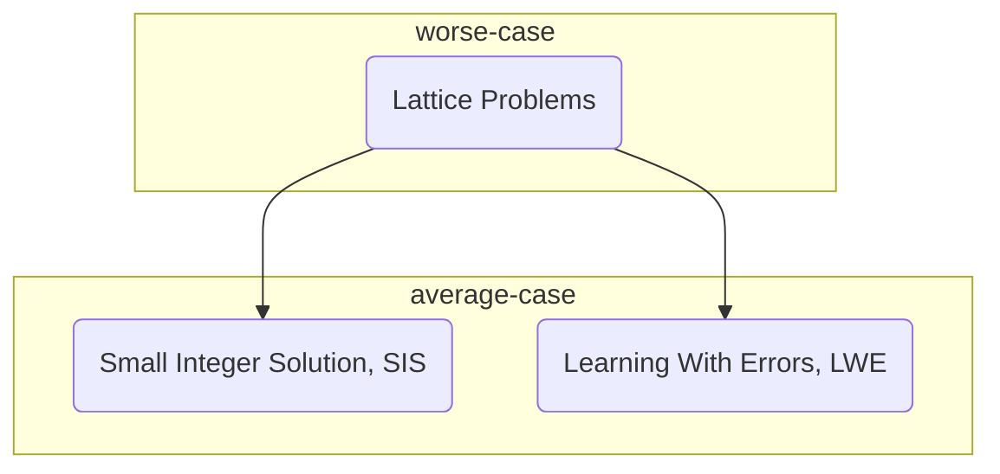

Worse-Case to Average-Case Reduction for SIS

If one wants to build the cryptography based on *worst-case lattice problems*, one just bases it on one of the these two problems:

- Small Integer Solution (**SIS**) Problem
- Learning With Erroes (**LWE**) Problem

*PostScript: Minicrypt &rarr; one of the 5 worlds of impagliazzo*

**Representing Lattices**:

- $$L(B) = \{z: z = Bx\ for\ x\ in\ Z^n\}$$
- $$L^{\perp}(A) = \{z\ in\ Z^m:Az = 0 \mod q\}$$

  

 ## Small Integer Solution Problem (SIS)

> Given: Random vectors $$a_1$$, $$a_2$$, ..., $$a_m$$ in $$Z^n_q$$
>
> Find: non-trivial solution $$z_1$$, $$z_2$$, ..., $$z_m$$ in {-1, 0,1} such that $$\Sigma_1^n z_ma_m = 0$$

### Observation

- If the size of $$z_i$$ is not restricted, then the problem is trivial.
- Immediately implies a collision-resistant hash function.
- A relationship to lattices emerges...

### SIS to Lattice

Let $$S$$ be the set of all integer $$z = (z_1, ..., z_m)$$

such that $$a_1z_1 + ... + a_mz_m = 0\ mod\ q$$

