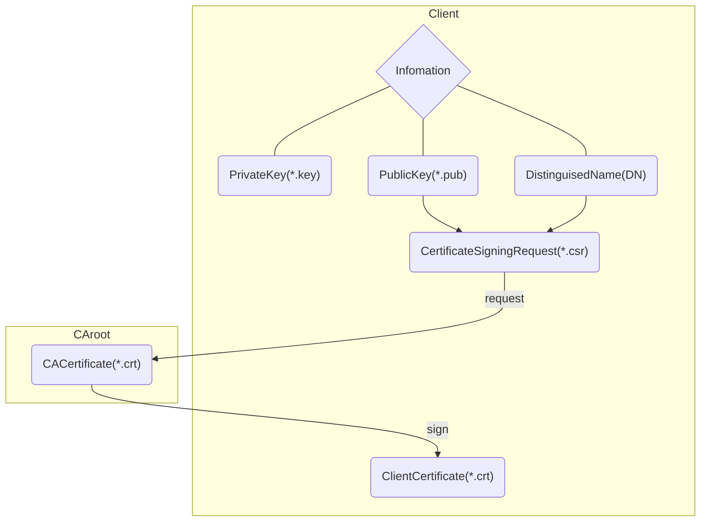

# About Certificate Signing Requests (CSRs)



If you would like to obtain an SSL certificate from a **certificate authority (CA)**, you must generate a **certificate signing request (CSR)**. A CSR consists mainly of the public key of a key pair, and some additional information. 

Whenever you generate a CSR, you will be prompted to provide information regarding the certificate. This information is known as a **Distinguised Name (DN)**. An important field in the DN is the **Common Name(CN)**, which should be the exact Fully Qualified Domain Name (FQDN) of the host that you intend to use the certificate with. It is also possible to skip the interactive prompts when creating a CSR by passing the information via command line or from a file.

Here is an example of what the CSR information prompt will look like:

```bash
---
Country Name (2 letter code) [AU]:US
State or Province Name (full name) [Some-State]:New York
Locality Name (eg, city) []:Brooklyn
Organization Name (eg, company) [Internet Widgits Pty Ltd]:Example Brooklyn Company
Organizational Unit Name (eg, section) []:Technology Division
Common Name (e.g. server FQDN or YOUR name) []:examplebrooklyn.com
Email Address []:
```

If you want to non-interactively answer the CSR information prompt, you can do so by adding the `-subj`option to any OpenSSL commands that request CSR information. Here is an example of the option, using the same information displayed in the code block above:

```bash
-subj "/C=US/ST=New York/L=Brooklyn/O=Example Brooklyn Company/CN=examplebrooklyn.com"
```

