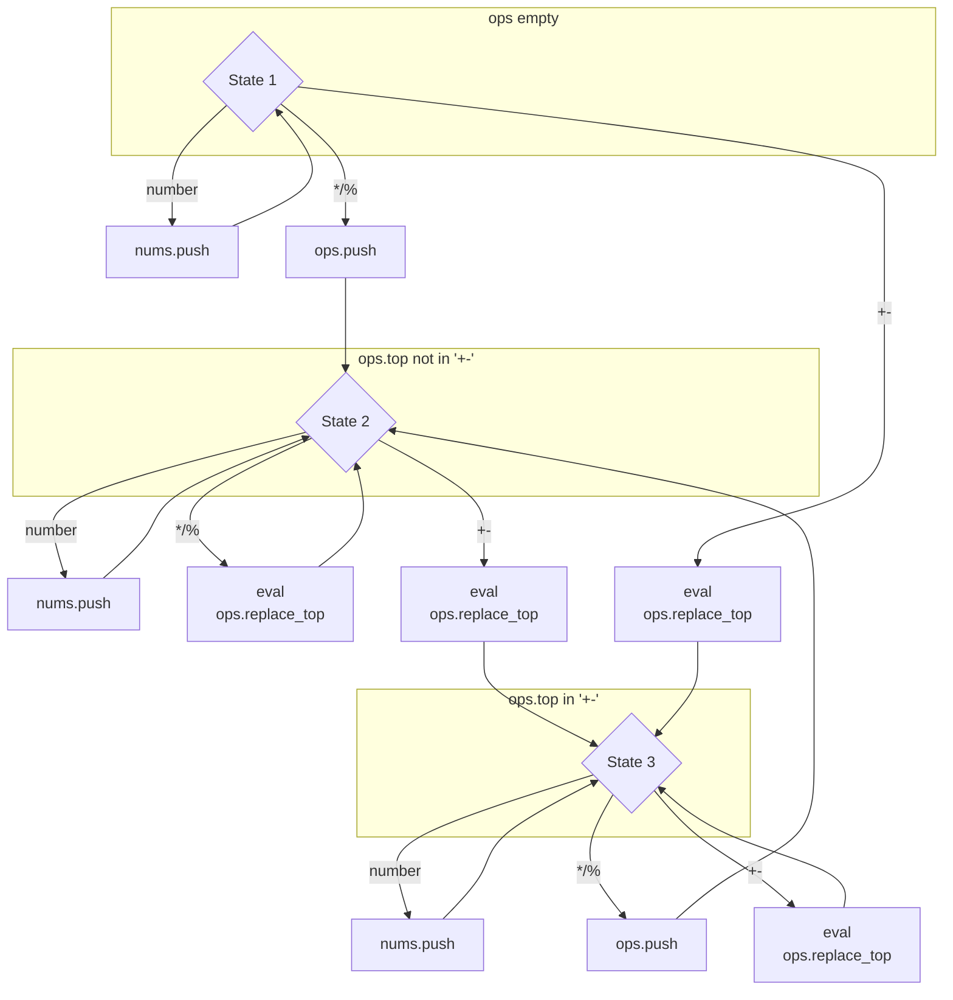

# CALC

## 保护等级

首先检查安全保护等级：

```bash
$ checksec calc
[*] '/media/data/program/ctf/pwnable/calc/calc'
    Arch:     i386-32-little
    RELRO:    Partial RELRO
    Stack:    Canary found
    NX:       NX enabled
    PIE:      No PIE (0x8048000)
```

## 程序逻辑

### `main`

在 `gdb` 中我们可以看到这个程序的逻辑结构过于复杂，我们使用 `Ida Pro` 打开。首先看 `main` 函数，可以在 `Ida Pro` 中查看其伪代码：

```c
int __cdecl main(int argc, const char **argv, const char **envp)
{
  ssignal(14, timeout);
  alarm(60);
  puts("=== Welcome to SECPROG calculator ===");
  fflush(stdout);
  calc();
  return puts("Merry Christmas!");
}
```

### `calc`

显然 `calc` 是这个程序的主函数：

```c
unsigned int calc()
{
  int v1; // [esp+18h] [ebp-5A0h]
  int v2[100]; // [esp+1Ch] [ebp-59Ch]
  char s; // [esp+1ACh] [ebp-40Ch]
  unsigned int v4; // [esp+5ACh] [ebp-Ch]

  v4 = __readgsdword(0x14u);
  while ( 1 )
  {
    bzero(&s, 0x400u);
    if ( !get_expr(&s, 1024) )
      break;
    init_pool(&v1);
    if ( parse_expr(&s, &v1) )
    {
      printf((const char *)&unk_80BF804, v2[v1 - 1]);
      fflush(stdout);
    }
  }
  return __readgsdword(0x14u) ^ v4;
}
```

并且可以查看它的调用栈：


我们逐个分析这个伪代码的功能：

1. `v4 = __readgsdword(0x14u)` 这个从 [MSDN](<https://docs.microsoft.com/en-us/cpp/intrinsics/readgsbyte-readgsdword-readgsqword-readgsword?view=vs-2019>) 中可以找到函数的功能，它从与 `gs` 段起始位置相对 `0x14u` 的位置中取出一个数字并赋值给 `v4`。它应该是实现了一个 `Canary` 的功能。
2. 循环中第一个语句 `bzero(%ebp - 0x40c, 0x400)` 仔细查看了其中的函数调用，之后又以无参数形式调用了 `bzero()` 的一个重载，不太看得懂。我们猜测是初始化的；
3. `get_expr(%ebp - 0x40c, 1024)` 应该是从我们的标准输入读取表达式的函数，我们暂时不研究其逻辑；
4. `init_pool(%ebp - 0x5a0);` 这个函数的作用是，将传入的指针作为一个四字节的指针，并且将这个地址之后的的 100 个位置全部赋值为 0。是一个初始化 int 数组的函数。
5. `parse_expr(%ebp -0x40c, %ebp - 0x5a0)` 应该是将输入解析到 `%ebp - 0x5a0` 这个地方做存储结果的函数，我们暂时不研究其逻辑；
6. 如果解析成功会调用 `printf((const char *)&unk_80BF804, v2[v1 - 1]);`，其中 `unk_80BF804` 的内容就是 `%d`，`v2[v1 - 1]` 应该是结果存储的位置（由它们的相对位置我们可以分析知道，`v2` 是一个字符串，`v1` 应该是一个标记结果与 `v2` 起始位置相对位置的整数）。

逻辑清晰了，我们接着分析取表达式和解析表达式这两个关键的函数。

### `get_expr`

首先是 `get_expr` 读取表达式的函数，我重命名了其中的变量，逻辑非常地清晰：

```c
int __cdecl get_expr(int dest, int max_len)
{
  int chr_pos; // eax
  char input_chr; // [esp+1Bh] [ebp-Dh]
  int cur_len; // [esp+1Ch] [ebp-Ch]

  cur_len = 0;
  while ( cur_len < max_len && read(0, &input_chr, 1) != -1 && input_chr != '\n' )
  {
    if ( input_chr == '+'
      || input_chr == '-'
      || input_chr == '*'
      || input_chr == '/'
      || input_chr == '%'
      || input_chr > 47 && input_chr <= 57 )
    {
      chr_pos = cur_len++;
      *(_BYTE *)(dest + chr_pos) = input_chr;
    }
  }
  *(_BYTE *)(cur_len + dest) = 0;
  return cur_len;
}
```

### `eval`

在讨论函数 `parse_expr` 之前，我们先分析在它调用最频繁的函数 `eval`：

```c
int *__cdecl eval(int *num_stack, char operator)
{
    int *result; // eax

    if (operator== '+')
    {
        num_stack[*num_stack - 1] += num_stack[*num_stack];
    }
    else if (operator> 43)
    {
        if (operator== '-')
        {
            num_stack[*num_stack - 1] -= num_stack[*num_stack];
        }
        else if (operator== '/')
        {
            num_stack[*num_stack - 1] /= num_stack[*num_stack];
        }
    }
    else if (operator== '*')
    {
        num_stack[*num_stack - 1] *= num_stack[*num_stack];
    }
    result = num_stack;
    --*num_stack;
    return result;
}
```

简单地说这个函数做了这样一件事情：

1. 它传入一个数字栈和一个字符型的操作符
2. 它弹出了栈顶的两个元素，对栈顶的这两个元素进行这个操作符所指定的运算
3. 将这个运算结果压栈

### `parse_expr`

然后我们分析 `parse_expr`，漏洞应该就出现在这里。我通读了伪代码之后重命名了一些局部变量，并且对照汇编代码解决了一些不必要的转换之后得到以下的伪代码：

```c
signed int __cdecl parse_expr(int src_str, _DWORD *dest)
{
    int dest_len;        // [esp+18h] [ebp-90h]
    char *src_str_cpy;   // [esp+1Ch] [ecp-8Ch]
    int numstr_bgn;      // [esp+20h] [ebp-88h]
    int i;               // [esp+24h] [ebp-84h]
    int stack_top;       // [esp+28h] [ebp-80h]
    int numstr_len;      // [esp+2Ch] [ebp-7Ch]
    char *numstr;        // [esp+30h] [ebp-78h]
    int number;          // [esp+34h] [ebp-74h]
    char stack[100];     // [esp+38h] [ebp-70h]
    unsigned int canary; // [esp+9Ch] [ebp-Ch]

    canary = __readgsdword(0x14u);
    numstr_bgn = src_str;
    stack_top = 0;
    bzero(stack, 0x64u);
    for (i = 0;; ++i)
    {
        // if operator
        if ((unsigned int)(*(char *)(i + src_str) - 48) > 9)
        {
            numstr_len = i + src_str - numstr_bgn;
            numstr = (char *)malloc(numstr_len + 1);
            memcpy(numstr, numstr_bgn, numstr_len);
            numstr[numstr_len] = 0;
            if (!strcmp(numstr, "0"))
            {
                puts("prevent division by zero");
                fflush(stdout);
                return 0;
            }
            number = atoi(numstr);
            if (number > 0)
            {
                dest_len = (*dest)++;
                dest[dest_len + 1] = number;
            }
            if (*(_BYTE *)(i + src_str) && (unsigned int)(*(char *)(i + 1 + src_str) - 48) > 9)
            {
                puts("expression error!");
                fflush(stdout);
                return 0;
            }
            numstr_bgn = i + 1 + src_str;
            if (stack[stack_top])
            {
                switch (*(char *)(i + src_str))
                {
                case '%':
                case '*':
                case '/':
                    // */%: 栈顶是加减法则将操作符入栈，否则调用 eval 后覆盖栈顶
                    if (stack[stack_top] != '+' && stack[stack_top] != '-')
                    {
                        eval(dest, stack[stack_top]);
                        stack[stack_top] = *(_BYTE *)(i + src_str);
                    }
                    else
                    {
                        stack[++stack_top] = *(_BYTE *)(i + src_str);
                    }
                    break;
                case '+':
                case '-':
                    // +-: 调用 eval 后覆盖栈顶
                    eval(dest, stack[stack_top]);
                    stack[stack_top] = *(_BYTE *)(i + src_str);
                    break;
                default:
                    eval(dest, stack[stack_top--]);
                    break;
                }
            }
            else
            {
                stack[stack_top] = *(_BYTE *)(i + src_str);
            }
            if (!*(_BYTE *)(i + src_str))
                break;
        }
    }
    while (stack_top >= 0)
        eval(dest, stack[stack_top--]);
    return 1;
}
```

这个解析运算符的流程大致可以从 `数字栈 num_stack` 与 `操作符栈 op_stack` 这两个栈之间的运算展开。我觉得有必要用一个状态转换图来解释这个函数的工作流程，我们用操作符栈的栈顶来确定三种状态：




