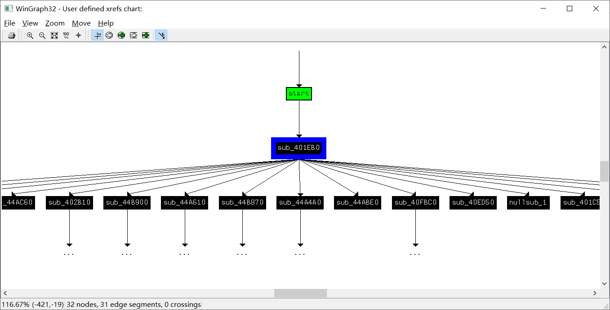

> 参考资料：
>
> - 64 位程序函数调用的参数传递顺序：<http://abcdxyzk.github.io/blog/2012/11/23/assembly-args/>

# 3x17

## 保护等级

首先检查程序的保护等级：

```bash
$ checksec 3x17 
[*] '/media/data/program/ctf/pwnable/3x17/3x17'
    Arch:     amd64-64-little
    RELRO:    Partial RELRO
    Stack:    No canary found
    NX:       NX enabled
    PIE:      No PIE (0x400000)
```

首先我们发现这是一个 64 位的程序，另外程序没有开启栈溢出的 `canary` 保护，但是堆栈不可执行。

我们再看程序的链接方式：

```bash
$ objdump -R 3x17 

3x17：     文件格式 elf64-x86-64

objdump: 3x17：不是动态对象
objdump: 3x17: invalid operation
```

是一个静态链接的文件。

## 程序逻辑

在 `gdb` 中我们并没有发现任何函数名与变量名的信息。于是我们可以尝试为文件添加一些标识，否则分析起来就太困难了。我们用 `ida` 打开后发现一个名为 `start` 的函数，我们从这个函数开始我们的逻辑分析。

### `start`

这个函数貌似因为没有返回值而无法被 `ida` 翻译出伪代码，因此我们直接分析它的汇编代码：

```assembly
.text:0000000000401A50                 xor     ebp, ebp
.text:0000000000401A52                 mov     r9, rdx
.text:0000000000401A55                 pop     rsi
.text:0000000000401A56                 mov     rdx, rsp
.text:0000000000401A59                 and     rsp, 0FFFFFFFFFFFFFFF0h
.text:0000000000401A5D                 push    rax
.text:0000000000401A5E                 push    rsp
.text:0000000000401A5F                 mov     r8, offset sub_402960
.text:0000000000401A66                 mov     rcx, offset loc_4028D0
.text:0000000000401A6D                 mov     rdi, offset sub_401B6D
.text:0000000000401A74                 db      67h
.text:0000000000401A74                 call    sub_401EB0
.text:0000000000401A7A                 hlt
```

其主要做的事情是，初始化栈帧。取到了函数 `sub_402960` 与 `sub_401B6D` 这两个函数的地址。并且通过一个参数调用了 `sub_401EB0` 这个函数。我们通过 64 位程序的调用参数顺序约定，可以得出 `start` 中主要调用：

```c
// 栈帧初始化, assert rdx == 0
$ebp = $esp = 0
// 函数调用
sub_401EB0(*sub_401B6D, 0x0, 0x0, *loc_4028D0, *sub_402960, 0x0)
```

### `sub_401EB0` (major)

对于 `sub_401EB0` 这个函数，我们查看它的调用函数图：



很明显这就是程序的主函数，但是它的参数与 c 中的 `main` 并不符合，我们将其重命名为 `major`。这个程序的流程过于复杂我们先一个个分析它调用的子过程。

### `sub_44AC60`

`major` 函数中将一个 `int64` 的数组全部自加后，将数组的起始指针作为传入值，调用了这个函数。

研究了函数的内部逻辑之后，这个函数实际上是实现了一个映射，将传入的数组中的每一个值映射到了一个全局变量并且对全局变量进行了赋值或进行一些奇怪的操作。看了一会看不出来，将其命名为 `hash_encrypt`。