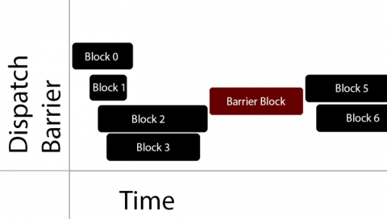

# 多线程

## iOS 线程概述

主线程：

- iOS App 运行后，默认会开启 1 条线程，称为“主线程”或“UI线程”
- 主线程处理 UI 事件（比如点、滑动、拖拽等等）和显示、刷新 UI 界面

iOS 的线程相关技术主要有以下四种：

| 技术方案    | 特点                                                         | 语言        | 线程生命周期 |
| ----------- | ------------------------------------------------------------ | ----------- | ------------ |
| pthread     | 一套通用的多线程 API<br />适用于 Unix/Linux/Windows 系统<br />跨平台、可移植、使用难度大 | C           | 程序员管理   |
| NSThread    | 使用面向对象编程<br />简单易用，可以直接操作线程对象         | Objective-C | 程序员管理   |
| GCD         | 旨在替代前面两种的线程技术<br />充分利用设备的多核特性       | C           | 自动管理     |
| NSOperation | 基于 GCD，加入一些简单实用的功能<br />内容更加面向对象       | Objective-C | 自动管理     |

多线程的优缺点：

- 优点是很显然的：能适当提升程序的执行效率；能适当提升资源利用率（CPU、内存等）
- 缺点：
  - 创建线程是有开销的，比如 iOS 的开销主要有（内核数据结构大约 `1KB`，栈空间，创建时间 90ms）
  - 如果开启大量的线程，会降低程序的性能、增加 CPU 在线程调度上的开销、程序设计更加复杂。

## `NSThread`

什么是 `NSThread`？

- NSThread 是经过 Apple 封装的面向对象的，它允许开发者直接以面向对象的思想对线程进行操作。每一个 NSThread 对象就代表一条线程，但是开发者必须手动管理线程的生命周期，这点是 Apple 不提倡的。

下面是一个利用这个类的实例：

```objective-c
NSThread *thread = [[NSThread alloc] initWithTarget:self selector:@selector(run) object:nil];
[thread start];
```

这个类常见的方法如下所示：

```objective-c
[NSThread mainThread];		// 获取主线程
[NSThread currentThread]; // 获取当前线程
[NSThread exit]; 					// 退出线程
[thread cancel]; 					// 取消线程
[NSThread isMainThread]; 	// 判断是否为多线程
```

创建一个新的多线程还有其他的创建方式：

```objective-c
[NSThread detachNewThreadSelector:@selector(run) toTarget:self withObject:nil];
[self performSelectorInBackground:@selector(run) withObject:nil];
```

## GCD && NSOperation

### GCD

GCD：Grand Central Dispatch。

- 它可用于多核的并行运算，自动利用更多的 CPU 内核，自动管理的线程生命周期。

同步执行与异步执行：

- 同步：同步添加任务到指定的队列中，在添加的任务执行结束之前，会一直等待，直到队列里面的任务完成之后再继续执行。只能在当前线程中执行任务，不具备开启新线程的能力。

  下面是一个使用同步执行任务的例子：

  ```objective-c
  dispatch_queue_t queue = dispatch_get_main_queue();
  dispatch_sync(queue, ^{
          // 想执行的任务
  });
  ```

- 异步：异步添加任务到指定的队列中，它不会做任何等待，可以继续执行任务。可以在新的线程中执行任务，具备开启新线程的能力。

  下面是一个使用异步执行任务的例子：

  ```objective-c
  dispatch_queue_t queue = dispatch_get_main_queue();
  dispatch_async(queue, ^{
     // 想执行的任务
  });
  ```

Dispatch Queue 是执行处理的等待队列。主要有以下两种：

1. `Serial Queue`：串行队列，也称为私有调度队列。按顺序将其中一个任务添加到队列中，并且一次只执行一个任务。一个串行队列使用一个线程。

   下面是生成一个串行队列，并且使用的示例代码：

   ```objective-c
   dispatch_queue_t queue = dispatch_queue_create("MySerialDiapatchQueue", DISPATCH_QUEUE_SERIAL);
       
   dispatch_async(queue, ^{ NSLog(@"thread1"); });
   dispatch_async(queue, ^{ NSLog(@"thread2"); });
   dispatch_async(queue, ^{ NSLog(@"thread3"); });
   ```

2. `Concurrent Queue`：并行队列，也称为全局调度队列。同时执行一个或多个任务，但任务仍然按照它们添加到队列的顺序执行。

   下面是生成一个并行队列，并且使用的示例代码：

   ```objective-c
   dispatch_queue_t queue = dispatch_queue_create("MyConcurrentDiapatchQueue", DISPATCH_QUEUE_CONCURRENT);
   
   dispatch_async(queue, ^{ NSLog(@"thread1"); });
   dispatch_async(queue, ^{ NSLog(@"thread2"); });
   dispatch_async(queue, ^{ NSLog(@"thread3"); });
   ```

另外，系统为每个应用程序提供了一个主调度队列和四个并发调度队列。这些队列对应用程序而言是全局的，而且只对它们的优先级进行区分。我们不需要创建它们，可以用 `dispatch_get_global_queue` 函数的获取其中一个队列：

1. `Main Dispatch Queue`：主调度队列，是一种串行队列。通过下面的方式获取：

   ```objective-c
   dispatch_queue_t mainDiapatchQueue = dispatch_get_main_queue();
   ```

2. `Global Dispatch Queue`：全局并发队列，是四个并行队列。系统为它们四个划分了优先级顺序，分别是 高 `High Priority`、默认 `Default Priority`、低 `Low Priotity`、后台 `Background Priority`。

   下面是四段获取这些队列的代码：

   ```objective-c
   dispatch_queue_t globalDiapatchQueueHigh = dispatch_get_global_queue(DISPATCH_QUEUE_PRIORITY_HIGH, 0);
   
   dispatch_queue_t globalDiapatchQueueDefault = dispatch_get_global_queue(DISPATCH_QUEUE_PRIORITY_DEFAULT, 0);
   
   dispatch_queue_t globalDiapatchQueueLow = dispatch_get_global_queue(DISPATCH_QUEUE_PRIORITY_LOW, 0);
   
   dispatch_queue_t globalDiapatchQueueBackground = dispatch_get_global_queue(DISPATCH_QUEUE_PRIORITY_BACKGROUND, 0);
   ```

另外，处理 GCD 也有一些常见的函数和概念：

- `dispatch_after`：指定一个时间，在延迟给定的时间过后，将任务添加到任务队列中执行（可能因为主线程本身的处理有延迟，导致时间不准确）。

  下面是一个使用这个函数的例子：

  ```objective-c
  /**
   * dispatch_time: 获取 dispatch_time_t 类型的时间
   * DISPATCH_TIME_NOW: 当前时间
   * NSEC_PER_SEC: 单位秒
   */
  dispatch_time_t time = dispatch_time(DISPATCH_TIME_NOW, (int64_t)(3 * NSEC_PER_SEC));
  
  dispatch_after(time, dispatch_get_main_queue(), ^{
      NSLog(@"wait at least three second");
  });
  ```

- `dispatch group`：可以将数个异步多线程任务 组合成一个调度组，通过 `dispatch_group_create` 函数创建，通过 `dispatch_group_async` 函数添加任务。组中的所有异步任务执行结束之后，发出统一的通知，使用 `dispatch_group_notify` 捕获。

  比如下面是一个使用这些函数的例子：

  ```objective-c
  dispatch_queue_t queue = dispatch_get_global_queue(DISPATCH_QUEUE_PRIORITY_HIGH, 0);
  
  dispatch_group_t group = dispatch_group_create();
  dispatch_group_async(group, queue, ^{ NSLog(@"下载图片A"); });
  dispatch_group_async(group, queue, ^{ NSLog(@"下载图片B"); });
  dispatch_group_async(group, queue, ^{ NSLog(@"下载图片C"); });
  
  dispatch_group_notify(group, dispatch_get_main_queue(), ^{
    NSLog(@"处理下载完成的图片");
  });
  ```

  另外也可以调用 `dispatch_group_enter` 函数，从而将之后创建的所有的任务都加入对应的调度组。也可以在任务代码中调用 `dispatch_group_leave`，使当前的任务离开对应的调度组。

  比如下面是一个使用这两个函数的例子：

  ```objective-c
  dispatch_group_t group = dispatch_group_create();
  dispatch_queue_t queue = dispatch_get_global_queue(DISPATCH_QUEUE_PRIORITY_DEFAULT, 0);
  dispatch_group_enter(group);
  dispatch_async(queue, ^{
      NSBlockOperation *op = [NSBlockOperation blockOperationWithBlock:^{
          NSLog(@"group 1");
          dispatch_group_leave(group);
      }];
      [op start];
  });
  
  dispatch_group_enter(group);
  dispatch_async(queue, ^{
      NSBlockOperation *op = [NSBlockOperation blockOperationWithBlock:^{
          NSLog(@"group 2");
          dispatch_group_leave(group);
      }];
      [op start];
  });
  
  dispatch_group_notify(group, dispatch_get_main_queue(), ^{
      NSLog(@"group end");
  });
  ```

- `dispatch_barrier_async` 函数用于将一个任务添加到并发执行的任务队列中，通过这种方式添加到队列中的任务：

  1. 需要等待前面的所有并发任务执行完成后才开始执行；
  2. 在这个任务执行时，该并发队列中不能有其他任务执行；
  3. 所有排列在该任务之后的任务，需在这个任务执行完成之后执行。

  也就是说，它大概是通过下面这个图片的方式执行的：

  

### NSOperation

`NSOperation`、`NSOperationQueue` 是基于 GCD 更高一层的封装，完全面向对象。下面介绍一下与这个类相关的一些方法：

任务的创建过程：

- 使用 `NSOperation` 的子类 `NSInvocationOperation`、`NSBlockOperation`。

- 下面是一个使用 `NSInvocationOperation` 创建任务的例子：

  ```objective-c
  - (void)task1 {
      for (int i = 0; i < 2; i++) {
          [NSThread sleepForTimeInterval:2]; 					// 模拟耗时操作
          NSLog(@"1---%@", [NSThread currentThread]); // 打印当前线程
      }
  }
  
  - (void)useInvocationOperation {
      // 1.创建 NSInvocationOperation 对象
      NSInvocationOperation *op = [[NSInvocationOperation alloc] initWithTarget:self selector:@selector(task1) object:nil];
      // 2.调用 start 方法开始执行操作
      [op start];
  }
  ```

- 下面则是一个使用 `NSBlockOperation` 创建任务的例子：

  ```objective-c
  - (void)useBlockOperation {
      // 1.创建 NSBlockOperation 对象
      NSBlockOperation *op = [NSBlockOperation blockOperationWithBlock:^{
          for (int i = 0; i < 2; i++) {
              [NSThread sleepForTimeInterval:2]; 					// 模拟耗时操作
              NSLog(@"1---%@", [NSThread currentThread]); // 打印当前线程
          }
      }];
      // 2.调用 start 方法开始执行操作
      [op start];
  }
  ```

  另外在执行 `start` 之前，可以通过调用 `addExecutionBlock` 函数，向 Operation 中添加新的任务。

队列的创建过程：

- `NSOperationQueue` 是任务的队列。可以通过下面的方法获得这样的队列：

  ```objective-c
  // 获取主队列
  NSOperationQueue *queue = [NSOperationQueue mainQueue];
  
  // 创建一个自定义队列
  NSOperationQueue *queue = [[NSOperationQueue alloc] init];
  ```

- `NSOperationQueue` 有一个函数名称为 `addOperation`，即将任务添加到队列中。下面是一个用例：

  ```objective-c
  - (void)addOperationToQueue {
      // 1.创建队列
      NSOperationQueue *queue = [[NSOperationQueue alloc] init];
      
      // 2.创建操作
      // 使用 NSInvocationOperation 创建操作1
      NSInvocationOperation *op1 = [[NSInvocationOperation alloc] initWithTarget:self selector:@selector(task1) object:nil];
      
      // 使用 NSInvocationOperation 创建操作2
      NSInvocationOperation *op2 = [[NSInvocationOperation alloc] initWithTarget:self selector:@selector(task2) object:nil];
      
      // 使用 NSBlockOperation 创建操作3
      NSBlockOperation *op3 = [NSBlockOperation blockOperationWithBlock:^{
          for (int i = 0; i < 2; i++) {
              [NSThread sleepForTimeInterval:2]; // 模拟耗时操作
              NSLog(@"3---%@", [NSThread currentThread]); // 打印当前线程
          }
      }];
      [op3 addExecutionBlock:^{
          for (int i = 0; i < 2; i++) {
              [NSThread sleepForTimeInterval:2]; // 模拟耗时操作
              NSLog(@"4---%@", [NSThread currentThread]); // 打印当前线程
          }
      }];
      
      // 3.使用 addOperation: 添加所有操作到队列中
      [queue addOperation:op1]; // [op1 start]
      [queue addOperation:op2]; // [op2 start]
      [queue addOperation:op3]; // [op3 start]
  }
  ```

- 设置属性 `maxConcurrentOperationCount` 可以控制队列中的最大并发数；

- 调用函数 `addDependency` 可以设置队列中任务执行的依赖顺序。比如希望 op2 一定在 op1 之后执行：

  ```objective-c
  [op2 addDependency:op1];
  ```

`NSOperation` 也存在任务之间的优先级的关系，它们是通过枚举常量定义的：

```objective-c
typedef NS_ENUM(NSInteger, NSOperationQueuePriority) {
    NSOperationQueuePriorityVeryLow = -8L,
    NSOperationQueuePriorityLow = -4L,
    NSOperationQueuePriorityNormal = 0,
    NSOperationQueuePriorityHigh = 4,
    NSOperationQueuePriorityVeryHigh = 8
};
```

