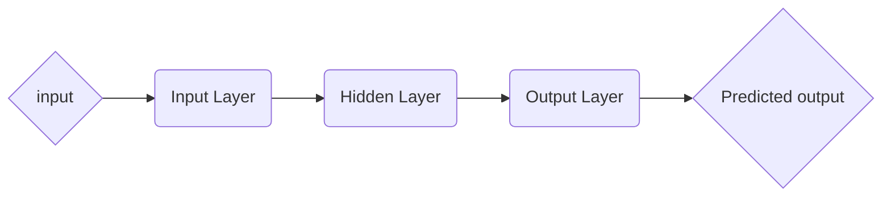
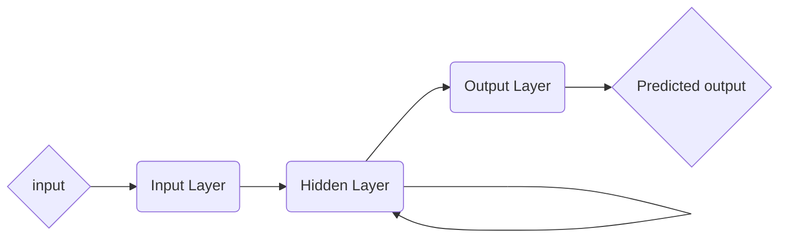
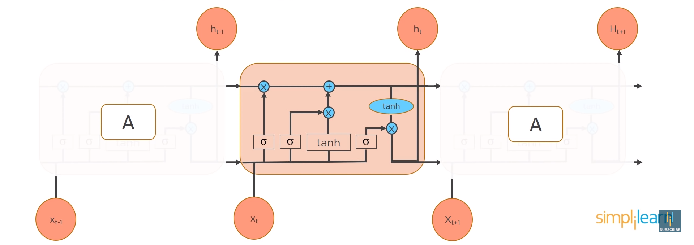

> 学习地址：
>
> - https://www.youtube.com/watch?v=lWkFhVq9-nc

# introduction to `RNN`

## Feed Forward Neural Network, `FFNN`

In a Feed-Forward Network, information flow **only in forward direction**.

1. Decisions are based on current input.
2. No memory about the past.
3. No future scope.

Question:

1. cannot handle sequential data.
2. considers only the current input.
3. cannot memorize previous inputs.

## Recurrent Neural Network, `RNN`

How does `RNN` works?

Types of `RNN`：

1. many to one network

2. many to many network

### Gradient Problem:

- Vanishing Gradient Problem.
- Explaining Gradient Problem.

Solution to Gradient Problem:

## Long Short-Term Memory Network, `LSTM`

`LSTMs` are special kind of `RNN`, capable of learning long-term dependencies.

Three steps of `LSTMs`:

### Step-1: Decides how much of the past it should remember

It looks at the previous state ($$h_{t-1}$$) and the current input $$x_t$$ and computes the function.

- $$f_t = \sigma(W_f [h_{t-1}, x_t] + b_f)$$, $$f_t$$ is called forget gate.

### Step-2: Decides how much should this unit add to the current state

There are 2 parts:

- One is **sigmoid** function, it decides which values to let through (0 or 1).

  $$i_t = \sigma(W_i [h_{t-1}, x_t] + b_i)$$

- The other is **tanh** function, which gives the weightage to the value which are passed deciding their level of importance (-1 to 1).

  $$\overset{\sim}{C_t} = tanh(W_C [h_{t-1}, x_t] + b_c)$$

### Step-3: Decides what part of the current cell state makes it to the output

$$o_t = \sigma(W_o [h_{t-1}, x_t] + b_0)$$, $$o_t$$ is called output gate.

$$h_t = o_t * tanh(C_t)$$

### Implementation of `LSTM`

