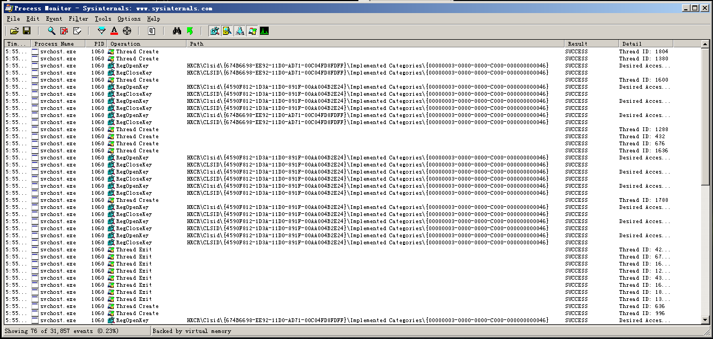

# lab 3-2

## QUESTION 1

> How can you get this malware to install itself?

首先查看文件类型：

```cmd
$ file Lab03-02.dll
Lab03-02.dll: PE32 executable (DLL) (GUI) Intel 80386, for MS Windows
```

因此使用程序 `rundll32.exe` 安装动态链接库，[msdn 使用教程](<https://support.microsoft.com/en-us/help/164787/info-windows-rundll-and-rundll32-interface>)。

我们进一步查看这个动态链接库的导出内容，以查看应该运行哪个函数安装：


因此从名字来判断，有可能是 `Install` 也有可能是 `installA`，我们发现前者运行不了，因此安装这个动态链接库的指令为：

```bash
$ rundll32.exe Lab03-02.dll, installA
```

## QUESTION 2

### regmon

恢复虚拟机快照到运行动态链接库之前，打开 `Regmon`，过滤 `rundll32.exe` 这个可执行文件，再高亮调用的 `CreateKey` 这个函数，再运行上面安装动态链接库的命令，我们得到以下的结果：


可见这个动态链接库通过 `rundll32.exe` 创建了一个名为 `IPRIP` 的服务。

### regedit

我们也可以通过 `regedit` 观察这个注册表的内容（可以看到其名称为 `Intranet Network Awareness (INA+)`）：


### msconfig

另外也可以用 `msconfig` 命令查看所有安装的服务（可见这个服务还尝试将自己的制作商伪装为微软官方）：


### 启动

可以用以下的命令启动这个服务：

```cmd
$ net start IPRIP
Intranet Network Awareness (INA+) 服务正在启动 .
Intranet Network Awareness (INA+) 服务已经启动成功。
```

## QUESTION 3

> How can you find the process under which this malware is running?

运行起服务之后，可以用 `tasklist` 命令查看运行期程序的 `PID`：


可见这是 `svchost.exe` 这个程序再运行这个服务，其 PID 是 `1060`。另外，可以用 `procexp` 这个软件搜索调用 `Lab03-02.dll` 的应用程序：


也可以见到调用这个动态链接库的是 PID 为 1060 的程序 `svchost.exe`。

## QUESTION 4

> Which filters could you set in order to use procmon to glean information?

通过 `PID is 1060` 过滤 PID：



因为这过滤的是 `svchost.exe` 这个进程，这个进程是用于管理服务的；同时根据第三问的查看，用这种方法过滤会选出其他的服务。

## QUESTION 5

> What are the malware’s host-based indicators?

根据前面的观察，主要会有以下的特征：

1. 安装了一个服务 `Intranet Network Awareness (INA+)`，其制造商被伪造为 `Microsoft Corporation`；
2. 上面的服务被安装在了注册表中名为 `IPRIP` 表项服务，这个表项中还有动态链接库的位置；
3. 在运行时查看调用的动态链接库是否有 `Lab03-02.dll`

## QUESTION 6

> Are there any useful network-based signatures for this malware?

对于网络连接，我们像 `3-1` 一样搭建一个网络分析环境，先打开 `Win7` 运行一个 DNS 服务，并将 DNS 解析结果全部指向 `Kali Linux`，并在 `Kali Linux` 上运行一个 `INetSim` 服务。

首先，我们在 `Win7` 的 DNS 服务器中看到病毒启动后请求解析 `practicalmalwareanalysis.com` 这个域名：


我们将这个域名解析到 `Kali Linux` 上后，可以通过以下的方式查看来自 `XP`  的访问 `practicalmalwareanalysis.com` 的访问记录：

```bash
$ cat /usr/share/inetsim/log/service.log | grep 128 | grep malware
[2019-05-11 07:25:58] [3067] [http_80_tcp 3860] [192.168.32.128:1038] recv: Host: practicalmalwareanalysis.com
[2019-05-11 07:25:58] [3067] [http_80_tcp 3860] [192.168.32.128:1038] info: Request URL: http://practicalmalwareanalysis.com/serve.html
[2019-05-11 07:25:58] [3067] [http_80_tcp 3860] [192.168.32.128:1038] stat: 1 method=GET url=http://practicalmalwareanalysis.com/serve.html sent=/usr/share/inetsim/data/http/fakefiles/sample.html postdata=
```

可见这个服务通过 80 端口访问了 `http://practicalmalwareanalysis.com/serve.html` 这个地址。