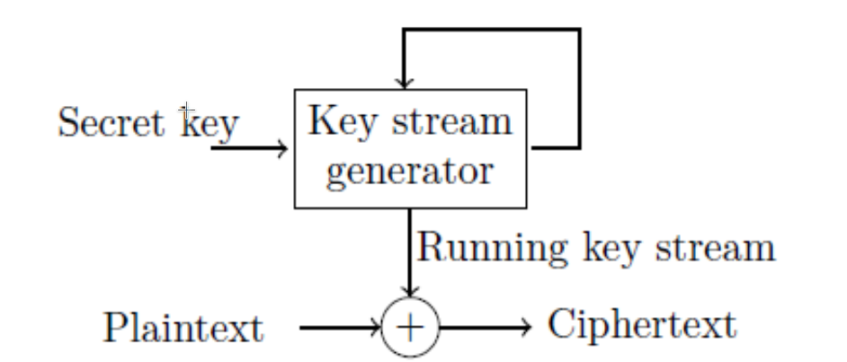

# Chapter 2. Pseudorandom Sequence Generators

## Background

We focus on the deterministic algorithm:

1. One is linear/non-linear feedback shift registers based on `PRSGs`.
2. One relies on computation infeasible problems or other types of maths structure.

## Feedback Shift Register Sequence

Feedback shift register (反馈位移寄存器), denotes as `FSR`：

- Introduction to `FSR`: feedback function $$a_{k+n} = f(a_k, a_{k+1}, \cdots, a_{k+n-1})$$

- A state diagram of an `FSR`

- `FSRs` with maximum periods:
  1. Maximum periods of an n-stage `FSR` sequence: $$2^n$$. Referred to as **de Bruijn sequence**.
  2. Maximum periods of an n-stage `LFSR` sequence: $$2^n - 1$$. Referred to as **m-sequence**.

## `LFSR` and m-sequence

### Definition and properties

Definition (Characteristic polynomial):

- For feedback function: $$f(x_0, x_1, ..., x_{n-1}) = c_{n-1}x_{n-1} +... +c_1x_1 + c_0 x_0$$
- $$f(x) = x^n + c_{n-1}x^{n-1} +... +c_1x^1 + c_0 x^0$$ is called **characteristic polynomial**

Definition (Minimal polynomial):

- For a given sequence $$\{a_i\} = \{a_0, a_1, \cdots, a_{n-1}\}$$
- The characteristic polynomial with the smallest degree generating $$\{a_i\}$$ is called **minimal polynomial**

Property:

- The minimal polynomial of an `LFSR` is a divisor of its characteristic polynomial.

Property (m-sequence and its feedback polynomial):

- The period of the sequence $$\{a_i\}$$ is equal to the period of its minimal polynomial.
- So in order to design an m-sequence, we need to find a **primitive polynomial**.($$\deg f(x) = n$$)

Property:

- All m-sequences generated by the same `LFSR` are **shift equivalent**.

Common equations:

- $$\displaystyle \underbrace{0, \cdots, 0}_{n-1},1 \Rightarrow f(x) = x^n + 1$$
- $$\displaystyle \underbrace{1, \cdots, 1}_{n-1}, 0 \Rightarrow  f(x) = x^{n-1}(x+1) + 1$$

### Linear span and BM algorithm

Definition (linear span):

- For a given sequence $$\{a_i\} = \{a_0, a_1, \cdots, a_{n-1}\}$$

- We define the degree of the minimal polynomial of `a` as **linear span (linear complexity)** of `a`, denotes as **LS(a)**. `Berlekamp-Massey` algorithm can be used to calculate `LS(a)`

Property:

- For a given sequence $$\{a_i\} = \{a_0, a_1, \cdots, a_{n-1}\}$$, linear span of first `N` bit denotes as $$L_N$$
- Then we have: $$L_{N+1} = L_N \or (N+1-L_N)$$

Definition (**Discrepancy sequences**):

- For a given sequence $$a^N = a_0, a_1, \cdots, a_{N-1}$$
- Let $$\displaystyle f(x) = x^l + \sum_{i=0}^{l-1}c_ix^i$$ be the minimal polynomial of `LFSR`.
- Let $$\displaystyle v_k = a_{l+k} + \sum_{i = 0}^{l - 1} c_i a_{i+k}, k = 0,1, \cdots, N-l-1$$
- $$\{V_k\}$$ is called **discrepancy sequence** associated with `f(x)` and $$a^N$$

Lemma:

- Assume that $$f_{n-1}(x)$$ is the characteristic polynomial of the shortest `LFSR` generating $$a_0, a_1, \cdots, a_{n-1}$$, but not $$a_0, a_1, \cdots, a_{n}, n < N$$. In the other word (Assuming $$LS(f(x)) = l_{n-1}$$):
  - For $$k=0,1,\cdots, n-1-l_{n-1}$$, we have $$\displaystyle a_{l_{n-1}+k} = \sum_{i=0}^{l_{n-1}-1}a_{i+k} \Rightarrow v_k = 0$$
  - But for $$k = n - l_{n-1} \Rightarrow v_k = 1$$
- Consider discrepancy sequences: $$\displaystyle (v_0, v_1, \cdots, v_{n - l_{n-1}}) = (\underbrace{0, \cdots,0}_{n - l_{n-1}}, 1)$$
- How to obtain $$f_n$$ from the previous $$f_i, i < n$$?
  1. Find the nearest `LFSR` such that $$l_{m-1} < l_{m} = \cdots = l_{n-1}$$
  2. Assuming $$a = m - l_{m-1}, b = n - l_{n-1}$$, 
  3. we can obtain f: $$f_n(x) = \begin{cases} f_{n-1} + x^d f_{m-1}, & d = a - b, a > b \\ x^d f_{n-1} + f_{m-1}, & d = b - a, a \le b\end{cases}$$

Algorithm (`Berlekamp-Massey`) python code (it seems couldn't run):

```python
#!/usr/bin/env python2.7
# coding=utf-8
from sage.all import *


class BMSolution:
    def __init__(self, capturedSequence):
        self.x = var("x")
        self.Z = GF(2)
        capturedSequence = [self.Z(bit) for bit in capturedSequence]
        self.rawSequence = capturedSequence
        self.initializePolynomial()

    def initializePolynomial(self):
        self.k = self.rawSequence.index(1) # 第一个 1 bit
        self.minimalPolynomial = self.x ** (self.k+1) + 1 # f(x), 当前的最小多项式
        self.m = 0  # 前一个多项式所在的最后的位置
        self.prevMinPolynomial = 1 # g(x), 之前的一个最小多项式

    def solvePolynomial(self):
        for n in range(self.k, len(self.rawSequence)):
            l = self.minimalPolynomial.degree(self.x)
            d = sum([self.minimalPolynomial.coefficient(self.x, i) * self.rawSequence[n - l + i] for i in range(l + 1)]) % 2
            if d == 0: continue
            a = (self.m - self.prevMinPolynomial.degree(self.x))
            b = (n - self.minimalPolynomial.degree(self.x))
            if 2*l > n:
                self.minimalPolynomial = self.minimalPolynomial - self.x ** (a - b) * self.prevMinPolynomial
            else:
                prevMinPolynomial = self.minimalPolynomial
                self.minimalPolynomial = self.x ** (b - a) * self.minimalPolynomial - self.prevMinPolynomial
                self.prevMinPolynomial = prevMinPolynomial
        return self.minimalPolynomial

if __name__ == "__main__":
    sp = BMSolution([0,0,0,1,1,1,0,1,0,1])
    print(sp.solvePolynomial())
```

*PostScript*: 可以直接在 `sagemath` 中使用下面的方式求解：

```python
berlekamp_massey([0,0,0,1,0,1,0,1]) # x^2 - 1
```

Property:

- If `2n` (`n` is the linear span) bits are known in an `N` bits long sequence, we can recover the rest of bits.

### Correlation function

Goal:

- Correlation function measure the similarity one sequence with a shift of the other.

Definition (when periods are the same `N`):

- $$\displaystyle C_{a, b}(\tau) = \sum_{i = 0}^{N - 1} (-1)^{a_i + b_i + \tau}$$
- It's equal to the difference between the number of the agreements and that of disagreements of `a` with the shift `t`.

Definition (when period are different `N` and `M`):

- Assume $$T = lcm(N, M)$$, $$\displaystyle C_{(a^T, b)} (\tau) = \sum_{i = 0}^{T - 1} (-1)^{a_i + b_i +\tau}$$

## Randomness

### Golomb's Randomness Postulates

R-1 Blance property:

- 0 and 1 has the same possibility

R-2 run property:

- A periodic sequence is said to have the run property if in every period of the sequence, there are $$2^k$$ runs of length n-k where $$n = logN, 1 \le k \lt n$$. Moreover, for each of these lengths, there are equally many runs of 0's and of 1's.

R-3 Idea 2-level autocorrelation:

### Randomness Criteria

1. Large period
2. Statistics properties:
   1. Balanced property: each element occurs nearly equally many times;
   2. Run property R2;
   3. (ideal) `k-tuple` distribution; Each non-zero k-tuple occurs exactly one.
3. Correlation:
   1. 2-level autocorrelation
   2. Low crosscorrelation
4. Large linear span (complexity). $$\displaystyle \frac{tN}{2} \le LS(a) \le N, \text{where t is constant}, 0 \lt t \le 1$$
5. Indistinguishability.

## Generators

1. Non-linear generator
2. Filtering sequence generator
3. Combination sequence generator
4. Select boolean generator
5. Clock control & shrink generator
6. Stop and go generator
7. Shrink generator

## One-Time Pad



## Known Attack

### Correlation attack

A naive way to conduct an attack is to do an **exhaustive search** for the entire space for a possible internal state, then the search complexity is given by: $$\displaystyle T_0 = \prod_{i=0}^{m-1} 2^{n_i}$$

If we can decompose the `PRSG` into m sub-generators, those m sub-generators are filtered by a boolean function `h`: $$Z = h(X_0, X_1, \cdots, X_{m-1})$$. 

We now look at whether the output random variable Z and input variable $$X_i$$ are correlated. Using this fact, the search complexity can be tremendously reduced to approximately:

- $$\displaystyle T_1 = \sum_{i \in I_c} 2^{n_i} + \prod_{i \in I_{uc}}2^{n_i}$$
- where $$\begin{cases}I_c = \{i | 0 \le i < m,& Z\text{ and }X_i\text{ are correlated}\} \\ I_{uc} = \{i | 0 \le i < m,& Z\text{ and }X_i\text{ are uncorrelated}\} \end{cases}$$

# 课堂笔记

## 有限域

需要一个随机性、算法速度兼顾的算法。

所以我们考虑以下的运算：异或、移位、加减法、布尔函数...

定义（Finite Field）：记作 $$\mathbb{F}_n$$

- 对于 `+` 运算：存在 `0` 元；对于任意元素，存在一个其加法运算的负元。
- 对于 `*` 运算：存在 `1` 元；对于任意元素，存在一个其乘法的逆元。

定理：

- 对于 p 是素数，$$\mathbb{Z}_p = \mathbb{F}_p$$

- Expansion：$$\displaystyle \mathbb{F}_p \Rightarrow \mathbb{F}_{p^n}$$

如何从 $$\mathbb{F}_2$$ 构造 $$\mathbb{F}_{2^n}$$：

- 令 $$GF(2^n) = \{x_0 + x_1 \alpha + ... + x_{n-1} \alpha^{n-1}\text{, where } x_i \in \mathbb{F_2}\}$$

- 那么我们可以构造：$$\displaystyle \mathbb{F}_4 = \frac{GF(2)[x]}{p(x)}\text{, where }\deg{p(x)} = n, p(x):irreducible$$

表示方法：

- polynomial representation:$$x_0 + x_1\alpha + x_2 \alpha^2 +... + x_{n-1}\alpha^{n-1}$$
- vector based representation:$$(x_0, x_1,..., x_{n-1})$$
- Exponential representation:$$\{\alpha^i, i = 0,1,...,2^{n}-2\}$$

定义（Multiplicative Group）：

- $$\displaystyle GF(2^n)^{*} = GF(2^n)\text{\\}\{0\} = \{\alpha^i, i = 0,1,...,2^{n}-2\}$$

## Group

定义：

1. Associative: $$a * (b*c) = (a*b)*c$$

2. Identity: $$\exist e \in G, a*e = e*a = a$$
3. $$\forall a \in G, \exist a^{-1}, \text{so that }a * a^{-1} = e$$
4. $$\text{For }a, b \in G, a*b = b*a \Rightarrow$$ Commutative Group 交换群

## Primitive

定义：考虑在 $$GF(2^n)^*$$ 中：

- $$ord \beta$$: the least integer m such that $$\beta^m = 1$$

- primitive: We say $$\beta$$ is primitive if $$ord \beta = 2^n - 1$$

定理：

- $$\alpha$$ is a root of $$f(x)$$, then $$\alpha^{2^i}, i = 0,1,...,n-1$$ are root of $$f(x)$$

- $$\displaystyle ord \alpha^s = \frac{ord \alpha}{gcd(s, ord \alpha)}$$

## Feedback Shift Register Sequences

### Maximum Periods

我们发现：

- Output bits are closely related to `feedback function`, and `internal states`

### m-sequence

性质：

- 定义操作符 L：$$(a_0, a_1, ..., a_{n-1}) \rightarrow (a_1, a_2, ..., a_n)$$

- 对于特征多项式，我们总有：$$\displaystyle f(L)*\overset{\rightarrow}{a} = 0$$

性质：

- 如果 f(x), g(x) 是特征多项式，我们有：$$f(x) + g(x), x^i *f(x), h(x) * f(x)$$ 也是特征多项式

有 Caylor-Hamilton Theorem：

- 对于 FSRS 的转移矩阵 M，

- If $$f(x) | x^r -1 \Rightarrow M^r = I \Rightarrow$$ Internal state repeats at the period `r`

定义：

- 如果我们连个 LFSR 通过同一个转移函数得到，则我们称他们为 `shift equivalent`

### linear span

定义：

- An LFSR s said to generate a finite sequence $$a_0, a_1, ..., a_{N-1}$$ when the this sequence conincides  with the first N output elements of l-stage LFSR for the initial state $$(a_0, a_1,...,a_{l-1})$$. The shortest length of the LFSR which generate $$a^N$$ is called the linear span of $$a^N$$.

### Discrepancy Sequences

对于一个给定的序列，`Discrepancy Sequences` 是一个构造生成给定序列的 LFSR 的方法。

因为特殊的我们有：$$00\dots001 \Rightarrow f(x) = x^n +1$$

我们又知道 $$\displaystyle f_n(x) \begin{cases}f_{n-1} + x^d f_{m-1}, d = a-b,\text{if }a>b \\ x^df_{n-1} + f_{m-1}, d = b-a, \text{if }a \le b \end{cases}$$

### Correlation Functions of Sequences

Mesure the similarity of one sequence with a shift of the other.

Define the two sequences correlation function with the same period N: $$\displaystyle C_{a,b}(\tau) = \sum_{i = 0}^{N-1} (-1)^{a_i + b_i + \tau}$$

$$C_a(t)$$ measures the **similarity** between the sequence and its shift, euqal to the difference between the number of the agreements and that of disagreements of a with the shift t.

Defined for two sequences a and b with their respective lengths N and M: $$\displaystyle C_{a^T, b} (\tau) \sum_{i = 0}^{T-1} (-1)^{a_i + b_i + \tau}, \tau = 0,1,\dots, T = lcm(N, M)$$


