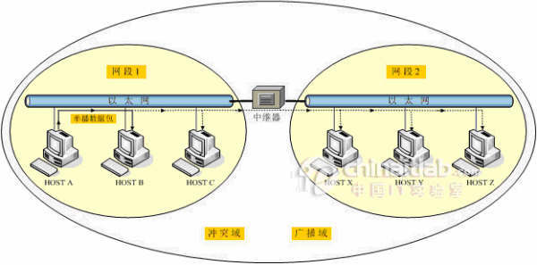
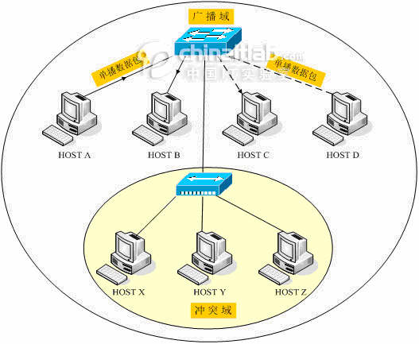
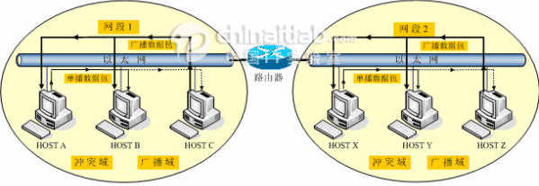

> 学习网址：https://www.kancloud.cn/wizardforcel/network-basic/135484

# 交换机

帧转发技术

## 交换概念

交换指基于以下两条准则做出决定的设备：

1. 进入（ingress）端口
2. 目的地址

交换机通过以太网帧中的源 MAC 地址与目的 MAC 地址，从源设备接收到帧并快速发往目的地址。

术语 `ingress` 用于描述帧通过特定端口进入设备，`egress` 用于描述帧通过特定端口离开设备。

LAN（*Local Area Network*，局域网）交换机维护一张表，通过这张表决定如何转发数据流。LAN 交换机唯一智能部分是利用这张表基于消息的进入端口和目的地址来转发。

一个 LAN 交换机中只有一张定义了地址和端口的主交换表；因此，**无论进入端口如何，同一目的地址的消息永远从同一出口离开。**

## MAC 地址表动态更新

一个交换机要知道使用哪一个端口进行传送帧，首先必须知道各个端口有哪些设备。

交换机使用 MAC 表的方式完成，它建立起一张 MAC 地址表，内容可寻址寄存表（CAM）。交换机将连接到它的端口的设备的 MAC 地址记录到 MAC 表中，然后利用表中信息将帧发送至输出端口设备，该端口已指定给该设备。

交换机操作模式的一句简单的话是：**交换机学习“源地址”，基于“目的地址”转发**。以下步骤描述了更新 MAC 地址表的方法：

1. 交换机在 `port1` 接收到来自 `PC1` 的帧。
2. 交换机检查源 MAC 地址并与 MAC 地址表相比较：
   - 如果地址不在表中，则将交换机在 MAC 地址表中将 `PC 1` 的源 MAC 地址关联到进入端口（`port 1`）
   - 如果地址已经存在该表中，则交换机重置老化计时器。通常一个表项会保持 5 分钟。
3. 交换机记录源地址信息后，检查目的地址：如果目的 MAC 地址不在表项中或如果它是一个广播 MAC 地址，则交换机把该帧泛洪（flood）至除了进入端口以外的所有端口。（如果在表项中则可以直接正常通信）
4. 目标设备（`PC 3`）返回目的地址为 `PC 1` 的单播帧。
5. 交换机地址表中输入 `PC 3` 的源 MAC 地址以及进入的端口号。
6. 交换机现在可以在源 `PC 1` 和目标设备 `PC 3` 之间传送帧而无需泛洪。

## 交换机的转发方式

### 存储转发交换 Store-and-Forward

运行在存储转发模式下的交换机在发送信息前要把整帧数据读入内存并检查其正确性。

尽管采用这种方式比采用直通方式更花时间，但采用这种方式可以存储转发数据，从而保证其准确性。由于运行在存储转发模式下的交换机不传播错误数据，因而更适合大型局域网。

存储转发模式有两大主要特征区别于直通转发模式：

- 差错控制：在进入端口接收完整一帧之后，交换机将数据报最后一个字段的帧校验序列（frame check sequence, FCS）与自己的 FCS 进行比较。FCS 校验过程用以帮助确保帧没有物理及数据链路错误，如果该帧校验正确，则转发。否则丢弃。
- 自动缓存：存储转发交换机通过进入端口缓存，支持不同速率以太网的混合连接。例如，接收到一个以 1Gb/s 速率发出的帧，转发至百兆以太网端口，就需要使用存储转发方式。当进入与输出端口速率不匹配时，交换机将整帧内容放入缓存中，计算 FCS 校验，转发至输出缓存之后将帧发出。

`Cisco` 的主要交换方式是存储转发交换。

### 直通交换 Cut-Through

采用直通模式的交换机会在接收完整个数据包之前就读取帧头，并决定把数据发往哪个端口。直通交换的一个优势是比存储转发技术更为快速，不用缓存数据也不用检查数据的完整性。

这种交换方式有两大特点：

- 快速帧转发：一旦交换机在 MAC 地址表中查找到目的 MAC 地址，就立刻做出转发决定。而无需等待帧的剩余部分进入端口再做出转发决定。

- 无效帧处理：对于大多数无效帧，直通方式交换机并不将其丢弃。

  错误帧被转发至其他网段。如果网络中出现高差错率（无效帧），直通交换可能会对带宽造成不利影响，损坏以及无效帧会造成带宽拥塞。在拥塞情况下，这种交换机必须像存储转发交换机那样缓存。

### 无碎片转发 Fragment-Free

无碎片转发是直通方式的一种改进模式。交换机转发之前检查帧是否大于 64 字节（小于则丢弃），以保证没有碎片帧。无碎片方式比直通方式拥有更好的差错检测，而实际上没有增加延时。

它比较适合于高性能计算应用，即进程到进程延时小于 10ms 的应用场景。

# 冲突域广播域

> 学习地址：
>
> - https://www.cnblogs.com/bakari/archive/2012/09/08/2677086.html

## 概念理解

### 冲突域

连接在同一导线上的所有工作站的集合，或者说是同一物理网段上所有节点的集合或以太网上竞争同一带宽的节点集合。这个域代表了冲突在其中发生并传播的区域，这个区域可以被认为是共享段。在 OSI 模型中，**冲突域被看作是第一层的概念**，连接同一冲突域的设备有 Hub，Reperter 或者其他进行简单复制信号的设备。也就是说，用 Hub 或者 Repeater 连接的所有节点可以被认为是在同一个冲突域内，它不会划分冲突域。

### 广播域

接收同样广播消息的节点的集合。如：在该集合中的任何一个节点传输一个广播帧，则所有其他能收到这个帧的节点都被认为是该广播帧的一部分。由于许多设备都极易产生广播，所以如果不维护，就会消耗大量的带宽，降低网络的效率。由于**广播域被认为是 OSI 中的第二层概念**，所以像 Hub，交换机等第一，第二层设备连接的节点被认为都是在同一个广播域。而路由器，第三层交换机则可以划分广播域，即可以连接不同的广播域。

## 在不同网络互联设备上的特点

### 传统以太网操作

主机 A 只是想要发送一个单播数据包给主机 B。但由于传统共享式以太网的广播性质，接入到总线上的所有主机都将收到此单播数据包。同时，此时如果任何第二方，包括主机 B 也要发送数据到总线上都将冲突，导致双方数据发送失败。我们称连接在总线上的所有主机共同构成了一个**冲突域**。

当主机 A 发送一个目标是所有主机的广播类型数据包时，总线上的所有主机都要接收该广播数据包，并检查广播数据包的内容，如果需要的话加以进一步的处理。我们称连接在总线上的所有主机共同构成了一个**广播域**。

如下图：

### 中继器 Repeater

中继器出现的两个功能为：

1. 扩展网络距离，将衰减信号经过再生。
2. 实现粗同轴电缆以太网和细同轴电缆以太网的互连。

通过中继器虽然可以延长信号传输的距离、实现两个网段的互连。但并没有增加网络的可用带宽。如下图所示，网段 1 和网段 2 经过中继器连接后构成了**一个单个的冲突域和广播域**：

### 集线器 HUB

集线器实际上相当于多端口的中继器。集线器通常有8个、16个或24个等数量不等的接口。

集线器同样可以延长网络的通信距离，或连接物理结构不同的网络，但主要还是作为一个主机站点的汇聚点，将连接在集线器上各个接口上的主机联系起来使之可以互相通信。

实际上，在集线器内部，各接口都是通过背板总线连接在一起的，在逻辑上仍构成一个共享的总线。因此，集线器和其所有接口所接的主机共同构成了**一个冲突域和一个广播域**。如下图所示：

### 网桥 Bridge

网桥（Bridge）又称为桥接器。和中继器类似，传统的网桥只有两个端口，用于连接不同的网段。和中继器不同的是，网桥具有一定的"智能"性，可以"学习"网络上主机的地址，同时具有信号过滤的功能。

如下图所示：

- 网段 1 的主机 A 发给主机 B 的数据包不会被网桥转发到网段 2。因为，网桥可以识别这是网段 1 内部的通信数据流。
- 同样，网段 2 的主机 X 发给主机 Y 的数据包也不会被网桥转发到网段 1。可见，网桥可以将一个**冲突域分割为两个**。其中，每个冲突域共享自己的总线信道带宽。

- 但是，如果主机 C 发送了一个目标是所有主机的广播类型数据包时，网桥要转发这样的数据包。网桥两侧的两个网段总线上的所有主机都要接收该广播数据包。因此，网段 1 和网段 2 仍属于**同一个广播域**。

### 交换机 Switch

交换机（Switch）也被称为交换式集线器。它的出现是为了解决连接在集线器上的所有主机共享可用带宽的缺陷。

交换机是通过为需要通信的两台主机直接建立专用的通信信道来增加可用带宽的。从这个角度上来讲，交换机相当于多端口网桥。

如下图所示：交换机上的**每个接口都是自己的一个冲突域**。

交换机同样没有过滤广播通信的功能。如果交换机收到一个广播数据包后，它会向其所有的端口转发此广播数据包。因此，交换机和其所有接口所连接的主机共同构成了**一个广播域**。

我们将使用交换机作为互连设备的局域网称为*交换式局域网*。

### 路由器 Router

路由器工作在网络层，可以识别网络层的地址 IP 地址，有能力过滤第 3 层的广播消息。实际上，除非做特殊配置，否则路由器从不转发广播类型的数据包。因此，路由器的每个端口所连接的网络都**独自构成一个广播域和冲突域**。

如下图所示：

