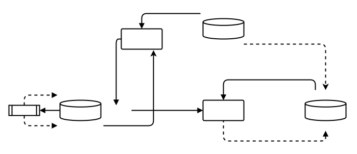

# 正向基础

## App 结构与构建

**应用包的本质？**

iOS 中的应用包有 `.app` 与 `.ipa` 两种形式，前者就是一个文件夹，后者是这个文件夹的 zip 格式压缩包（Android 中的 `.apk`）。

**如何获取一个线上 App 的 `ipa` 文件包？**

在 `iTunes` 之后，苹果官方提供了一个方法进行 `ipa` 的下载，即应用：Apple Configurator 2。在这个应用中下载了 App 之后，可以在以下的文件夹下找到 `ipa` 文件：

- `/Users/shesonglin/Library/Group Containers/K36BKF7T3D.group.com.apple.configurator/Library/Caches/Assets/TemporaryItems/MobileApps`

## App 签名

### 签名原理

App 签名是一个基于 CA 的认证架构，CA 指 [Certificate Authority](https://en.wikipedia.org/wiki/Certificate_authority)，对于 CA 机构的信任是一切现代信息安全互信体系的基石。

CA 的认证流程大致如下：



上面的流程大致的阐述了如何实现一个用户，如何实现对一个未知身份的开发者的信任问题。

对于这一体系在 App 信任中的应用，则可以用下面的流程阐述：


具体在 iOS 中，App 签名这个过程中有以下关键的几个文件：

- `CertificateSigningRequest.certSigningRequest`：对应上图中的 `Dev-PublicKey` 的打包文件；
- `iOS_development.cer`；对应上图一中绿色的 `certificate` 文件；
- `Entitlements` 授权文件，一般是 `plist` 后缀：在上图二中，对 App 的哈希过程中，也会加入 App 的授权信息；

### 重签名

一旦改变了 App 的二进制内容或任何授权内容，上面的授权信息 `distribution certificate` 就会被破坏。App 信息完整性验证这一过程就会失败，因此我们就需要对 App 进行重签名。

重签名的步骤大致如下：

1. 通过命令获取本机上的证书列表：

   ```bash
   $ security find-identity -p codesigning -v
   ```

2. 生成 `entitlements.plist`：

3. 复制 `mobileprovision` 文件到 `.app` 目录下；

4. 手动签名；

5. 将 `.app` 打包成 `.ipa`；

