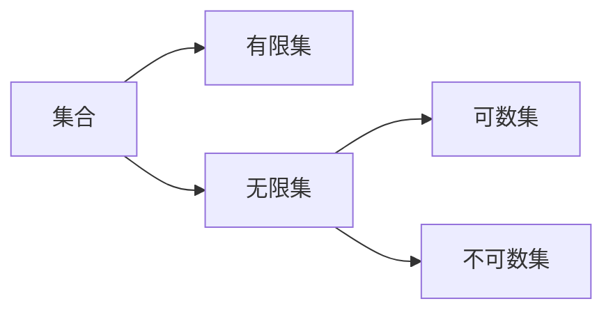

# 第一周

## 概念

集合的大小：集合的势。

基数：

[可数集](https://en.wikipedia.org/wiki/Countable_set)（countable set）： a **countable set** is a [set](https://en.wikipedia.org/wiki/Set_(mathematics)) with the same [cardinality](https://en.wikipedia.org/wiki/Cardinality) ([number](https://en.wikipedia.org/wiki/Cardinal_number) of elements) as some [subset](https://en.wikipedia.org/wiki/Subset) of the set of [natural numbers](https://en.wikipedia.org/wiki/Natural_number). A countable set is either a [finite set](https://en.wikipedia.org/wiki/Finite_set) or a **countably infinite** set. 

同余。

同余关系，等价关系。

## 数论基础

整除的性质。

序偶。序组。叉积。

辗转相除——求最大公约数。

定理：

- 如果 a,b 互素，存在整数 m,n 使得 $$a m + b n = 1$$

算术基本定理：

- 任何一个正整数 a 可以分解成 $$\displaystyle p_1^{s_1} p_2^{s_2} ... p_n^{s_n}$$，其中 $$p_i, i=1,2...n$$ 是素数。

梅森素数。菲尔马素数。

完全数：

- 如果一个正整数 N 的所有正因子之和为 2N，则 N 称为完全数。

- $$\sigma(a)$$ 表示 a 的素因子之和。

