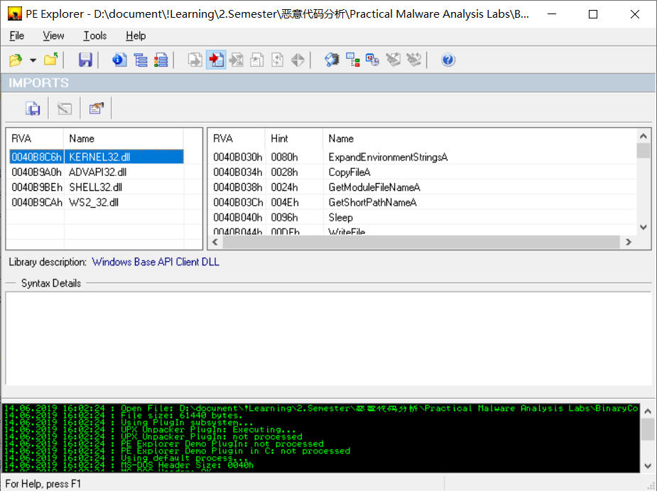

# lab 9-1

## QUESTION 1

> How can you get this malware to install itself?

在 `BinaryCollection/` 文件夹下运行 `diff` 命令可以查看两个文件之间的差异：

```bash
$ diff Chapter_9L/Lab09-01.exe Chapter_3L/Lab03-04.exe
# 没有返回值说明这两个文件没有任何不同
```

我们发现 `Lab09-01.exe` 与 `Lab03-04.exe` 是同一个文件。在 `Lab03-04` 中，我们的分析结果是这个文件运行起来就直接闪退并且把自己删除了。

我们先用 `PE Explorer` 查看这个函数的导入表内容：



可见它导入的动态链接库以及其中调用的函数都非常敏感：

1. `KERNEL32.dll` 中的 `CopyFileA()`、`WriteFile()` 等操作文件的函数， `CreateProcess()` 等操作进程、互斥量等相关的函数；
2. `ADVAPI32.dll` 中的 `RegSetValueExA()` 等操作注册表的函数，`CreateService()`、`DeleteService()` 等控制系统服务的函数；
3. `SHELL32.dll` 动态链接库仅导入了一个函数，但非常敏感：`ShellExecuteA()`；
4. `WS2_32.dll` 则是 Windows Socket 编程中最常用的动态链接库，这说明这个程序会有网络请求。

然后我们用 `Ida Pro` 打开这个文件，查看其中的 `main` 函数伪代码，发现其中的主要代码结构是一个如下的 `if` 语句结构：

```c
int __cdecl main(int argc, const char **argv, const char **envp)
{
  // ... // 此处定义了局部变量
  if ( argc == 1 )
  {
    if ( !sub_401000() )
      sub_402410();
    sub_402360();
  }
  else
  {
    //.....
  }
  return 0;
}
```

我们对以上的伪代码逐行分析：

1. 可以看到主函数的第一个条件分支语句就是判断命令行参数是否为 1，根据我们之前对病毒分析的经验知道 `sub_402360()` 这个函数的功能应该是删除可执行文件本身。而 `sub_401000()` 是一个判断函数，`sub_402410()` 则应该是进行报错的函数。
2. 在条件分支的 `else` 分支中调用了更多的函数，我们进一步分析其中的逻辑。

`sub_402510()`：在命令行参数多于一个时，以命令行参数的最后一个字符串作为传入值的函数：

```c
int __cdecl sub_402510(int a1)
{
  //.....
  if ( strlen((const char *)a1) == 4 )
  {
    if ( *(_BYTE *)a1 == 97 )
    {
      v2 = *(_BYTE *)(a1 + 1) - *(_BYTE *)a1;
      if ( v2 == 1 )
      {
        v3 = 99 * v2;
        if ( v3 == *(_BYTE *)(a1 + 2) )
          result = (char)(v3 + 1) == *(_BYTE *)(a1 + 3);
        else
          result = 0;
      }
      else
      {
        result = 0;
      }
    }
    else
    {
      result = 0;
    }
  }
  else
  {
    result = 0;
  }
  return result;
}
```

分析以上的伪代码，发现如果传入的字符串为 `chr(97) + chr(97 + 1) + chr(99 * 1) + chr(97 + 3)` = `abcd` 时返回真，否则返回 0。

再进一步分析主函数的逻辑，得知运行的命令行命令为 `./Lab09-01.exe -in abcd`

## QUESTION 2

> What are the command-line options for this program? What is the password requirement?

根据对前面分析出的伪代码进行进一步分析，我们总结了命令行参数的表格：

| 命令行参数        | 执行的功能 |
| ----------------- | ---------- |
| `./.exe -in abcd` | 安装自身   |
| `./.exe -re abcd` | 删除自身   |
| `./.exe -c abcd`  | 更新配置   |
| `./.exe -cc abcd` | 打印配置   |

## QUESTION 3

> How can you use OllyDbg to permanently patch this malware, so that it doesn’t require the special command-line password?

将判断的逻辑改为反即可。比如将 `if` 语句中的跳转 `jz` 改成 `jnz`。

## QUESTION 4

> What are the host-based indicators of this malware?

恶意代码创建了一个注册表项 `HKEY_LOCAL_MACHINE\SOFTWARE\Microsoft \XPS\Configuration`，同时它创建了一个服务，默认名称为恶意代码文件名，也可通过命令行参数指定。

## QUESTION 5

> What are the different actions this malware can be instructed to take via the network?

通过读 `Ida Pro` 分析出来的伪代码，我们可以得到这个程序执行的网络命令内容：

| 命令格式               | 命令效果                               |
| ---------------------- | -------------------------------------- |
| `SLEEP integer`        | 应用程序睡眠 `integer`s 钟             |
| `UPLOAD port filename` | 读取本地文件并向远程的指定主机端口发送 |
| `CMD port`             | 执行命令并且通过指定端口发送执行结果   |

## QUESTION 6

> Are there any useful network-based signatures for this malware?

默认情况下，恶意代码向 http://www.practicalmalwareanalysis.com 发送 `HTTP1.0GET` 请求，格式为
`****/****.***` 其中 `*` 是随机的数字或字母字符。
可以通过 `-c` 命令配置目标主机、端口号等。

