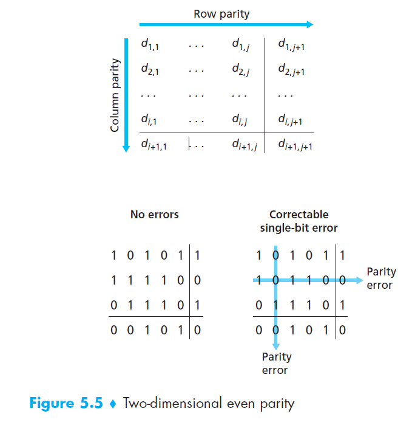
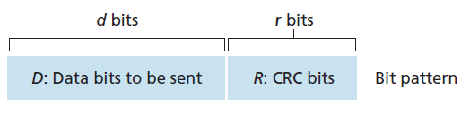
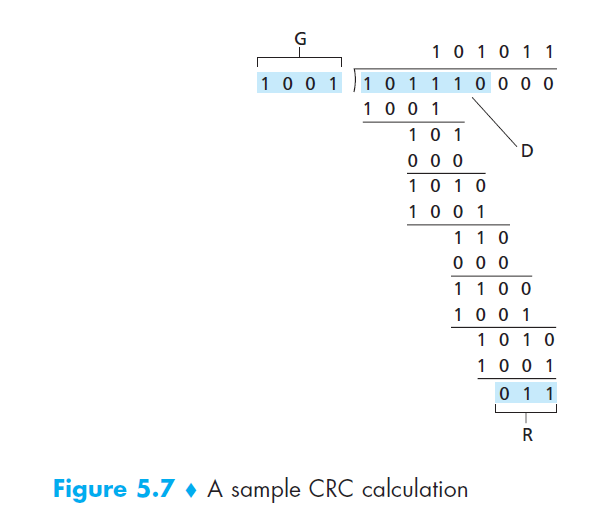

> 学习地址：
>
> - 《计算机网络：自顶向下的方法》

# 链路层

## 概念

结点（node）：运行链路层协议的任何设备（比如：主机、路由器、交换机和 WiFi 接入点）。

链路（link）：沿着通信路径连接响铃结点的通信信道。


链路层协议能提供可能的服务包括：

- 成帧（framing）：一个帧由一个数据字段（网络层数据报）和若干个首部字段组成。
- 链路接入：媒体访问控制（Medium Access Control, MAC）协议规定了帧在链路上传输的规则。
- 可靠交付：当链路层协议提供可靠交付服务时，它保证无差错地经链路层移动每个数据报网络。
- 差错检测和纠正


链路层的主体部分是在**网络适配器**（network adapter）中实现的，网络适配器有时也称作**网络接口卡**（Network Interface Card, NIC）。

位于网络适配器核心的是链路层控制器，该控制器通常是一个实现了许多链路层服务的专用芯片（例如，Intel 的 8254x 控制器实现了以太网协议，Atheros AR5006 控制器实现了 802.11 WiFi 协议）

## 差错检测和纠正技术

### 奇偶校验

差错检测最简单的方式就是奇偶校验位（parity bit）。实现方式：

- 发送方需要包含一个附加的比特位，使得所有比特中，1 的总数总是一个偶数。
- 接收方只要检测到奇数个值位 1 的比特位，则传输信息出现了差错。


使用二维奇偶校验（two-dimensional parity）方案，包含值改变的列和行的校验值都将会差错，因此可以予以纠正，如下：




接收方检测和纠正差错的能力被称为前向纠正（Forward Error Correction, FEC）。

### 检验和

因特网检验和（Internet checksum）就基于这种方法，即数据的字节作为 16 比特的整数对待并求和，这个和的反码形成了携带在报文段首部的因特网检验和。

### 循环冗余检测

循环冗余检测（Cyclic Redundancy Check, CRC）编码又被称作多项式编码（polynomial code），因为该编码能够将要发送的比特串看作为系数是 0 和 1 的多项式，比特串的操作被解释位多项式算术。 

生成多项式 G（generator）：The sender and receiver must first agree on an r + 1 bit pattern, known as a generator. （Assert `max_bit_of(G) == 1` and `bit_length_of(G) == r+1`）

发送方通过以下的方式计算 `R`：

- Math formula: 
  - $$(D << r) \oplus R \equiv 0 \mod{G}$$
  - 其中 D 是传输信息，r 是协商的给定比特长度，G 是长位 `r+1`，最高比特位为 1 的比特模式。

- Pseudo-code:

  ```python
  def crc_remainder(D, G, init):
      '''
      Calculates the CRC remainder of a string of bits using a chosen polynomial.
      initial_filler should be '1' or '0'.
      '''
      G, d = G.lstrip('0'), len(D)
      DR = [int(i) for i in (D + init * (len(G) - 1))]
      while 1 in DR[:d]:
          pos = DR.index(1)
          for i in range(len(G)):
              DR[pos + i] ^= int(G[i])
      return ''.join(DR)[d:]
  ```

- description graph: (padding pattern graph and generation flow)

  

  ```pseudocode
  Given: D=11010011101100, G=1011
  
  11010011101100 000 <--- input right padded by 3 bits
  1011               <--- divisor
  01100011101100 000 <--- result (note the first four bits are the XOR with the divisor beneath, the rest of the bits are unchanged)
   1011              <--- divisor ...
  00111011101100 000
    1011
  00010111101100 000
     1011
  00000001101100 000 <--- note that the divisor moves over to align with the next 1 in the dividend (since quotient for that step was zero)
         1011             (in other words, it doesn't necessarily move one bit per iteration)
  00000000110100 000
          1011
  00000000011000 000
           1011
  00000000001110 000
            1011
  00000000000101 000
             101 1
  -----------------
  00000000000000 100 <--- remainder (3 bits).  Division algorithm stops here as dividend is equal to zero.
  ```

  

国际标准已经定义了 8、16、32 比特的生成多项式 G，CRC-32 的标准被多种链路级的 IEEE 采用

- 使用的一个生成多项式为：$$G_{CRC-32} = 0x04C11DB7$$

- 其生成多项式为：$$x^{{32}}+x^{{26}}+x^{{23}}+x^{{22}}+x^{{16}}+x^{{12}}+x^{{11}}+x^{{10}}+x^{8}+x^{7}+x^{5}+x^{4}+x^{2}+x+1$$

## 多路访问链路和协议

多路访问问题（multiple access problem）：如何协调多个发送和接收结点对一个共享信道的访问。

多路访问协议（multiple access protocol）：信道划分协议（channel partitioning protocol）、随机接入协议（random access protocol）和轮流协议（taking-turns protocol）

碰撞（collide）：所有结点可以同时传输帧，多个结点可能会同时传输帧，所有结点同时接收到多个帧，导致没有一个结点能够有效地获得任何传输的帧。

### 信道划分协议

能够用于所有共享信道结点之间划分广播信道带宽技术：

- 时分多路复用（TDM）：按时间复用；
- 频分多路复用（FDM）：按频率复用：
- 码分多址（Code Division Multiple Access, CDMA）：给每个结点分配一种不同的编码。

### 随机接入协议

一个传输总是以信道的全部速率进行发送，当有碰撞时，随机等待一个延时后，重新发送。

1. 时隙 ALOHA

2. **载波侦听多路访问** (Carrier Sense Multiple Access, CSMA)：

   - 两个重要的原则：
     1. 说话之前先听；
     2. 如果与他人同时开始说话，停止说话；

   - 该协议加入了载波侦听 (carrier sense) 规则，即在发送信号之前侦听信道是否空闲。
   - 端到端信号传播时延 (channel propagation delay) 在决定其性能方面起决定性的作用。

3. 具有碰撞检测 (collision detection) 的载波侦听多路访问 (CSMA/CD)：
   - 在 CSMA 的基础上，当某节点检测到碰撞时将立即停止传输，随机等待一个时间延迟后重新传输
   - 以太网以及 DOCSIS 电缆网络多路访问协议 [DOCSIS 2011] 使用了二进制指数后退（binary exponential backoff）算法：对于经历了 n 此碰撞的帧，随机地从 $$\{0, 1, 2, ..., 2^n-1\}$$ 中选择一个数作为时间间隔进行等待。

4. 具有碰撞避免的载波侦听多路访问（CSMA/AD）。

### 轮流协议

