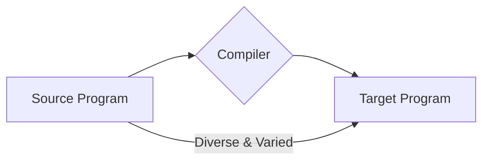

> Note: 第一天
>
> Teacher: 李忠伟

Quote：未经过优化时，指针运算更快；经过编译器优化后，数组运算更快。

语法分析：操作符做连接点，操作数做叶子节点 &rarr; 语法分析树

简单的编译器流程图：

```mermaid
graph LR;
SP[Source Program]-->C{Compiler};
C-->TP[Target Program]
SP-->|Diverse & Varied|TP
```

